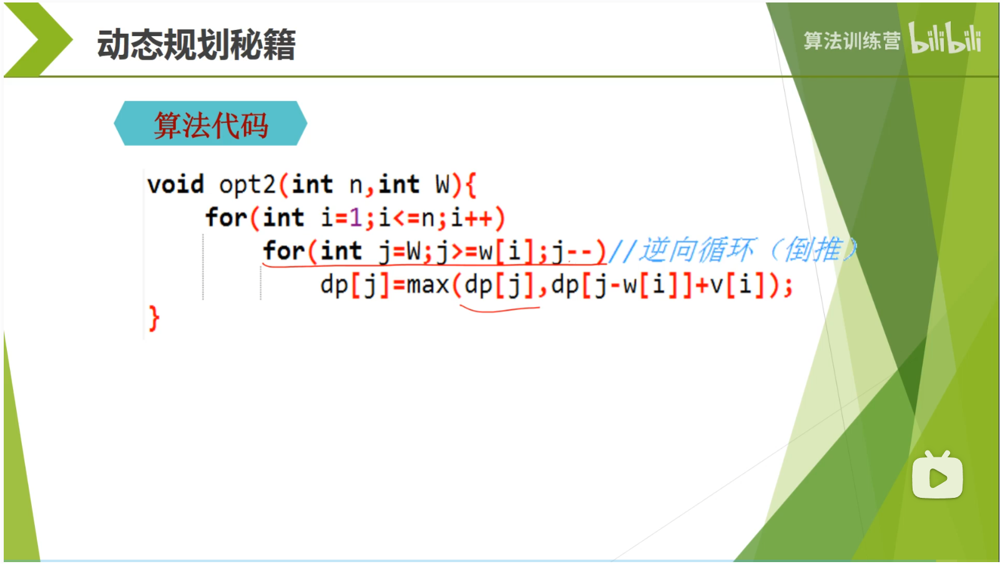
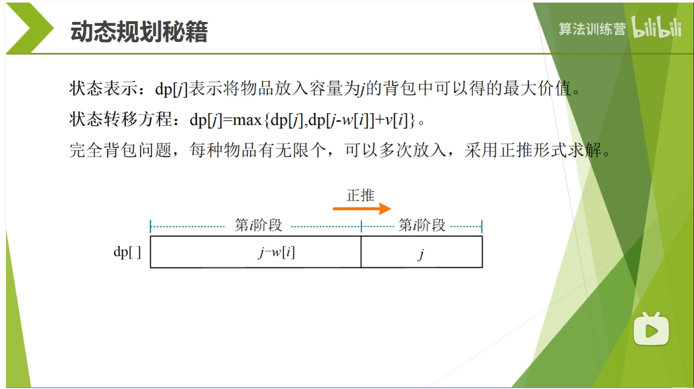
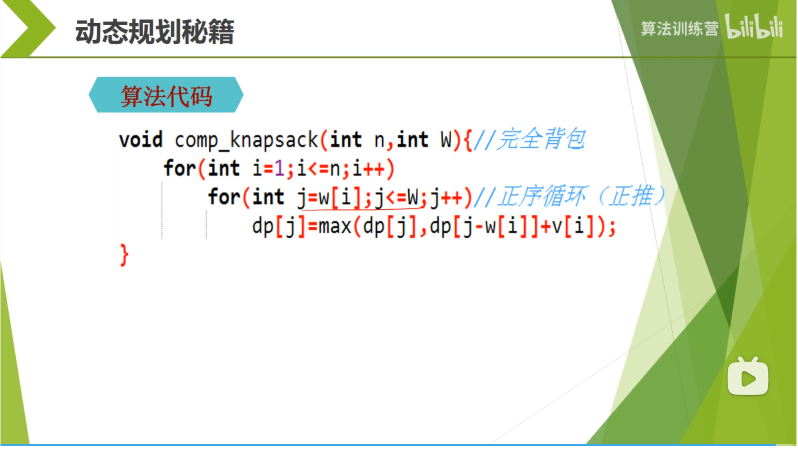
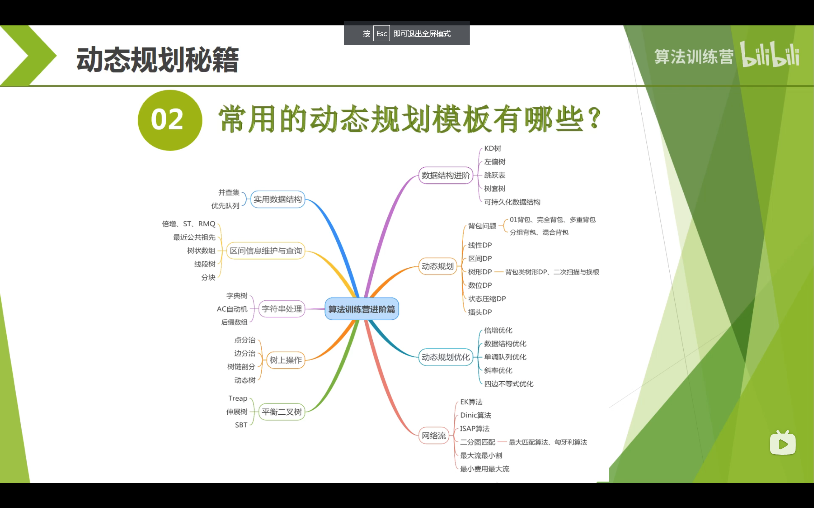
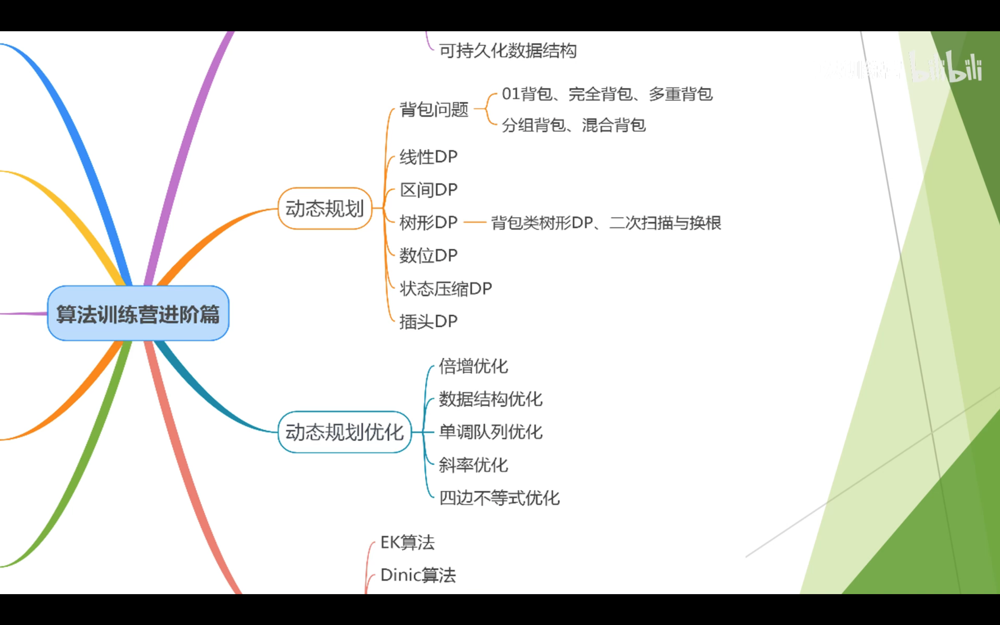

# leetcode笔记

## 二叉树

### [450. 删除二叉搜索树中的节点](https://leetcode.cn/problems/delete-node-in-a-bst/)

二叉搜索树的三个特性：
这些性质最好在面试之前了解清楚：

- 二叉搜索树的中序遍历的序列是递增排序的序列。中序遍历的遍历次序：`Left -> Node -> Right`。

  ```java
  public LinkedList<Integer> inorder(TreeNode root, LinkedList<Integer> arr) {
    if (root == null) return arr;
    inorder(root.left, arr);
    arr.add(root.val);
    inorder(root.right, arr);
    return arr;
  } 
  ```

  

- `Successor` 代表的是中序遍历序列的下一个节点。即比当前节点大的最小节点，简称**后继节点**。 先取当前节点的右节点，然后一直取该节点的左节点，直到左节点为空，则最后指向的节点为后继节点。

  ```java
  public int successor(TreeNode root) {
    root = root.right;
    while (root.left != null) root = root.left;
    return root;
  } 
  ```

  

- `Predecessor` 代表的是中序遍历序列的前一个节点。即比当前节点小的最大节点，简称**前驱节点**。先取当前节点的左节点，然后取该节点的右节点，直到右节点为空，则最后指向的节点为前驱节点。

```java
public int predecessor(TreeNode root) {
  root = root.left;
  while (root.right != null) root = root.right;
  return root;
} 
```


*注意：官方题解给的找后继与前驱节点的函数，都是为了找更低层的节点来进行替换。**并不是严格意义上的后继和前驱节点**。*

作者：LeetCode
链接：https://leetcode.cn/problems/delete-node-in-a-bst/solution/shan-chu-er-cha-sou-suo-shu-zhong-de-jie-dian-by-l/
来源：力扣（LeetCode）
著作权归作者所有。商业转载请联系作者获得授权，非商业转载请注明出处。


## 滚动数组

[滚动数组（简单说明）](https://blog.csdn.net/m0_46427179/article/details/107419492)

[动态规划之滚动数组](https://blog.csdn.net/qq_45888103/article/details/123452741)

[【动态规划秘籍】01背包、一维数组优化、完全背包，一网打尽！](https://www.bilibili.com/video/BV1jT4y1o71J/?vd_source=ada6f000d1772e939ebb2f8afea929b3) ，第42分钟（*）

## 背包问题

### 0-1背包问题

https://www.bilibili.com/video/BV1jT4y1o71J/?vd_source=ada6f000d1772e939ebb2f8afea929b3

一维数组**倒退**即可。



### 完全背包




## 动态规划秘籍

### 001 彻底搞懂动态规划

https://www.bilibili.com/video/BV1oL4y187Fq/?spm_id_from=333.788&vd_source=ada6f000d1772e939ebb2f8afea929b3



### 002 线性动态规划详解

https://www.bilibili.com/video/BV1EL411s7jo/?spm_id_from=333.788&vd_source=ada6f000d1772e939ebb2f8afea929b3

爬楼梯

1、递归（可能会超时）

2、记忆化递归（备忘录memo递归）

3、动态规划

4、动态规划（空间优化）

5、打表法（固定的可枚举的输入，一次运行多次使用）

### 003 0-1背包问题

### 004 多重背包问题详解

https://www.bilibili.com/video/BV1UQ4y1X76y/?spm_id_from=333.788&vd_source=ada6f000d1772e939ebb2f8afea929b3

01背包：每种物品只有1个；

完全背包：每种物品有无穷多个；

多重背包：每种物品有Ci个；

分组背包：第i组有Ci个物品；

多重背包问题，暴力拆分（可能超时）、二进制拆分、数组优化（只能求解存在性问题），一目了然！

#### 二进制拆分

#### 数组优化

若不要求最优性，仅关注可行性（如面值是否能拼成），可使用数组优化。

### 005 区间动态规划详解

https://www.bilibili.com/video/BV1S44y1x7xj/?spm_id_from=333.788&vd_source=ada6f000d1772e939ebb2f8afea929b3

## 图

**分类**：有向图、无向图。

**表示法**：邻接表、邻接矩阵。

**权重：**有权图、无权图。

### 图的搜索

**广度优先搜索**

实现广度优先搜索算法需要一个**先进先出的队列**。

能够保证在无权图中从某个起始节点出发用最短的距离到达目标节点。

**深度优先搜索**

如果访问与某个节点相邻的节点的顺序不同，那么深度优先搜索算法从起点开始到达某个节点的路径也不同。

深度优先搜索从一个节点到达另一个节点并不能保证一定沿着最短路径。


**时间复杂度**

O(v+e)

### 面试题105：最大的岛屿

广度优先搜索

- 基于队列

深度优先搜索

- 基于栈实现深度优先搜索
- 基于递归实现深度优先搜索

