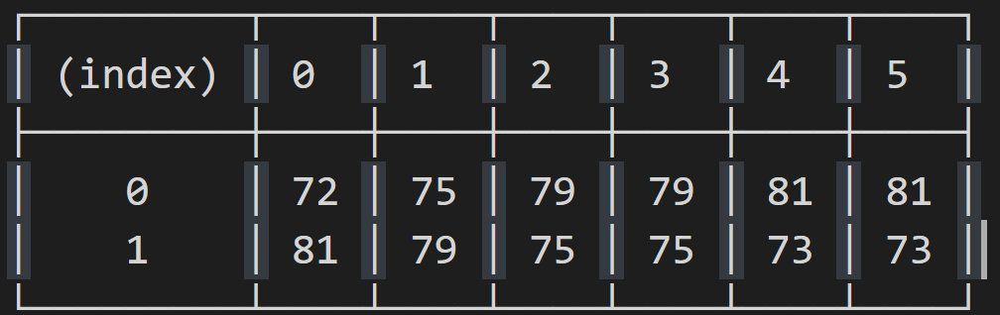

# 学习JavaScript数据结构与算法第3版

`null`表示变量没有值，`undefined`表示变量已经被声明，但尚未赋值。


数组解构也可以用来进行值的互换，而不需要创建临时变量，如下所示。

```
[x, y] = [y, x];
```

这对学习排序算法很有用，因为互换值的情况很常见。


**使用属性存取器**

下面的例子声明了`get`和`set`函数的类。

```js
class Person {
    constructor (name) {
    	this._name = name; // {1}
    }
    get name() { // {2}
    	return this._name;
    }
    set name(value) { // {3}
    	this._name = value;
    }
}

let lotrChar = new Person('Frodo');

console.log(lotrChar.name); // {4}

lotrChar.name = 'Gandalf'; // {5}

console.log(lotrChar.name);

lotrChar._name = 'Sam'; // {6}

console.log(lotrChar.name);
```

### 2.2.9 模块

- 在Node.js中使用原生的ES2015导入功能

将文件的扩展名由js修改为mjs.

在node命令后面添加`--experimental-modules`   来执行代码，如下所示。

```sh
node --experimental-modules 17-ES2015-ES6-Modules.mjs
```

### 2.3.1 类型推断

TypeScript  有一个类型推断机制，会根据为变量赋的值自动给该变量设置一个类型。因此，不需要显式地给这些变量设置类型。

```tsx
let age = 20; // 数
let existsFlag = true; // 布尔值
let language = 'JavaScript'; // 字符串
```

那么，什么时候需要给变量设置类型呢？如果声明了一个变量但没有设置其初始值，推荐为其设置一个类型。如下所示。

### 2.3.4 TypeScript中对 JavaScript 文件的编译时检查

# 第3章 数组

### 3.3.2  在数组开头插入元素

**使用unshift方法**

```js
numbers.unshift(-2);
numbers.unshift(-4, -3);

//[ -4, -3, -2 ]
```

## 3.4 删除元素

### 3.4.1 从数组末尾删除元素  

```js
numbers.pop();  
```

通过 `push` 和 `pop` 方法，就能用数组来模拟栈 。

### 3.4.2 从数组开头删除元素  

```js
numbers.shift();  
```

通过 `shift` 和 `unshift` 方法，我们就能用数组模拟基本的队列数据结构。（？）

## 3.5 在任意位置添加或删除元素  

使用 splice 方法，简单地通过指定位置/索引，就可以删除相应位置上指定数量的元素。  

```js
numbers.splice(5,3);  
```

这行代码删除了从数组索引 5 开始的 3 个元素。  这就意味着 numbers[5]、 numbers[6]和numbers[7]从数组中删除了。  


现在，我们想把数 2、 3、 4 插入数组里，放到之前删除元素的位置上，可以再次使用 splice方法。

```js
numbers.splice(5, 0, 2, 3, 4);  
```

`splice` 方法接收的第一个参数，表示想要删除或插入的元素的索引值。第二个参数是删除元素的个数（这个例子里，我们的目的不是删除元素，所以传入 0）。第三个参数往后，就是要添加到数组里的值（元素 2、 3、 4）。  

## 3.6 二维和多维数组  

### 3.6.1 迭代二维数组的元素  

```js
let averageTemp = [];
// day 1
averageTemp[0] = [];
averageTemp[0][0] = 72;
averageTemp[0][1] = 75;
averageTemp[0][2] = 79;
averageTemp[0][3] = 79;
averageTemp[0][4] = 81;
averageTemp[0][5] = 81;
// day 2
averageTemp[1] = [];
averageTemp[1][0] = 81;
averageTemp[1][1] = 79;
averageTemp[1][2] = 75;
averageTemp[1][3] = 75;
averageTemp[1][4] = 73;
averageTemp[1][5] = 73;

console.table(averageTemp)
```



### 3.6.2 多维数组  

```js
const matrix3x3x3 = [];
for (let i = 0; i < 3; i++) {
    matrix3x3x3[i] = []; // 我们需要初始化每个数组
    for (let j = 0; j < 3; j++) {
        matrix3x3x3[i][j] = [];
        for (let z = 0; z < 3; z++) {
            matrix3x3x3[i][j][z] = i + j + z;
        }
    }
}
```

输出这个矩阵的内容  

```js
for (let i = 0; i < matrix3x3x3.length; i++) {
    for (let j = 0; j < matrix3x3x3[i].length; j++) {
        for (let z = 0; z < matrix3x3x3[i][j].length; z++) {
            console.log(matrix3x3x3[i][j][z]);
        }
    }
}
```

## 3.7 JavaScript 的数组方法参考  

| slice                                                  |
| ------------------------------------------------------ |
| 传入索引值，将数组里对应索引范围内的元素作为新数组返回 |

54