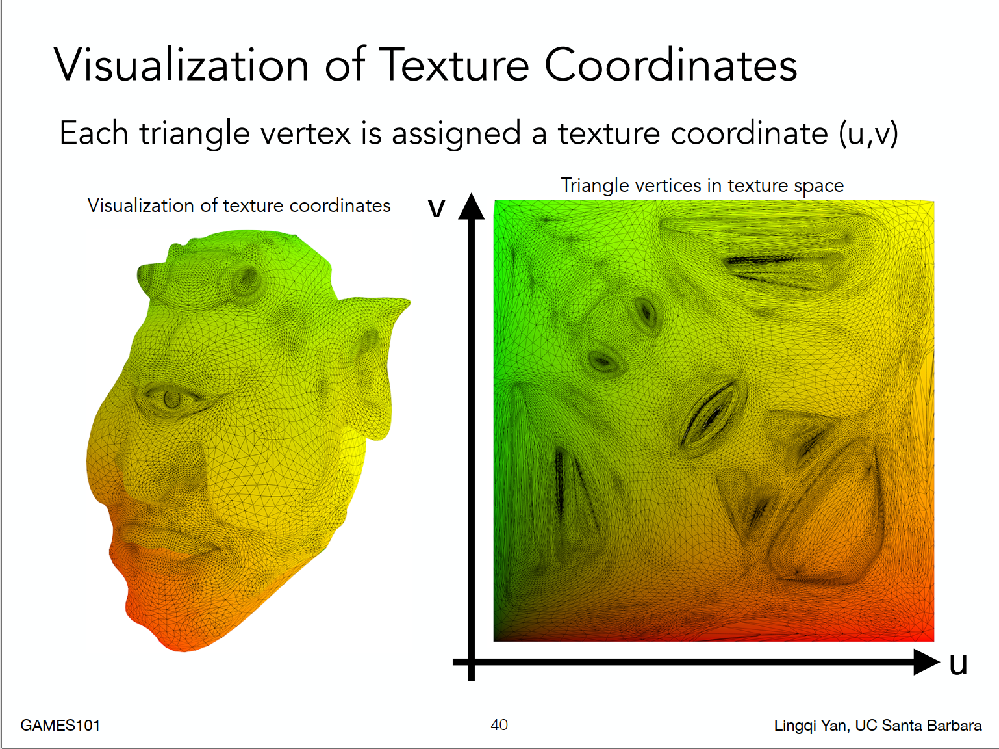
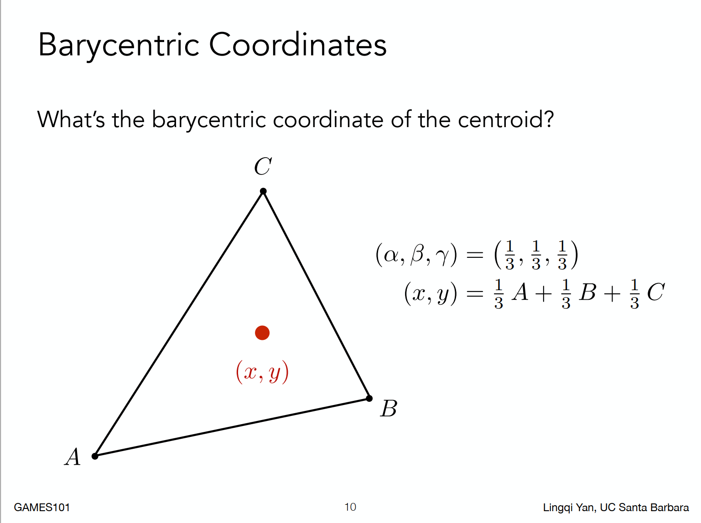

# GAMES101:现代计算机图形学入门

https://games-cn.org/intro-graphics/

https://www.bilibili.com/video/av90798049?vd_source=ada6f000d1772e939ebb2f8afea929b3

## 第3讲 变换

Homogeneous coordinates（齐次坐标）

x'、y'读音：x prime，y prime.

## 第5讲 

判断点是否在三角形内部，用向量的叉乘(cross product)。

## 第6讲 栅格化2（反锯齿和Z-Buffering）

sample artifacts(mistake/inaccuracy/)

aliases:走样

## 第7讲 着色1

Visibility/occlusion（遮挡）

z-buffering/depth-buffering

## 第8讲 着色（光照与基本着色模型）

定义每个顶点的法线方向：相邻面的法线方向的（加权）平均值。

### Graphics Pipeline  

这个流程是在GPU里面处理的。

### Shader Programs  

顶点着色器，片元/像素/片段着色器

### Snail Shader Program  

Shadertoy

### 纹理映射

3维物体的表面是2维的。纹理就是一张图。

纹理坐标系

不管是否正方形，长宽比多少，通常认为UV范围都在[0-1]范围之内。

## 第9讲  着色3 (纹理映射续.)  

Texture Mapping cont.  

### Interpolation Across Triangles:Barycentric Coordinates(重⼼坐标)  

重心把三角形分成3个等面积的小三角形。

然而，重心坐标在投影下不是不变的！

### 纹理放大（纹理偏小）

A pixel on a texture — a **texel**(纹理元素、纹素)  

### 纹理偏大

远处会出现摩尔纹，近处出现锯齿。

Point Query vs. (Avg.) Range Query  

**Mipmap**
Allowing (fast, approx., square) range queries  

mipmap可以提前生成。pixel pyramid

Mipmap有个缺陷，会overblur.

**Anisotropic Filtering  (各向异性过滤)**

Ripmap，对矩形区域有效，斜着的区域无效。

## Lecture 10:  Geometry 1 (Introduction)

### 纹理应用

Environment Map  