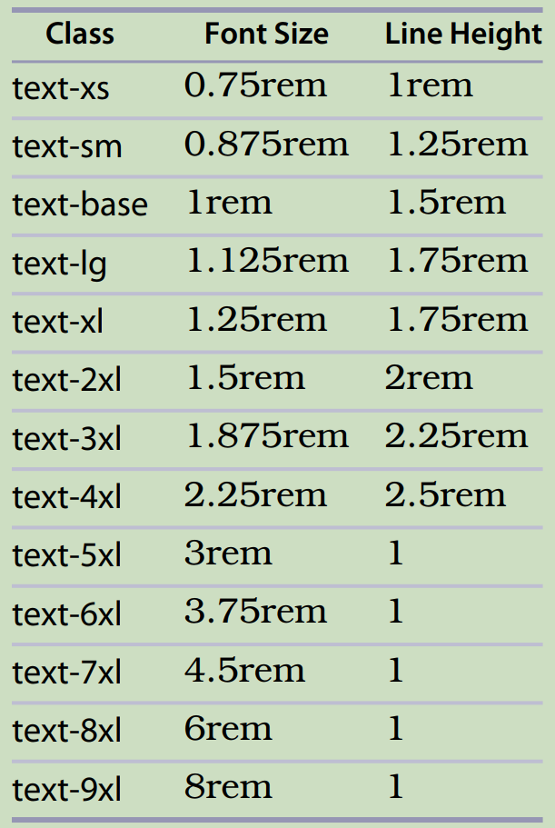

# 书籍

- Modern CSS with Tailwind Flexible Styling Without the Fuss - Second Edition.2022.pdf

Tailwind 3.0  

- Ultimate Tailwind CSS Handbook-Build sleek and modern websites with immersive UIs using Tailwind CSS.epub

  2023

- 

# 网站

https://tailwindcss.com/docs/installation/using-vite

# Modern CSS with Tailwind, Second Edition

May 2022

Tailwind 3.0

https://pragprog.com/titles/tailwind2/modern-css-with-tailwind-second-edition/


# 第1章 开始使用 Tailwind

## Tailwind CLI 的作用是什么

定义所有这些潜在的 CSS 类（其中绝大多数实际上并不会被用到），然后将它们全部发送到浏览器，将会造成严重的性能问题。为了避免这个问题，Tailwind 使用了一种 即时（Just-In-Time，简称 JIT）引擎，它可以检测出你实际使用了哪些 CSS 类，并限制所定义的 CSS 数量，只生成你项目中实际用到的 CSS。

为此，Tailwind 提供了一个 命令行界面（Command-Line Interface，简称 CLI），你的前端构建工具（如 Webpack、Vite 等）可以通过这个 CLI 来生成你的项目所需的 CSS。

## 使用样例代码

有了独立的命令行工具后，你可以修改现有代码或在 html 目录中添加新的 HTML 文件。然后，当你运行命令 ./tailwindcss -o css/output.css 时，它会重新解析这些 HTML 文件并重新生成 css/output.css 文件。别担心，我们会在本书后面详细讲解这条命令的各个部分都做了什么。

## 将 Tailwind 添加到你的应用中

## Utilities  

虽然 Tailwind 为尺寸、颜色等属性提供了一套默认值，但你也可以通过在数值两侧加上方括号的方式使用任意自定义值。例如，当需要设置一个非常规外边距时，可以使用 m-[104px] 来定义 104 像素的外边距——这个数值并不在 Tailwind 默认提供的尺寸范围内。通常来说，在任何需要填写变量占位符的地方，你都可以用方括号插入自定义值。

这类任意值主要用于一次性特殊调整。如果你发现自己反复使用同一个自定义值，建议将其添加到配置文件中，这样既能全局复用该值，又能保持设计的一致性。

你甚至可以用方括号插入一整个 CSS 样式属性（当 Tailwind 原生不支持某个属性时），比如 [mask-type:alpha] 这种特殊样式声明。

## Preflight  

## 重复问题

在使用 Tailwind CSS 时，为了实现设计目标，常常需要编写一长串类名列表，而如何管理其中的重复内容是一个常见问题。也就是说，如果像我们在第 xi 页“介绍”部分所做的那样，每次给 <h1> 元素都设置 class="text-6xl font-bold text-blue-700"，每次使用时都保持一致，这不是要输入很多内容吗？要是你的 <h1> 设计发生变化，又该怎么办呢？

### 代码中重复问题的管理

Tailwind 确实有办法管理 CSS 类名列表的重复问题，但同时也建议你将重复问题视为整体代码架构的一部分，而不仅仅是一个 CSS 方面的问题。无论你使用什么工具来构建 HTML 标记，很可能已经使用了组件或函数机制来减少代码重复。使用 Tailwind 时，把 CSS 类名列表也当作代码的一部分是个不错的主意。

例如，如果你使用的是 React，那么你可以使用组件。许多其他客户端框架也提供组件功能。与其在 CSS 中管理重复内容，你可以创建带有常用 Tailwind 类名的 React 组件。


在纯 JavaScript 里，你也可以创建一个返回 Tailwind 类名列表的函数：

```javascript
const title = () => { return "text-6xl font-bold text-blue-700" }
```
而在 React 中，你可以这样使用这个函数：
```jsx
<Component className={title()}>Cool Text</Component>
```

如果你不喜欢上述这些语法选项，更倾向于采用基于 CSS 的方式来解决类名重复问题，那么 Tailwind 提供了一个名为 `@apply` 的 CSS 指令和一个名为 `@layer` 的指令，接下来我们将对其进行介绍。 

### Using @apply for Duplication  

`@apply` 指令允许你在其他 CSS 选择器的定义中使用 Tailwind 类名。因此，我们可以像这样在 CSS 中重新定义我们的标题类名：

```css
@layer components {
  .title { @apply text-6xl font-bold }
  .subtitle { @apply text-4xl font-semibold }
  .subsubtitle { @apply text-lg font-medium italic }
}
```
然后，你可以像使用其他任何 CSS 类一样使用这些类：
```html
<div class="title">Title</div>
```

`@layer` 指令可以取值为 `base`、`components` 或者 `utilities`。就浏览器而言，如果你使用了 `@layer`，那么无论选择器定义实际上在 CSS 文件中的哪个位置，这些选择器都会被定义为你所声明的层的一部分。

使用 `@layer components` 会将选择器定义为客户端组件层的一部分，并且排在实用工具层之前。这意味着如果你将自己定义的类与 Tailwind 实用工具类结合使用，实用工具类的样式会生效，这正是我们期望的结果。所以，我们可以定义一个超大标题，如下所示：
```html
<div class="title text-5xl">Title</div>
```

要理解 `@layer` 为何重要，你需要了解 CSS 的一个通用原则：在其他条件相同的情况下，如果两个 CSS 类试图调整同一个底层属性，最后定义的那个类生效。（如果你熟悉 CSS，就会知道还有一个特异性原则，即最具体的定义生效，但由于所有 Tailwind 实用工具类的特异性都相同，所以在这里这不是问题。） 

在 CSS 文件中，如果针对同一个 CSS 选择器有两个定义，并且它们设置了相同的属性，那么文件中靠后定义的选择器会生效。在 Tailwind 中，如果有两个实用工具类定义了同一个属性，那么在类名列表中靠后的那个类会生效，所以 `class="text-xl text-2xl"` 会让文本显示为 2xl 大小。

通过在某一层中定义自定义选择器，该选择器会在该层的末尾加载，并在下一次层之前加载。这对于自定义 CSS 如何与其他 Tailwind 实用工具类或 CSS 进行交互会产生一些影响。

例如，我们可以通过在标签（而非类选择器）上使用 `@apply`，将我们的定义作为 HTML 的一部分。在这种情况下，我们将定义放在基础层（base layer）中：
```css
@layer base {
  h1 { @apply text-4xl font-bold }
  h2 { @apply text-2xl font-semibold }
  h3 { @apply text-lg font-medium italic }
}
```
这里，我们直接重新定义了 `<h1>`、`<h2>` 和 `<h3>` 元素，因此可以这样使用：
```html
<h1>Title</h1>
```

由于这些定义位于基础层，它们会在所有实用工具类之前生效，所以 `<h1 class="text-6xl">` 会如你所期望的那样，让 `text-6xl` 生效并优先显示。如果 `<h1>` 是在实用工具层中定义的，那么 `<h1>` 的定义会优先生效，因为它比 `text-6xl` 定义得更靠后。

而且，由于我们将层移动到了基础层，Tailwind 会将其视为预检样式（Preflight styles）的一部分，并在定义任何组件之前进行加载。同样，这样的放置方式允许你按照预期混合使用标签、组件和实用工具类。 

这一切都非常有用，它让你能够有效地以 Tailwind 实用工具为基础构件，搭建出属于自己的框架。但需要意识到的是，你实际上是在构建一个框架，并且需要承担由此带来的所有命名和维护责任。

## Modifiers  

## CSS 单位

# 第3章 字体

## 大小和形状

默认情况下，文本大小使用的是 `text-base` 类，它定义了以下 CSS 属性：`font-size: 1rem` 和 `line-height: 1.5rem`。这意味着 `text-base` 的字体大小与你页面根元素（通常是 `<html>`）的字体大小一致，而行高则是该字体大小的 **1.5 倍**。Tailwind 提供了一系列文本大小相关的实用工具类，即 `text-{size}`，其中包含 **两个更小的字号**、**十个更大的字号**，以及基础的 `text-base`，总共提供了 **十三个不同的字号选项**。每个字号都同时定义了字体大小和行高，具体数值可参考第 20 页的表格。



这是我们首次接触到 Tailwind 的一个明确设计目标：**为可能无限变化的数值提供一套一致的、有规律的步进选项**。通过 `text-{size}` 这一系列工具类，Tailwind 让你在整个网站中保持字体大小和间距的一致性变得非常简单。如第 10 页「实用工具（Utilities）」一节中提到的，你还可以使用方括号语法来定义任意值作为字号，比如 `text-[20px]`；需要注意的是，你不仅要写数字，还必须带上单位。

关于字体样式——比如基本的粗体、斜体、下划线等——虽然它们是由不同的 CSS 属性控制的，但在 Tailwind 中，这些样式都被封装成了简单的实用工具类，例如：  
- `italic` 和 `not-italic`（斜体 / 非斜体）  
- `underline` 和 `no-underline`（下划线 / 无下划线）

你通常只有在希望文本在不同状态下呈现不同样式时，才会用到 `not-italic` 和 `no-underline`，这一般与响应式行为（即在不同屏幕尺寸下的表现）有关，我们将在第 7 章「响应式设计（Responsive Design）」（第 61 页）中进一步探讨。此外，你还可以使用 `overline`（上划线）和 `line-through`（删除线）。

对于粗体字体，CSS 提供了从 100 到 900 的九个字重等级，其中普通文本的字重是 400。Tailwind 同样提供了九个对应的实用工具类，每个类对应一个字重等级：

- `font-hairline`（极细，相当于 100）
- `font-thin`（细体，相当于 200）
- `font-light`（轻体，相当于 300）
- `font-normal`（正常，相当于 400）
- `font-medium`（中等，相当于 500）
- `font-semibold`（半粗，相当于 600）
- `font-bold`（粗体，相当于 700）
- `font-extrabold`（特粗，相当于 800）
- `font-black`（极粗，相当于 900）

这些类可以让你精确控制文本的粗细程度，从而实现更细致的排版效果。

## Color 和 Opacity  

文本颜色的实用工具类遵循 `text-{color}` 的命名模式。其中有三个特殊的颜色类：

- `text-transparent`（透明文本）：将文本设置为完全透明，这样你可以透过文本看到背景颜色。这个类有时可用于视觉效果，尤其是配合 `bg-clip-text`（背景裁剪到文本形状）一起使用时，可以让背景呈现出与文本轮廓一致的形状。
  
- `text-inherit`（继承颜色）：使用从父元素继承的颜色。这是一个常用的“重置”类，当你希望文本颜色与父级保持一致时可以使用它。

- `text-current`（当前颜色）：使用 CSS 的 `currentColor` 属性。`currentColor` 通常用于将其他颜色属性（如边框、阴影等）设置为与文本颜色相同。对于文本本身来说，`text-current` 的表现应该与 `text-inherit` 类似。

此外，Tailwind 还明确定义了两个基础颜色类：

- `text-black`：将文本颜色设置为纯黑色，对应的颜色值是 `#000000`。
- `text-white`：将文本颜色设置为纯白色，对应的颜色值是 `#ffffff`。

这些类为你提供了灵活的方式来控制文本颜色，无论是使用主题色、语义色，还是特殊效果，都能轻松实现。

## Alignment 和Spacing  

## 特殊文字

Tailwind 允许你使用修饰符来匹配一些你可能想要区别对待的文本类型的 CSS 伪类。

该修饰符适用于用户选中的文本，因此你可以为其应用颜色（如 `selection:bg-red-400`）或其他样式（如 `selection:font-bold`）。如果将 `selection` 修饰符应用于父元素，它将自动应用到所有子元素上。

如果你喜欢报纸或杂志风格的排版效果，Tailwind 提供了 `first-line` 和 `first-letter` 修饰符。这通常适用于设置首行或首字母的大小和字重，比如：`first-letter:text-9xl`、`first-letter:font-bold`、`first-line:text-2xl` 等。

此外，Tailwind 还允许使用 `before:` 和 `after:` 作为修饰符，对应 CSS 的 `::before` 和 `::after` 伪类，它们可以用来插入不会出现在 DOM 中的内容。不过，在大多数情况下，使用实际的 HTML `<span>` 标签将内容放在正确的位置，会比使用 CSS 的 `before` 和 `after` 工具类更加简单和有效。

# 第4章 The Box  

## Padding 和Margins  

内边距（padding）和外边距（margin）并不是紧挨在一起的——它们之间总是隔着边框（border）。但 Tailwind 对它们的处理方式足够相似，因此我们可以很方便地将它们放在一起讨论。

据我统计，Tailwind 提供了 **245 个不同的类** 来管理内边距（不包括任意值）。这里我不会一一列出它们（不过 Tailwind 官方文档中有完整列表），因为它们都遵循一个规律：**p{方向}-{尺寸}**。

所有的内边距类都以 **p** 开头，后面可以跟一个可选的字符来表示方向。一共有六个方向：

- **t**：top（顶部）
- **b**：bottom（底部）
- **l**：left（左侧）
- **r**：right（右侧）
- **x**：horizontal（水平方向，即左右两边）
- **y**：vertical（垂直方向，即上下两边）

如果没有指定方向字符，那么内边距会应用到 **所有方向**。

默认情况下，Tailwind 定义了 **34 个数值尺寸**，可用于设置内边距和外边距。其中有一个特殊尺寸 **px**，等于 **1 像素**。

这些尺寸分别是：

> 0, 0.5, 1, 1.5, 2, 2.5, 3, 3.5, 4, 5, 6, 7, 8, 9, 10, 11, 12, 14, 16, 20, 24, 28, 32, 36, 40, 44, 48, 52, 56, 60, 64, 72, 80, 96

每个数字对应的单位是 **0.25rem**，也就是页面根元素字体大小的 **四分之一**。

举个例子：

- `.p-10` 表示在 **所有方向** 上添加 **2.5rem** 的内边距
- `.px-4` 表示在 **水平方向（左右）** 上添加 **1rem** 的内边距
- `.pr-1.5` 表示在 **右侧** 添加 **0.375rem** 的内边距
- `.pt-px` 表示在 **顶部** 添加 **1 像素** 的内边距

这样设计的目的是在小尺寸上给你更精细的控制，而在较大的内边距值上则提供一组统一的数值。你还可以为不同方向组合使用多个内边距类，比如：  
**`class="px-10 py-20"`**，表示水平方向内边距为 10，垂直方向内边距为 20。

> **尺寸模式**
>
> 这种尺寸设定模式是 Tailwind 中用于多个不同属性的通用模式。我们在这里看到了它在内边距上的应用，比如 `p-24`，但它同样适用于外边距（如 `m-24`）、高度（如 `h-24`）和宽度（如 `w-24`）。
>
> 在所有这些情况下，你都可以使用方括号来指定任意尺寸和单位，比如 `p-[15px]`。

## Borders  

## 背景色

### 阴影

### 梯度

Tailwind 还允许你将背景设置为渐变效果，但这需要你在同一个元素上设置多个类。我认为这是我们第一次遇到需要使用多个 Tailwind 类才能实现某个效果的情况，随着我们在下一章探讨页面布局选项，这种模式会越来越常见。

在纯 CSS 中，你通过给 `background-image` 属性赋值为 `linear-gradient` 函数来实现渐变。你需要指定一个方向、“起始色”（即渐变的起点颜色）和“结束色”（即渐变的终点颜色）。你还可以选择性地指定一个“中间色”（via color），也就是渐变过程中的过渡色。

Tailwind 提供了一系列工具类，其命名模式为 `bg-gradient-to-{方向}`，其中方向可以是四个基本方位：`t`（顶部）、`b`（底部）、`r`（右侧）和 `l`（左侧）。例如，`bg-gradient-to-t` 表示渐变的“起始色”从底部开始，逐渐过渡到位于顶部的“结束色”；而 `bg-gradient-to-r` 则表示“起始色”在左侧，“结束色”在右侧。

此外，还有四个角方向：`tl`（左上）、`tr`（右上）、`bl`（左下）和 `br`（右下），它们组合起来可以实现对角线渐变。例如，`bg-gradient-to-tr` 表示从左下角到右上角的对角线渐变。

如果你想清除渐变效果，可以使用 `bg-none`。

在设置了方向之后，我们就可以添加颜色了。我们使用之前已经见过的那些颜色名称，但需要加上前缀：`from-`（起始色）、`to-`（结束色）和 `via-`（中间色）。例如，如果你想实现从红色到蓝色、并且是从右到左的渐变，你需要使用以下三个类：

```css
bg-gradient-to-l from-red-500 to-blue-500
```

## 背景图

## Filters  

## 宽高

在 CSS 中，元素的高度和宽度是出了名的难以控制。Tailwind 提供了一些用于设置尺寸的工具类，但请记住，尺寸通常也取决于父级元素和内容本身所允许的空间大小。

Tailwind 使用 `w-{尺寸}` 和 `h-{尺寸}` 的模式来定义宽度和高度的工具类。对于这两个方向，Tailwind 都提供了一组固定尺寸选项，这些选项基于与我们之前看到的内边距（padding）和外边距（margin）相同的尺寸等级和数字体系，每个数字对应 0.25rem。

特殊选项包括：

- `-auto`：自动尺寸  
- `-px`：单像素宽度/高度  
- `-full`：占满父容器的 100%  
- `-screen`：占满视口的 100%  
- `-min`：最小内容尺寸（CSS 中的 `min-content`）  
- `-max`：最大内容尺寸（CSS 中的 `max-content`）  
- `-fit`：适合内容的尺寸（CSS 中的 `fit-content`）

你可以将这些用在诸如 `h-0`、`w-8` 或 `h-px` 这样的类中。其中：

- `-min` 表示将盒子尺寸设为内容所需的最小宽度/高度；  
- `-max` 表示扩展到内容所需的最大宽度/高度；  
- `-fit` 表示在 `min-content` 和 `max-content` 之间找到一个合适的、能容纳内容的最大宽度/高度。

# 第5章 页面布局

## 容器

`container`  

许多CSS框架使用一个容器类作为通用的顶层容器来指定页面宽度。虽然Tailwind也提供了一个容器工具类，但Tailwind中的这个版本相比其他框架中类似的类功能要简单得多。在Tailwind中，容器工具类唯一的作用就是根据浏览器视口的宽度来设置元素的最大宽度（max-width）。例如，在视口宽度介于640到768像素之间时，最大宽度会被设为640像素；当视口宽度超过768像素后，最大宽度会保持在768像素，直到视口达到1024像素，之后再在视口达到1280像素时再次跳跃调整。

使用容器的优势在于，它让你只需关注这些特定的宽度来进行设计，而无需考虑视口可能出现的任何宽度。

如果你熟悉其他框架，那么你可能会发现 Tailwind 的容器类并不包含你预期的那些功能。Tailwind 的容器不会自动将其子元素水平居中。若要实现居中效果，你需要将容器与 mx-auto 工具类配合使用。同样，Tailwind 的容器也不会通过添加内边距或外边距，使其内容与浏览器边缘保持一定距离。若要实现这一效果，你需要将容器与 m- 或 p- 工具类配合使用。因此，你顶层元素的合理类名组合可能是：class="container mx-auto py-12 px-6"。

## Floats and Clears  

尽管一个全新的设计很可能会使用本章后续介绍的网格和弹性盒工具来定位元素，但如果你是在一个遗留项目中使用 Tailwind，你可能仍需要处理浮动（float）和清除浮动（clearfix）。

在 CSS 中，float 属性用于控制其容器内的内容如何定位。通常，float 属性被用来将某个特定元素（通常是图片）放在容器的某一侧，从而使容器的其余部分（通常是文本）完全位于另一侧，而不是让这些元素混在一起。

Tailwind 提供了 float-left 和 float-right 用于设置左浮动和右浮动，以及 float-none 作为重置选项。

CSS 的 clear 属性则强制某个元素被放置在可能与之重叠的浮动元素的下方（可以是一侧或两侧）。（从技术上讲，它是阻止其他元素浮动，从而达到同样的效果。）Tailwind 提供了用于指定清除行为在左侧、右侧、两侧或不进行清除的工具类：clear-left、clear-right、clear-both 和 clear-none。

## Position and Z-Index  

在 CSS 中，z-index 属性是一个整数值，用于决定元素沿着“z 轴”（即垂直于屏幕向外延伸的假想轴）的堆叠顺序。Tailwind 提供了 z-{index} 这一模式，其中 index 可以是 0、10、20、30、40、50 或 auto。你也可以使用负值的 z-index，比如通过 -z 模式，如 -z-20，或者使用任意值，如 z-[-1]。

## Tables  

## Grids  

网格最常见的用途是将页面划分为一系列列，你可以在 Tailwind 中使用 grid-cols-{count} 辅助类来实现这一点。这些类从 .grid-cols-1 到 .grid-cols-12，每个类会将页面分成相应数量的列。如果想要退出网格布局，可以使用 grid-cols-none 作为重置。

与其他一些 CSS 网格框架不同，你不需要显式地指定行。在网格中，CSS 会根据你声明的列数自动向下填充到下一行。例如，你可以这样使用：

```html
<div class="grid grid-cols-2 w-1/4 gap-4">
    <div class="border bg-gray-300 text-center">A</div>
    <div class="border bg-gray-300 text-center">B</div>
    <div class="border bg-gray-300 text-center">C</div>
    <div class="border bg-gray-300 text-center">D</div>
</div>
```

### 起始/终止

你可以通过指定网格项的起始和结束位置来调整它的位置，使用的是 **col-start-{列号}** 和 **col-end-{列号}**，或者 **row-start-{行号}** 和 **row-end-{行号}**，其中后缀可以是具体的数字位置，也可以是 reset 值 **auto**。

关键点如下：

- **起始位置（start）的最小值是 1**
- **结束位置（end）是排他性的（exclusive）**，也就是说它本身不包含在网格项中。  
  比如，你写 `class="col-start-2 col-end-4"`，表示该元素会占据第 2 列和第 3 列，但不包括第 4 列。
  
- 默认情况下，起始和结束位置是由网格中前面已放置的元素自动决定的，而且默认的跨度（span）为 1。

你只需要明确指定 **起始、结束、跨度（span）中的任意两个**，布局就能正确计算出来。

例如，`class="col-span-3 col-end-5"` 表示该元素：
- 跨越 3 列（col-span-3）
- 在第 5 列之前结束（col-end-5）

这意味着它实际占据的是第 2 列、第 3 列和第 4 列（共 3 列），并且不会延伸到第 5 列。

换句话说，你可以通过灵活组合这些属性，精确控制网格项在网格布局中的位置和大小。

## Columns  

## Flexbox  

### Direction and Axis  

### Order and Wrap  

### Grow, Shrink…Flex  

“flex”（弹性）这个词来源于 **flexbox 容器能够动态地改变其内部项目的尺寸和排列方式** 的能力。Tailwind 提供了一些常用的默认配置。这些配置是应用在 **flexbox 内部的子元素上** 的属性，而不是应用在父容器上的。

如果你想指定一个 flexbox 内部元素的尺寸，可以使用 Tailwind 的 **basis-{size}** 类，这些类对应的是 CSS 的 **flex-basis** 属性。**Flex basis（弹性基准）** 指定了元素沿 flex 主轴方向的尺寸，对于横向（row）布局来说就是宽度，对于纵向（column）布局来说就是高度。

如果设置了 flex-basis，那么在 flexbox 内部的元素将优先使用这个值，而不会使用常规的 width 或 height 属性。**basis 的尺寸选项几乎与 width 的选项相同**，包括从 0 开始的标准数值，最大可以到 80，也支持分数单位，比如二分之一（1/2）、三分之一（1/3）、四分之一（1/4）、五分之一（1/5）、六分之一（1/6）、十二分之一（1/12），另外还支持 **auto**、**px** 和 **full**，比如你可以使用：**basis-4**、**basis-3/5** 或者 **basis-auto**。另外别忘了，你还可以使用任意值，比如 **basis-[20px]**。

如果没有明确指定某个具体的宽度，flexbox 会自动伸缩内部的元素，以填满可用的空间。

如果你**不希望某个特定元素伸缩**，可以给它设置 **flex-none**，这样它就会保持其默认尺寸，既不会放大也不会缩小。

如果你**希望某个元素根据容器的可用空间自动伸缩**，可以使用 **flex-auto** 或 **flex-1**。这两者的区别在于：

- **flex-auto** 会以元素的默认尺寸为基础，然后根据需要放大或缩小，只对那些允许伸缩的元素生效；
- **flex-1** 则会将所有元素的初始尺寸都视为 0，然后**平均分配所有可用空间**，**不考虑它们原本的大小**。

一般来说，**在一组元素上使用 flex-1，会让它们变得大小相等；而使用 flex-auto，则不会让它们变得一样大。**

你也可以选择**单独控制收缩行为，而不影响伸展行为**：

- 如果你**允许收缩**，就使用 **flex-shrink**（这是默认行为）；
- 如果你**禁止收缩**，就使用 **flex-shrink-0**。

同理：

- **flex-grow** 是允许元素伸展（放大）的默认行为；
- **flex-grow-0** 则是**禁止元素伸展**，但不会影响其收缩行为。

## Box Alignment  

除了使用 flexbox 来在页面上放置元素之外，Tailwind 还提供了一些工具类，允许你更精确地控制 flexbox 内部元素的对齐和分布方式。这些工具类在适当的情况下也适用于网格布局。

我之前提到过，flexbox 容器有一个主轴（main axis）和一个交叉轴（cross axis）。Tailwind 中那些影响元素沿主轴方向放置的工具类都以 **justify-** 开头，而影响元素沿交叉轴方向放置的工具类则不是以 justify- 开头。这些命名方式是为了与底层 CSS 属性的名称保持一致。

### 主轴

我们先来看主轴（main axis）。沿主轴方向，元素的放置方式可以通过两种途径来指定：一种是元素在整个 flexbox 容器的主轴方向上的整体排列方式，另一种是单个元素在其自身盒子（位于 flexbox 容器内）的主轴方向上的位置。这两种放置方式可以分别定义，并且包含一些工具类，这些工具类是作用于 **父级 flexbox 容器** 上的，而不是作用于单个元素上。

当沿主轴方向放置元素时，Tailwind 提供了一系列工具类，用于控制在**所有元素的总宽度小于 flexbox 容器宽度的情况下**，这些元素是如何排列的。这些工具类控制了**额外空间的分配方式**。

有三种工具类会将元素尽可能紧密地挤在一起：

- **justify-start** 将元素放置在主轴的起始端，具体取决于文本方向。
- **justify-end** 将元素放置在主轴的末端。
- **justify-center** 将元素居中 —— 这是一个长期存在的 CSS 痛点。

还有三种工具类会在元素之间添加间距，它们的区别在于**具体把间距放在什么位置**：

- **justify-between** 将第一个元素紧贴 flexbox 的起始端，最后一个元素紧贴 flexbox 的末端，然后在内部元素之间均匀分配剩余空间。如果 flexbox 中有三个元素，你会得到两个大小相同的间距，排列模式为 **AxBxC**。
- **justify-evenly** 在每个元素周围放置**等量的间距**。如果 flexbox 中有三个元素，那么会在它们周围放置四个大小相同的间距，排列模式为 **xAxBxCx**。
- **justify-around** 在每个元素的每一侧都放置**相同的间距**。实际上，这样做会使末端的间距比内部间距小，因为每个内部间距都包含了前一个元素的右侧间距和后一个元素的左侧间距。如果 flexbox 中有三个元素，你会得到六个大小相同的间距，排列模式为 **xAxxBxxCx**。

一个元素在其自身盒子（即 flexbox 容器内的单个项目区域）中的位置，可以通过**在容器上使用相应的类**来控制。相关的工具类包括：

- **justify-items-start**：将元素放置在其盒子的起始端；
- **justify-items-end**：将元素放置在其盒子的末端；
- **justify-items-center**：将元素放置在其盒子的中央。

如果你希望该元素**扩展以填满其所在的空间**，可以使用 **justify-items-stretch**；若要重置为默认行为，则使用 **justify-items-auto**。

需要注意的是，通常情况下，你要么使用常规的 **justify-{option}** 工具类来控制**整个 flexbox 容器内所有元素之间的间距或排列**，要么使用 **justify-items-{option}** 工具类来控制**每个元素在其自身盒子内的对齐方式**，但一般**不需要同时使用两者**。

如果**某个单独的元素想要覆盖容器的整体对齐方式**，你可以为该元素使用 **justify-self-{option}**，它提供了与 **justify-items** 相同的五个选项，即：**start、end、center、stretch、auto**。

### 交叉轴

