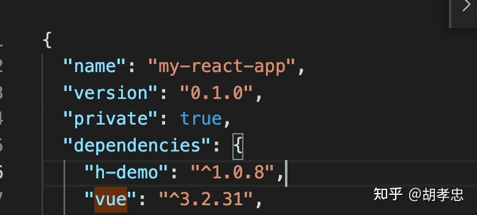
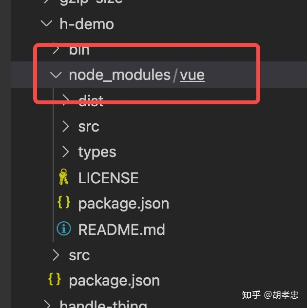
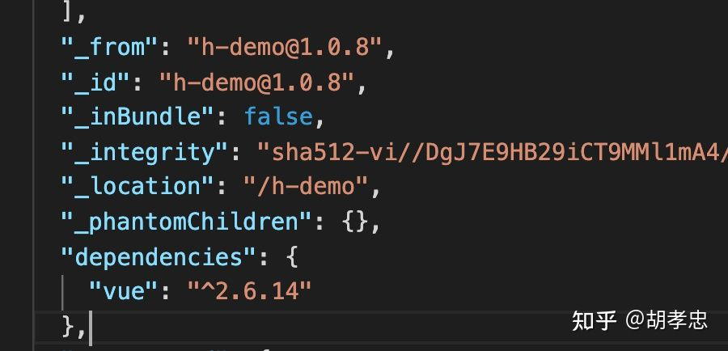

# package.json

https://zhuanlan.zhihu.com/p/470698799

## peerDependencies

用于放置当前package中使用的依赖，而且会在引用的项目中会存在的依赖。放在peerDependencies中的依赖不会再当前package中下载，而会使用引用的项目中的依赖。

如果package中放在peerDependencies的依赖，但是项目中不存在依赖，同样会报错。

比如：项目A中存在react，package B是一个基于react的依赖包，package B 就不需要自己安装一份react，因为使用它的项目A必然存在react。

## dependencies

如果在package中添加了某个依赖在dependencies中，如果在引用的项目中不存在该依赖，此依赖会安装到项目全局范围。如果引用的项目存在该依赖，则项目中会出现两份依赖，一份安装在全局范围，一份安装到package下。

下图情况就是，当前项目含有Vue依赖 引入的h-demo包自身带有一个放在dependencies中的依赖 则项目会出现两个Vue

**项目package.json**

**h-demo package.json文件**

