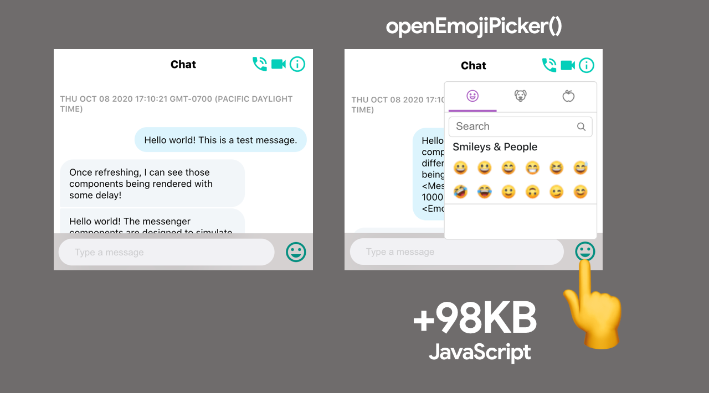

# Learning JavaScript Design Patterns

https://www.patterns.dev/posts/singleton-pattern/

## Design Patterns

### 单例模式

`Object.freeze` 方法确保消费代码不能修改 Singleton。 无法添加或修改冻结实例上的属性，这降低了意外覆盖 Singleton 上的值的风险。

```js
let instance;
let counter = 0;

class Counter {
  constructor() {
    if (instance) {
      throw new Error("You can only create one instance!");
    }
    instance = this;
  }

  getInstance() {
    return this;
  }

  getCount() {
    return counter;
  }

  increment() {
    return ++counter;
  }

  decrement() {
    return --counter;
  }
}

const singletonCounter = Object.freeze(new Counter());
export default singletonCounter;
```

#### 优/缺点

但是，上面示例中显示的类实现实际上是矫枉过正。 由于我们可以直接在 JavaScript 中创建对象，因此我们可以简单地使用常规对象来实现完全相同的结果。 让我们来介绍一下使用单例的一些缺点！

##### 使用常规对象

```js
let count = 0;

const counter = {
  increment() {
    return ++count;
  },
  decrement() {
    return --count;
  }
};

Object.freeze(counter);
export { counter };
```

#### 全局行为

但是，单例的常见用例是在整个应用程序中拥有某种全局状态。 让代码库的多个部分依赖同一个可变对象可能会导致意外行为。

通常，代码库的某些部分会修改全局状态中的值，而其他部分会使用该数据。 这里的执行顺序很重要：我们不想在没有数据要消费的时候（还）不小心先消费数据！ 随着应用程序的增长以及数十个组件相互依赖，使用全局状态时理解数据流可能会变得非常棘手。

#### React 中的状态管理

在 React 中，我们经常通过 **Redux** 或 **React Context** 等状态管理工具来依赖全局状态，而不是使用 Singletons。 尽管它们的全局状态行为可能看起来类似于单例，但这些工具提供了**只读状态**而不是单例的可变状态。 使用 Redux 时，只有纯函数 *reducer* 可以在组件通过*dispatcher*发送操作后更新状态。

尽管使用这些工具不会神奇地消除拥有全局状态的缺点，但我们至少可以确保全局状态按照我们的预期方式发生变化，因为组件不能直接更新状态。

### 代理模式（Proxy Pattern）

使用 Proxy 对象，我们可以更好地控制与某些对象的交互。 代理对象可以在我们与对象交互时确定行为，例如当我们获取值或设置值时。

一般来说，代理是指代他人。 你将与代表你尝试联系的人的代理人交谈，而不是直接与该人交谈。 JavaScript 中也是如此：我们将与 Proxy 对象进行交互，而不是直接与目标对象交互。

```js
const person = {
  name: "John Doe",
  age: 42,
  nationality: "American"
};

const personProxy = new Proxy(person, {
  get: (obj, prop) => {
    console.log(`The value of ${prop} is ${obj[prop]}`);
  },
  set: (obj, prop, value) => {
    console.log(`Changed ${prop} from ${obj[prop]} to ${value}`);
    obj[prop] = value;
    return true;
  }
});

personProxy.name;
personProxy.age = 43;
```

代理可用于添加验证。 用户不应该能够将人的年龄更改为字符串值，或者给他们一个空名称。 或者如果用户试图访问对象上不存在的属性，我们应该让用户知道。

```js
const personProxy = new Proxy(person, {
  get: (obj, prop) => {
    if (!obj[prop]) {
      console.log(
        `Hmm.. this property doesn't seem to exist on the target object`
      );
    } else {
      console.log(`The value of ${prop} is ${obj[prop]}`);
    }
  },
  set: (obj, prop, value) => {
    if (prop === "age" && typeof value !== "number") {
      console.log(`Sorry, you can only pass numeric values for age.`);
    } else if (prop === "name" && value.length < 2) {
      console.log(`You need to provide a valid name.`);
    } else {
      console.log(`Changed ${prop} from ${obj[prop]} to ${value}.`);
      obj[prop] = value;
    }
  }
});
```

#### Reflect

JavaScript 提供了一个名为 `Reflect` 的内置对象，它使我们在使用代理时更容易操作目标对象。

以前，我们尝试通过使用括号表示法直接获取或设置值来修改和访问代理中目标对象的属性。 相反，我们可以使用 `Reflect` 对象。 `Reflect` 对象上的方法与处`handler`对象上的方法同名。

我们可以通过 `Reflect.get()` 和 `Reflect.set()` 访问或修改目标对象上的属性，而不是通过 `obj[prop]` 访问属性或通过 `obj[prop] = value` 设置属性。 这些方法接收与处理程序对象上的方法相同的参数。

```js
const person = {
  name: "John Doe",
  age: 42,
  nationality: "American"
};

const personProxy = new Proxy(person, {
  get: (obj, prop) => {
    console.log(`The value of ${prop} is ${Reflect.get(obj, prop)}`);
  },
  set: (obj, prop, value) => {
    console.log(`Changed ${prop} from ${obj[prop]} to ${value}`);
    return Reflect.set(obj, prop, value);
  }
});

personProxy.name;
personProxy.age = 43;
personProxy.name = "Jane Doe";
```

代理是添加对对象行为的控制的强大方法。 代理可以有各种用例：它可以帮助验证、格式化、通知或调试。

过度使用 Proxy 对象或对每个`handler`方法调用执行繁重的操作很容易对应用程序的性能产生负面影响。 最好不要将代理用于性能关键代码。

### 提供者模式(Provider Pattern)

在某些情况下，我们希望为应用程序中的许多（如果不是全部）组件提供可用数据。 虽然我们可以使用 props 将数据传递给组件，但如果应用程序中的几乎所有组件都需要访问 props 的值，这可能很难做到。

我们经常会得到一种叫做 prop 钻取的东西，当我们将 props 传递到组件树的很远的地方时就是这种情况。 重构依赖于 props 的代码几乎是不可能的，而且很难知道某些数据的来源。

```jsx
function App() {
  const data = { ... }

  return (
    <div>
      <SideBar data={data} />
      <Content data={data} />
    </div>
  )
}

const SideBar = ({ data }) => <List data={data} />
const List = ({ data }) => <ListItem data={data} />
const ListItem = ({ data }) => <span>{data.listItem}</span>

const Content = ({ data }) => (
  <div>
    <Header data={data} />
    <Block data={data} />
  </div>
)
const Header = ({ data }) => <div>{data.title}</div>
const Block = ({ data }) => <Text data={data} />
const Text = ({ data }) => <h1>{data.text}</h1>
```

以这种方式传递道具会变得非常混乱。 如果我们将来想重命名 data 属性，我们必须在所有组件中重命名它。 你的应用程序越大，属性钻取就越棘手。

如果我们可以跳过不需要使用这些数据的所有组件层，那将是最佳选择。 我们需要一些东西，让需要访问数据价值的组件直接访问它，而不依赖于属性钻取。

这就是提供者模式可以帮助我们的地方！ 使用**提供者模式**，我们可以使数据可用于多个组件。 我们可以将所有组件包装在 `Provider` 中，而不是通过 props 将数据向下传递到每一层。 Provider 是 `Context` 对象提供给我们的高阶组件。 我们可以使用 React 为我们提供的 `createContext` 方法创建一个 Context 对象。

```jsx
const DataContext = React.createContext()

function App() {
  const data = { ... }

  return (
    <div>
      <DataContext.Provider value={data}>
        <SideBar />
        <Content />
      </DataContext.Provider>
    </div>
  )
}
```

我们不再需要手动将 `data` prop 传递给每个组件！ 那么，`ListItem`、`Header` 和 `Text` 组件如何访问`data`的值呢？

通过使用 `useContext` hook，每个组件都可以访问数据。 这个hoook接收数据有引用的上下文，在这种情况下是DataContext。 useContext 钩子让我们可以读取和写入数据到上下文对象。

```jsx
const DataContext = React.createContext();

function App() {
  const data = { ... }

  return (
    <div>
      <SideBar />
      <Content />
    </div>
  )
}

const SideBar = () => <List />
const List = () => <ListItem />
const Content = () => <div><Header /><Block /></div>


function ListItem() {
  const { data } = React.useContext(DataContext);
  return <span>{data.listItem}</span>;
}

function Text() {
  const { data } = React.useContext(DataContext);
  return <h1>{data.text}</h1>;
}

function Header() {
  const { data } = React.useContext(DataContext);
  return <div>{data.title}</div>;
}
```

Provider 模式对于共享全局数据非常有用。 提供者模式的一个常见用例是与许多组件共享主题 UI 状态。

```jsx
import React, { useState } from "react";
import "./styles.css";

import List from "./List";
import Toggle from "./Toggle";

export const themes = {
  light: {
    background: "#fff",
    color: "#000"
  },
  dark: {
    background: "#171717",
    color: "#fff"
  }
};

export const ThemeContext = React.createContext();

export default function App() {
  const [theme, setTheme] = useState("dark");

  function toggleTheme() {
    setTheme(theme === "light" ? "dark" : "light");
  }

  return (
    <div className={`App theme-${theme}`}>
      <ThemeContext.Provider value={{ theme: themes[theme], toggleTheme }}>
        <>
          <Toggle />
          <List />
        </>
      </ThemeContext.Provider>
    </div>
  );
}
```

#### Hooks

我们可以创建一个hook来为组件提供上下文。 不必在每个组件中导入 useContext 和 Context，我们可以使用一个hook来返回我们需要的上下文。

#### 案例分析

一些库提供了内置的providers，我们可以在消费组件中使用这些值。 一个很好的例子就是[styled-components](https://styled-components.com/docs/advanced).。

#### 优点

 Provider pattern/Context API 使得将数据传递给许多组件成为可能，而无需手动通过每个组件层传递数据。

#### 缺点

在某些情况下，过度使用Provider 模式会导致性能问题。 所有使用上下文的组件都会在每次状态更改时重新渲染。

为了确保组件不使用包含可能更新的不必要值的providers ，你可以为每个单独的用例创建多个providers 。

### 观察者模式

使用观察者模式，我们可以将某些对象（观察者）订阅到另一个对象，称为 observable。 每当一个事件发生时，observable 就会通知它的所有观察者！

An observable object usually contains 3 important parts:

- `observers`: an array of observers that will get notified whenever a specific event occurs
- `subscribe()`: a method in order to add observers to the observers list
- `unsubscribe()`: a method in order to remove observers from the observers list
- `notify()`: a method to notify all observers whenever a specific event occurs


尽管我们可以通过多种方式使用观察者模式，但它在处理异步、基于事件的数据时非常有用。 也许你希望某些组件在某些数据完成下载时得到通知，或者每当用户向留言板发送新消息时，所有其他成员都应该得到通知。

#### 案例分析

A popular library that uses the observable pattern is RxJS.

> ReactiveX 将观察者模式与迭代器模式和函数式编程与集合相结合，以满足对管理事件序列的理想方式的需求。 -RxJS

#### 优点

使用观察者模式是执行关注点分离和单一职责原则的好方法。 观察者对象与可观察对象没有紧密耦合，并且可以随时（解）耦合。 可观察对象负责监控事件，而观察者只是处理接收到的数据。

#### 缺点

如果观察者变得过于复杂，则在通知所有订阅者时可能会导致性能问题。

### Mixin Pattern

mixin 是一个对象，我们可以使用它来向另一个对象或类添加可重用的功能，而无需使用继承。 我们不能单独使用 mixin：它们的唯一目的是在没有继承的情况下向对象或类添加功能。

```js
class Dog {
  constructor(name) {
    this.name = name;
  }
}

const dogFunctionality = {
  bark: () => console.log("Woof!"),
  wagTail: () => console.log("Wagging my tail!"),
  play: () => console.log("Playing!")
};

Object.assign(Dog.prototype, dogFunctionality);
```

#### React (pre ES6)

在引入 ES6 类之前，Mixins 经常被用来为 React 组件添加功能。 React 团队不鼓励使用 mixin，因为它很容易给组件增加不必要的复杂性，使其难以维护和重用。 React 团队鼓励使用高阶组件，现在通常可以用 Hooks 代替。


Mixins 允许我们通过将功能注入到对象的原型中轻松地向对象添加功能而无需继承。 修改对象的原型被视为不好的做法，因为它可能导致原型污染和我们功能来源的不确定性。

### 原型模式

在许多相同类型的对象之间共享属性

原型模式是在许多相同类型的对象之间共享属性的有用方式。 原型是 JavaScript 原生的对象，对象可以通过原型链访问。

```js
class Dog {
  constructor(name) {
    this.name = name;
  }

  bark() {
    return `Woof!`;
  }
}

const dog1 = new Dog("Daisy");
const dog2 = new Dog("Max");
const dog3 = new Dog("Spot");
```

请注意这里的构造函数如何包含一个 name 属性，而类本身包含一个 bark 属性。 当使用 ES6 类时，在类本身上定义的所有属性，在本例中为 bark，都会自动添加到原型中。

我们可以通过访问构造函数的`prototype`属性，或通过任何实例的 `__proto__` 属性直接看到`prototype`。

```js
console.log(Dog.prototype);
// constructor: ƒ Dog(name, breed) bark: ƒ bark()

console.log(dog1.__proto__);
// constructor: ƒ Dog(name, breed) bark: ƒ bark()
```


很清楚为什么它被称为原型链：当我们尝试访问对象上不直接可用的属性时，JavaScript 会递归地遍历 `__proto__` 指向的所有对象，直到找到该属性！

#### Object.create

`Object.create` 方法允许我们创建一个新对象，我们可以将其原型的值显式传递给该对象。

```js
const dog = {
  bark() {
    return `Woof!`;
  }
};

const pet1 = Object.create(dog);
```
虽然 pet1 本身没有任何属性，但它确实可以访问其原型链上的属性！ 由于我们将 dog 对象作为 pet1 的原型传递，我们可以访问 bark 属性。
```js
const dog = {
  bark() {
    console.log(`Woof!`);
  }
};

const pet1 = Object.create(dog);

pet1.bark(); // Woof!
console.log("Direct properties on pet1: ", Object.keys(pet1));	
//Direct properties on pet1:  []

console.log("Properties on pet1's prototype: ", Object.keys(pet1.__proto__));
// Properties on pet1's prototype:  (1) ["bark"]
```


原型模式允许我们轻松地让对象访问和继承其他对象的属性。 由于原型链允许我们访问不是直接在对象本身上定义的属性，我们可以避免方法和属性的重复，从而减少使用的内存量。

### Container/Presentational Pattern

在 React 中，强制分离关注点的一种方法是使用 Container/Presentational 模式。 使用这种模式，我们可以将视图与应用程序逻辑分开。

#### 展示组件

一个展示组件通过 `props` 接收它的数据。 它的主要功能是简单地以我们希望的方式展示它接收到的数据，包括样式，而不修改该数据。

展示组件通常是无状态的：它们不包含自己的 React 状态，除非它们需要用于 UI 目的的状态。 他们收到的数据不会被展示组件本身更改。

展示组件从容器组件接收数据。

#### 容器组件

容器组件的主要功能是将数据传递给它们所包含的展示组件。

#### Hooks

在许多情况下，可以用 React Hooks 替换 Container/Presentational 模式。 Hooks 的引入使开发人员可以轻松添加状态，而无需容器组件来提供该状态。

```jsx
export default function useDogImages() {
  const [dogs, setDogs] = useState([]);

  useEffect(() => {
    fetch("https://dog.ceo/api/breed/labrador/images/random/6")
      .then(res => res.json())
      .then(({ message }) => setDogs(message));
  }, []);

  return dogs;
}
```

通过使用这个hook，我们不再需要包装 `DogImagesContainer` 容器组件来获取数据，并将其发送到展示的 `DogImages` 组件。 相反，我们可以直接在我们的演示 `DogImages` 组件中使用这个hook！

```jsx
import React from "react";
import useDogImages from "./useDogImages";

export default function DogImages() {
  const dogs = useDogImages();

  return dogs.map((dog, i) => );
}
```

Hooks 使得在组件中分离逻辑和视图变得容易，就像容器/展示模式一样。 它为我们节省了将展示组件包装在容器组件中所需的额外层。

#### 优点

#### 缺点

Container/Presentational 模式使得将应用程序逻辑与渲染逻辑分离变得很容易。 然而，Hooks 使得无需使用Container/Presentational 模式就可以实现相同的结果，也无需将无状态的功能组件重写为类组件。注意今天，我们不需要创建类组件来使用 状态了。

尽管我们仍然可以使用 Container/Presentational 模式，即使使用 React Hooks，这种模式在较小的应用程序中很容易被过度使用。

### 模块模式

将你的代码拆分成更小的、可重用的部分

除了能够将你的代码拆分成更小的可重用部分外，模块还允许你将文件中的某些值保密。 默认情况下，模块内的声明范围（封装）到该模块。 如果我们不显式导出某个值，则该值在该模块之外不可用。 这降低了代码库其他部分中声明的值的名称冲突风险，因为这些值在全局范围内不可用。

#### ES2015 模块

```js
import * as math from "./math.js";

math.default(7, 8);
math.multiply(8, 9);
math.subtract(10, 3);
math.square(3);
```

#### React

#### 动态导入

在文件顶部导入所有模块时，所有模块都会在文件的其余部分之前加载。 在某些情况下，我们只需要根据某个条件导入一个模块。 通过动态导入，我们可以按需导入模块。

```jsx
import("module").then(module => {
  module.default();
  module.namedExport();
});

// Or with async/await
(async () => {
  const module = await import("module");
  module.default();
  module.namedExport();
})();
```

让我们动态导入前面段落中使用的 math.js 示例。

只有当用户点击按钮时，模块才会被加载。

```jsx
const button = document.getElementById("btn");

button.addEventListener("click", () => {
  import("./math.js").then((module) => {
    console.log("Add: ", module.add(1, 2));
    console.log("Multiply: ", module.multiply(3, 2));

    const button = document.getElementById("btn");
    button.innerHTML = "Check the console";
  });
});

/*************************** */
/**** Or with async/await ****/
/*************************** */
// button.addEventListener("click", async () => {
//   const module = await import("./math.js");
//   console.log("Add: ", module.add(1, 2));
//   console.log("Multiply: ", module.multiply(3, 2));
// });

```

通过动态导入模块，我们可以减少页面加载时间。 我们只需要在用户需要时加载、解析和编译用户真正需要的代码。

除了能够按需导入模块外，import() 函数还可以接收表达式。 它允许我们传递模板文字，以便根据给定值动态加载模块。


用户单击“单击以加载图像”按钮后，将加载每个图像。 图像是本地 .png 文件，它们根据我们传递给字符串的 num 值加载。

```jsx
const res = await import(`../assets/dog${num}.png`);
```

这样，我们不依赖于硬编码的模块路径。 它为你根据用户输入、从外部源接收的数据、函数的结果等导入模块的方式增加了灵活性。

### 中介者/中间件模式

中介者模式使组件可以通过一个中心点相互交互：中介者。 中介者不是直接相互交谈，而是接收请求，并将它们转发！ 在 JavaScript 中，中介通常只是一个对象字面量或一个函数。

你可以将此模式与空中交通管制员和飞行员之间的关系进行比较。 与其让飞行员直接相互交谈（这可能最终会变得非常混乱），不如飞行员与空中交通管制员交谈。 空中交通管制员确保所有飞机都接收到安全飞行所需的信息，而不会撞到其他飞机。

尽管我们希望不在 JavaScript 中控制飞机，但我们经常不得不处理对象之间的多向数据。 如果有大量组件，组件之间的通信会变得相当混乱。

不是让每个对象直接与其他对象对话，从而产生多对多关系，而是由中介处理对象的请求。 中介处理此请求，并将其发送到需要的位置。

[](https://res.cloudinary.com/ddxwdqwkr/image/upload/v1609056523/patterns.dev/Screen_Shot_2020-12-23_at_11.23.32_PM_wjft0a.png)

中介者模式的一个很好的用例是聊天室！ 聊天室中的用户不会直接相互交谈。 相反，聊天室充当用户之间的中介。

```js
class ChatRoom {
  logMessage(user, message) {
    const sender = user.getName();
    console.log(`${new Date().toLocaleString()} [${sender}]: ${message}`);
  }
}

class User {
  constructor(name, chatroom) {
    this.name = name;
    this.chatroom = chatroom;
  }

  getName() {
    return this.name;
  }

  send(message) {
    this.chatroom.logMessage(this, message);
  }
}

const chatroom = new ChatRoom();

const user1 = new User("John Doe", chatroom);
const user2 = new User("Jane Doe", chatroom);

user1.send("Hi there!");
user2.send("Hey!");

```

#### 案例分析

Express.js 是一个流行的 Web 应用程序服务器框架。 我们可以为用户可以访问的某些路由添加回调。


中间件模式让我们很容易简化对象之间的多对多关系，让所有通信都流经一个中心点。

### HOC 模式

在我们的应用程序中，我们经常希望在多个组件中使用相同的逻辑。 此逻辑可以包括将特定样式应用于组件、要求授权或添加全局状态。

能够在多个组件中重用相同逻辑的一种方法是使用高阶组件模式。 这种模式允许我们在整个应用程序中重用组件逻辑。

高阶组件 (HOC) 是接收另一个组件的组件。 HOC 包含我们想要应用于作为参数传递的组件的某些逻辑。 应用该逻辑后，HOC 返回带有附加逻辑的元素。

假设我们一直想为应用程序中的多个组件添加某种样式。 不用每次都在本地创建样式对象，我们可以简单地创建一个 HOC，将样式对象添加到我们传递给它的组件中

```jsx
function withStyles(Component) {
  return props => {
    const style = { padding: '0.2rem', margin: '1rem' }
    return <Component style={style} {...props} />
  }
}

const Button = () = <button>Click me!</button>
const Text = () => <p>Hello World!</p>

const StyledButton = withStyles(Button)
const StyledText = withStyles(Text)
```


高阶组件模式允许我们为多个组件提供相同的逻辑，同时将所有逻辑保存在一个地方。 `withLoader` HOC 并不关心它接收到的组件或 url：只要它是一个有效的组件和一个有效的 API 端点，它就会简单地将数据从那个 API 端点传递给我们传递的组件。

#### Composing


>*A well-known library used for composing HOCs is* [recompose](https://github.com/acdlite/recompose)*. Since HOCs can largely be replaced by React Hooks, the recompose library is no longer maintained, thus won't be covered in this article.*

#### Hooks

在某些情况下，我们可以用 React Hooks 替换 HOC 模式。


一般来说，React Hooks 不会取代 HOC 模式。

*"In most cases, Hooks will be sufficient and can help reduce nesting in your tree."* - [React Docs](https://reactjs.org/docs/hooks-faq.html#do-hooks-replace-render-props-and-higher-order-components)

正如 React 文档告诉我们的，使用 Hooks 可以减少组件树的深度。 使用 HOC 模式，很容易得到一个深度嵌套的组件树。

```jsx
<withAuth>
  <withLayout>
    <withLogging>
      <Component />
    </withLogging>
  </withLayout>
</withAuth>
```

通过直接向组件添加 Hook，我们不再需要包装组件。


使用高阶组件可以为许多组件提供相同的逻辑，同时将该逻辑全部保存在一个地方。 Hooks 允许我们从组件中添加自定义行为，如果多个组件依赖此行为，与 HOC 模式相比，这可能会增加引入错误的风险。

##### HOC 的最佳用例：

- 整个应用程序中的许多组件都需要使用相同的、未定制的行为。
- 该组件可以独立工作，无需添加自定义逻辑。

##### Hooks 的最佳用例：

- 必须为使用它的每个组件自定义行为。
- 该行为不会在整个应用程序中传播，只有一个或几个组件使用该行为。
- 该行为为组件添加了许多属性

#### 案例分析

一些依赖 HOC 模式的库在发布后添加了 Hooks 支持。 [Apollo Client](https://www.apollographql.com/docs/react) 就是一个很好的例子。

使用 Apollo Client 的一种方法是通过 `graphql()` 高阶组件。

```jsx
import React from "react";
import "./styles.css";

import { graphql } from "react-apollo";
import { ADD_MESSAGE } from "./resolvers";

class Input extends React.Component {
  constructor() {
    super();
    this.state = { message: "" };
  }

  handleChange = (e) => {
    this.setState({ message: e.target.value });
  };

  handleClick = () => {
    this.props.mutate({ variables: { message: this.state.message } });
  };

  render() {
    return (
      <div className="input-row">
        <input
          onChange={this.handleChange}
          type="text"
          placeholder="Type something..."
        />
        <button onClick={this.handleClick}>Add</button>
      </div>
    );
  }
}

export default graphql(ADD_MESSAGE)(Input);
```

使用 `graphql()` HOC，我们可以使来自客户端的数据可用于由高阶组件包装的组件！ 虽然我们目前仍然可以使用 `graphql()` HOC，但使用它也有一些缺点。

在 Hooks 发布后，Apollo 在 Apollo Client 库中添加了 Hooks 支持。 开发人员现在可以通过库提供的挂钩直接访问数据，而不是使用 `graphql()` 高阶组件。

让我们看一个示例，该示例使用与我们之前在示例中使用 `graphql()` 高阶组件看到的完全相同的数据。 这一次，我们将使用 Apollo Client 为我们提供的 `useMutation` 钩子向组件提供数据。

```jsx
import React, { useState } from "react";
import "./styles.css";

import { useMutation } from "@apollo/react-hooks";
import { ADD_MESSAGE } from "./resolvers";

export default function Input() {
  const [message, setMessage] = useState("");
  const [addMessage] = useMutation(ADD_MESSAGE, {
    variables: { message }
  });

  return (
    <div className="input-row">
      <input
        onChange={(e) => setMessage(e.target.value)}
        type="text"
        placeholder="Type something..."
      />
      <button onClick={addMessage}>Add</button>
    </div>
  );
}
```

通过使用 `useMutation` 钩子，我们减少了向组件提供数据所需的代码量。

除了减少样板文件之外，在一个组件中使用多个解析器的数据也更容易。 不必组合多个高阶组件，我们可以简单地在组件中编写多个钩子。 通过这种方式，了解数据如何传递到组件要容易得多，并且可以在重构组件或将它们分解成更小的部分时改善开发人员的体验。

#### 优点

使用高阶组件模式允许我们将想要重用的逻辑全部保存在一个地方。 这通过一遍又一遍地重复代码降低了在整个应用程序中意外传播错误的风险，每次都可能引入新的错误。 通过将逻辑全部保存在一个地方，我们可以保持代码 DRY 并轻松实施关注点分离。

#### 缺点

HOC 可以传递给元素的属性的名称可能会导致命名冲突。


当使用多个组合的 HOC 时，它们都将 props 传递给包裹在其中的元素，很难确定哪个 HOC 负责哪个 prop。 这可能会妨碍调试和轻松扩展应用程序。

### Render Props 模式

通过 props 将 JSX 元素传递给组件

另一种使组件非常可重用的方法是使用 render prop 模式。 render prop 是组件上的属性，其值是返回 JSX 元素的函数。 除了 render prop 之外，组件本身不渲染任何东西。 相反，组件只是调用 render prop，而不是实现自己的渲染逻辑。

假设我们有一个 `Title` 组件。 在这种情况下，`Title` 组件除了渲染我们传递的值之外不应该做任何事情。 我们可以为此使用render prop！ 让我们将希望 `Title` 组件渲染的值传递给 `render` prop。

```jsx
import React from "react";
import { render } from "react-dom";
import "./styles.css";

const Title = (props) => props.render();

render(
  <div className="App">
    <Title render={() => <h1>✨ First render prop! ✨</h1>} />
    <Title render={() => <h2>🔥 Second render prop! 🔥</h2>} />
    <Title render={() => <h3>🚀 Third render prop! 🚀</h3>} />
  </div>,
  document.getElementById("root")
);

```

尽管它们被称为*render* 属性，但渲染属性不一定名称是`render`。


A component that takes a render prop usually does a lot more than simply invoking the `render` prop. Instead, we usually want to pass data from the component that takes the render prop, to the element that we pass as a render prop!

```jsx
function Component(props) {
  const data = { ... }

  return props.render(data)
}
```

render prop 现在可以接收我们作为参数传递的这个值。

```jsx
<Component render={data => <ChildComponent data={data} />}
```

#### Lifting state

#### Render props

```jsx
function Input(props) {
  const [value, setValue] = useState("");

  return (
    <>
      <input
        type="text"
        value={value}
        onChange={e => setValue(e.target.value)}
        placeholder="Temp in °C"
      />
      {props.render(value)}
    </>
  );
}

export default function App() {
  return (
    <div className="App">
      <h1>☃️ Temperature Converter 🌞</h1>
      <Input
        render={value => (
          <>
            <Kelvin value={value} />
            <Fahrenheit value={value} />
          </>
        )}
      />
    </div>
  );
}
```

#### Children as a function

除了常规的 JSX 组件，我们还可以将函数作为子组件传递给 React 组件。 这个功能可以通过 children 属性提供给我们，从技术上讲，它也是一个 render prop。

让我们更改 Input 组件。 我们将只传递一个函数作为 Input 组件的子组件，而不是显式传递 render prop。

```jsx
export default function App() {
  return (
    <div className="App">
      <h1>☃️ Temperature Converter 🌞</h1>
      <Input>
        {value => (
          <>
            <Kelvin value={value} />
            <Fahrenheit value={value} />
          </>
        )}
      </Input>
    </div>
  );
}
```

我们可以通过 Input 组件上可用的 `props.children` 属性访问此函数。 我们不会使用用户输入的值调用 `props.render`，而是使用用户输入的值调用 `props.children`。

```jsx
function Input(props) {
  const [value, setValue] = useState("");

  return (
    <>
      <input
        type="text"
        value={value}
        onChange={e => setValue(e.target.value)}
        placeholder="Temp in °C"
      />
      {props.children(value)}
    </>
  );
}
```

#### Hooks

在某些情况下，我们可以用 Hooks 替换 render props。 [Apollo Client](https://www.apollographql.com/docs/react) 就是一个很好的例子。

#### 优点


#### 缺点

我们试图用 render props 解决的问题，在很大程度上已经被 React Hooks 所取代。 由于 Hooks 改变了我们向组件添加可重用性和数据共享的方式，它们在许多情况下可以取代 render props 模式。

由于我们无法将生命周期方法添加到 render props，我们只能在不需要更改它们接收到的数据的组件上使用它。

### Hooks 模式

使用函数在整个应用程序的多个组件之间重用有状态逻辑


React 16.8 引入了一个名为 [Hooks](https://reactjs.org/docs/hooks-intro.html) 的新特性。 Hooks 使得使用 React 状态和生命周期方法成为可能，而无需使用 ES2015 类组件。

虽然 Hooks 不一定是一种设计模式，但 Hooks 在你的应用程序设计中扮演着非常重要的角色。 许多传统的设计模式都可以被 Hooks 取代。

#### 类组件

虽然在引入 React Hooks 之后我们仍然可以使用类组件，但是使用类组件可能会有一些缺点！ 让我们看看使用类组件时最常见的一些问题。

##### 了解 ES2015 类

##### 重构

##### 复杂性

随着我们向类组件添加更多逻辑，组件的大小会迅速增加。 该组件中的逻辑可能会变得混乱和非结构化，这会使开发人员难以理解在类组件中使用某些逻辑的位置。 这会使调试和优化性能变得更加困难。

生命周期方法也需要在代码中进行大量重复。 我们来看一个例子，它使用了一个 `Counter` 组件和一个 `Width` 组件。

#### Hooks

很明显，类组件在 React 中并不总是一个很棒的特性。 为了解决 React 开发者在使用类组件时可能遇到的常见问题，React 引入了 React Hooks。 React Hooks 是可用于管理组件状态和生命周期方法的函数。 React Hooks 可以：

- 向函数式组件添加状态
- 管理组件的生命周期，而无需使用诸如 `componentDidMount` 和 `componentWillUnmount` 之类的生命周期方法
- 在整个应用程序的多个组件中重用相同的有状态逻辑

##### State Hook

##### Effect Hook

With the `useEffect` hook, we can *"hook into"* a components lifecycle. The `useEffect` hook effectively combines the `componentDidMount`, `componentDidUpdate`, and `componentWillUnmount` lifecycle methods.

```jsx
componentDidMount() { ... }
useEffect(() => { ... }, [])

componentWillUnmount() { ... }
useEffect(() => { return () => { ... } }, [])

componentDidUpdate() { ... }
useEffect(() => { ... })
```

##### Custom Hooks

除了 React 提供的内置 hooks（`useState`、`useEffect`、`useReducer`、`useRef`、`useContext`、`useMemo`、`useImperativeHandle`、`useLayoutEffect`、`useDebugValue`、`useCallback`）外，我们还可以轻松创建自己的自定义 hooks。

你可能已经注意到所有的 hooks 都是以`use`开始的。 为了让 React 检查它是否违反 [Hooks 的规则](https://reactjs.org/docs/hooks-rules.html)，以 `use` 开始你的 hooks 是很重要的。

```jsx
function useKeyPress(targetKey) {
  const [keyPressed, setKeyPressed] = React.useState(false);

  function handleDown({ key }) {
    if (key === targetKey) {
      setKeyPressed(true);
    }
  }

  function handleUp({ key }) {
    if (key === targetKey) {
      setKeyPressed(false);
    }
  }

  React.useEffect(() => {
    window.addEventListener("keydown", handleDown);
    window.addEventListener("keyup", handleUp);

    return () => {
      window.removeEventListener("keydown", handleDown);
      window.removeEventListener("keyup", handleUp);
    };
  }, []);

  return keyPressed;
}
```

我们现在可以在多个组件中重用 `useKeyPress` hook，而不是将按键逻辑保留在 `Input` 组件的本地，而不必一遍又一遍地重写相同的逻辑。

Hooks 的另一个巨大优势是社区可以构建和共享 Hooks。 我们只是自己编写了 `useKeyPress` 钩子，但实际上根本没有必要！ 该钩子已经[由其他人构建](https://github.com/streamich/react-use/blob/master/docs/useKeyPress.md)，如果我们刚刚安装它，就可以在我们的应用程序中使用它！

这里有一些网站列出了社区构建的所有钩子，并准备在你的应用程序中使用。

- **[React Use](https://github.com/streamich/react-use)**
- **[useHooks](https://usehooks.com/)**
- **[Collection of React Hooks](https://nikgraf.github.io/react-hooks/)**

让我们重写上一节中显示的计数器和宽度示例。 我们将使用 React Hooks 重写应用程序，而不是使用类组件。

```jsx
import React, { useState, useEffect } from "react";
import "./styles.css";

import { Count } from "./Count";
import { Width } from "./Width";

function useCounter() {
  const [count, setCount] = useState(0);

  const increment = () => setCount(count + 1);
  const decrement = () => setCount(count - 1);

  return { count, increment, decrement };
}

function useWindowWidth() {
  const [width, setWidth] = useState(window.innerWidth);

  useEffect(() => {
    const handleResize = () => setWidth(window.innerWidth);
    window.addEventListener("resize", handleResize);
    return () => window.addEventListener("resize", handleResize);
  });

  return width;
}

export default function App() {
  const counter = useCounter();
  const width = useWindowWidth();

  return (
    <div className="App">
      <Count
        count={counter.count}
        increment={counter.increment}
        decrement={counter.decrement}
      />
      <div id="divider" />
      <Width width={width} />
    </div>
  );
}
```

使用 React Hooks 可以更清晰地将我们组件的逻辑分成几个更小的部分。 重用相同的有状态逻辑变得更加容易，如果我们想让组件有状态，我们不再需要将功能组件重写为类组件。 不再需要对 ES2015 类有很好的了解，并且拥有可重用的有状态逻辑增加了组件的可测试性、灵活性和可读性。

##### Additional Hooks guidance

###### Adding Hooks

**1. useState**

**2. useEffect**

`useEffect` Hook 用于在函数组件的主要生命周期事件期间运行代码。 函数组件的主体不允许突变（mutations）、订阅（subscriptions）、计时器（timers）、日志记录（logging）和其他副作用（side effects）。 如果它们被允许，可能会导致 UI 中出现令人困惑的错误和不一致。 `useEffect` hook可防止所有这些“副作用”，并允许 UI 顺利运行。 它是 `componentDidMount` 、 `componentDidUpdate` 和 `componentWillUnmount` 的组合，都在一个地方。

**3. useContext**

`useContext` Hook 接受一个上下文对象，它是从 `React.createcontext` 返回的值，并返回该上下文的当前上下文值。 `useContext` Hook 还可以与 React Context API 一起使用，以便在整个应用程序中共享数据，而无需将你的应用程序属性向下传递到各个级别。

需要注意的是，传递给 `useContext` 钩子的参数必须是上下文对象本身，并且任何调用 `useContext` 的组件总是在上下文值发生变化时重新渲染。

**4. useReducer**

`useReducer` Hook 提供了 `setState` 的替代方案，当你具有涉及多个子值的复杂状态逻辑或下一个状态取决于前一个状态时，它尤其可取。 它接受一个`reducer`函数和一个初始状态输入，并通过数组解构返回当前状态和一个`dispatch`函数作为输出。 `useReducer` 还优化了触发深度更新的组件的性能。

##### 使用Hooks的优缺点

以下是使用 Hooks 的一些好处：

**更少的代码行** Hooks 允许你按关注点和功能而不是生命周期对代码进行分组。 这使得代码不仅更简洁，而且更短。 下面是一个使用 React 的可搜索产品数据表的简单无状态组件的比较，以及使用 `useState` 关键字后它在 Hooks 中的外观。

**简化复杂的组件**

JavaScript 类可能难以管理，难以与热重载一起使用，并且可能不会缩小。 React Hooks 解决了这些问题并确保函数式编程变得容易。 有了 Hooks 的实现，我们就不需要类组件了。

**重用有状态逻辑**

JavaScript 中的类鼓励多层次的继承，这会迅速增加整体复杂性和出错的可能性。 但是，Hooks 允许你在不编写类的情况下使用状态和其他 React 功能。 使用 React，你始终可以重用有状态逻辑，而无需一遍又一遍地重写代码。 这减少了出错的机会，并允许使用普通函数进行组合。

**Sharing non-visual logic**

但是，Hooks 的引入解决了这个问题，因为它允许将有状态逻辑提取到一个简单的 JavaScript 函数中。


当然，Hooks 有一些潜在的缺点值得牢记：

- 必须尊重它的规则，没有 linter 插件，很难知道哪个规则被破坏了。
- 需要相当长的时间练习才能正确使用（Exp: useEffect）。
- 注意错误使用（Exp: useCallback, useMemo）。

#### React Hooks vs 类

以下是 Hooks 和 Classes 之间的一些区别，可帮助你做出决定：

| React Hooks                                     | Classes                                                      |
| ----------------------------------------------- | ------------------------------------------------------------ |
| 它有助于避免多个层次结构并使代码更清晰          | Generally, when you use HOC or *renderProps,* you have to restructure your App with multiple hierarchies when you try to see it in DevTools |
| It provides uniformity across React components. | Classes confuse both humans and machines due to the need to understand binding and the context in which functions are called. |

### 享元模式（Flyweight Pattern）

Reuse existing instances when working with identical objects

当我们创建大量相似对象时，享元模式是一种节省内存的有用方法。

```jsx
class Book {
  constructor(title, author, isbn) {
    this.title = title;
    this.author = author;
    this.isbn = isbn;
  }
}

const books = new Map();
const bookList = [];

const addBook = (title, author, isbn, availability, sales) => {
  const book = {
    ...createBook(title, author, isbn),
    sales,
    availability,
    isbn
  };

  bookList.push(book);
  return book;
};

const createBook = (title, author, isbn) => {
  const existingBook = books.has(isbn);

  if (existingBook) {
    return books.get(isbn);
  }

  const book = new Book(title, author, isbn);
  books.set(isbn, book);

  return book;
};

addBook("Harry Potter", "JK Rowling", "AB123", false, 100);
addBook("Harry Potter", "JK Rowling", "AB123", true, 50);
addBook("To Kill a Mockingbird", "Harper Lee", "CD345", true, 10);
addBook("To Kill a Mockingbird", "Harper Lee", "CD345", false, 20);
addBook("The Great Gatsby", "F. Scott Fitzgerald", "EF567", false, 20);

console.log("Total amount of copies: ", bookList.length);
console.log("Total amount of books: ", books.size);

```

当你创建大量对象时，享元模式很有用，这可能会耗尽所有可用的 RAM。 它使我们能够最大限度地减少消耗的内存量。

在 JavaScript 中，我们可以通过[原型继承](https://developer.mozilla.org/en-US/docs/Web/JavaScript/Inheritance_and_the_prototype_chain)轻松解决这个问题。 如今，硬件拥有 GB 的 RAM，这使得享元模式变得不那么重要了。

### 工厂模式

使用工厂模式，我们可以使用工厂函数来创建新对象。 当一个函数返回一个新对象而不使用 new 关键字时，它就是一个工厂函数！

```js
const createUser = ({ firstName, lastName, email }) => ({
  firstName,
  lastName,
  email,
  fullName() {
    return `${this.firstName} ${this.lastName}`;
  }
});

const user1 = createUser({
  firstName: "John",
  lastName: "Doe",
  email: "john@doe.com"
});

const user2 = createUser({
  firstName: "Jane",
  lastName: "Doe",
  email: "jane@doe.com"
});

console.log(user1);
console.log(user2);
```

如果我们要创建相对复杂和可配置的对象，工厂模式会很有用。 可能会发生键和值的值取决于特定环境或配置的情况。 使用工厂模式，我们可以轻松创建包含自定义键和值的新对象！

```js
const createObjectFromArray = ([key, value]) => ({
  [key]: value
});

createObjectFromArray(["name", "John"]); // { name: "John" }
```

#### 优点

当我们必须创建多个共享相同属性的较小对象时，工厂模式很有用。 工厂函数可以根据当前环境或用户特定的配置轻松返回自定义对象。

#### 缺点

在 JavaScript 中，工厂模式只不过是一个不使用 new 关键字就返回对象的函数。 [ES6 箭头函数](https://developer.mozilla.org/en-US/docs/Web/JavaScript/Guide/Functions#Arrow_functions)允许我们创建每次隐式返回一个对象的小型工厂函数。

但是，在许多情况下，每次创建新实例而不是新对象可能更节省内存。

```js
class User {
  constructor(firstName, lastName, email) {
    this.firstName = firstName;
    this.lastName = lastName;
    this.email = email;
  }

  fullName() {
    return `${this.firstName} ${this.lastName}`;
  }
}

const user1 = new User({
  firstName: "John",
  lastName: "Doe",
  email: "john@doe.com"
});

const user2 = new User({
  firstName: "Jane",
  lastName: "Doe",
  email: "jane@doe.com"
});
```

### 复合模式

创建多个组件协同工作以执行单个任务

在我们的应用程序中，我们经常有属于彼此的组件。 它们通过共享状态相互依赖，并共同共享逻辑。 你经常会在`select`、下拉组件或菜单项等组件中看到这一点。 复合组件模式允许你创建所有组件一起工作以执行任务。

#### Context API

使用复合组件模式和 React 的 [Context API](https://reactjs.org/docs/context.html) 非常适合这个例子！

FlyOut.js

```jsx
import React from "react";
import Icon from "./Icon";

const FlyOutContext = React.createContext();

export function FlyOut(props) {
  const [open, toggle] = React.useState(false);

  return (
    <div className={`flyout`}>
      <FlyOutContext.Provider value={{ open, toggle }}>
        {props.children}
      </FlyOutContext.Provider>
    </div>
  );
}

function Toggle() {
  const { open, toggle } = React.useContext(FlyOutContext);

  return (
    <div className="flyout-btn" onClick={() => toggle(!open)}>
      <Icon />
    </div>
  );
}

function List({ children }) {
  const { open } = React.useContext(FlyOutContext);
  return open && <ul className="flyout-list">{children}</ul>;
}

function Item({ children }) {
  return <li className="flyout-item">{children}</li>;
}

FlyOut.Toggle = Toggle;
FlyOut.List = List;
FlyOut.Item = Item;

```

FlyoutMenu.js

```jsx
import React from "react";
import "./styles.css";
import { FlyOut } from "./FlyOut";

export default function FlyoutMenu() {
  return (
    <FlyOut>
      <FlyOut.Toggle />
      <FlyOut.List>
        <FlyOut.Item>Edit</FlyOut.Item>
        <FlyOut.Item>Delete</FlyOut.Item>
      </FlyOut.List>
    </FlyOut>
  );
}
```

#### [React.Children.map](https://reactjs.org/docs/react-api.html#reactchildrenmap)

We can also implement the Compound Component pattern by mapping over the children of the component. We can add the `open` and `toggle` properties to these elements, by [cloning](https://reactjs.org/docs/react-api.html#cloneelement) them with the additional props.

FlyOut.js

```js
import React from "react";
import Icon from "./Icon";

export function FlyOut(props) {
  const [open, toggle] = React.useState(false);

  return (
    <div className={`flyout`}>
      {React.Children.map(props.children, child =>
        React.cloneElement(child, { open, toggle })
      )}
    </div>
  );
}

function Toggle({ open, toggle }) {
  return (
    <div className="flyout-btn" onClick={() => toggle(!open)}>
      <Icon />
    </div>
  );
}

function List({ children, open }) {
  return open && <ul className="flyout-list">{children}</ul>;
}

function Item({ children }) {
  return <li className="flyout-item">{children}</li>;
}

FlyOut.Toggle = Toggle;
FlyOut.List = List;
FlyOut.Item = Item;

```

#### 优点

复合组件管理它们自己的内部状态，它们在几个子组件之间共享。 在实现复合组件时，我们不必担心自己管理状态。

导入复合组件时，我们不必显式导入该组件上可用的子组件。

```jsx
import { FlyOut } from "./FlyOut";

export default function FlyoutMenu() {
  return (
    <FlyOut>
      <FlyOut.Toggle />
      <FlyOut.List>
        <FlyOut.Item>Edit</FlyOut.Item>
        <FlyOut.Item>Delete</FlyOut.Item>
      </FlyOut.List>
    </FlyOut>
  );
}
```


#### 缺点

当使用 `React.Children.map` 提供值时，组件嵌套是有限的。 只有父组件的直接子组件才能访问 `open` 和 `toggle` 属性，这意味着我们不能将这些组件中的任何一个包装在另一个组件中。

### 命令模式

使用命令模式，我们可以将执行某个任务的对象与调用该方法的对象分离。

假设我们有一个在线食品配送平台。 用户可以下达、跟踪和取消订单。

```js
class OrderManager {
  constructor() {
    this.orders = [];
  }

  execute(command, ...args) {
    return command.execute(this.orders, ...args);
  }
}

class Command {
  constructor(execute) {
    this.execute = execute;
  }
}

function PlaceOrderCommand(order, id) {
  return new Command(orders => {
    orders.push(id);
    console.log(`You have successfully ordered ${order} (${id})`);
  });
}

function CancelOrderCommand(id) {
  return new Command(orders => {
    orders = orders.filter(order => order.id !== id);
    console.log(`You have canceled your order ${id}`);
  });
}

function TrackOrderCommand(id) {
  return new Command(() =>
    console.log(`Your order ${id} will arrive in 20 minutes.`)
  );
}

const manager = new OrderManager();

manager.execute(new PlaceOrderCommand("Pad Thai", "1234"));
manager.execute(new TrackOrderCommand("1234"));
manager.execute(new CancelOrderCommand("1234"));
```

#### 优点

命令模式允许我们将方法与执行操作的对象分离。 如果你正在处理具有特定生命周期的命令，或者应该在特定时间排队和执行的命令，它会给你更多的控制权。

#### 缺点

命令模式的用例非常有限，并且经常向应用程序添加不必要的样板（boilerplate ）。

## 渲染模式（Rendering Patterns）

### 简介

如今，可以通过多种方式在 Web 上渲染内容。 决定如何以及在何处获取和渲染内容是应用程序性能的关键。 可用的框架和库可用于实现不同的渲染模式，如客户端渲染、静态渲染、水化（Hydration）、渐进式渲染和服务器端渲染。 在决定哪种模式最适合我们的应用程序之前，了解每种模式的含义很重要。

Chrome 团队[鼓励](https://developers.google.com/web/updates/2019/02/rendering-on-the-web)开发人员考虑静态渲染或服务器端渲染，而不是完全补水（rehydration）的方法。 随着时间的推移，默认情况下的渐进式加载和渲染技术可能有助于在使用现代框架时实现性能和功能交付的良好平衡

以下部分将提供有关衡量应用程序在 Web 渲染方面的性能要求的指南，并建议最能满足这些要求的模式。 随后，我们将深入探索每种模式并了解如何实现它。 我们还将讨论可用于实现这些模式的 Next.js。 但是，在我们进入可用模式或 Next.js 之前，让我们先看看我们是如何到达这里的，以及导致创建 React 框架和 Next.js 的驱动程序是什么。

#### 渲染 - 关键性能指标

#### 模式 - 快速浏览

Client-Side Rendering (CSR) and Server-Side Rendering (SSR) 

客户端渲染 (CSR) 和服务器端渲染 (SSR) 形成了可用于渲染的选择范围的两个极端。下图中列出的其他模式使用不同的方法来提供从 CSR 和 SSR 中借用的某些功能组合。

#### 结论

[](https://res.cloudinary.com/ddxwdqwkr/image/upload/v1616883143/patterns.dev/renderingwebap--iujq895dom.png)

##### 概括

根据应用程序的类型或页面类型，某些模式可能比其他模式更合适。 下图重新审视、总结和比较了我们在前几节中讨论的每种模式的亮点，并提供了每种模式的用例。

### React.js 概述

React 当然不是唯一的 UI 库。 [Preact](https://preactjs.com/)、[Vue](https://vuejs.org/)、[Angular](https://angular.io/)、[Svelte](https://svelte.dev/)、[Lit](https://lit.dev/) 和许多其他工具也非常适合从可重用元素组成界面。鉴于 React 的受欢迎程度，有必要了解一下它的工作原理，因为我们将使用它来了解本指南中的一些设计、渲染和性能模式。

因为 React 以组合为中心，它可以完美地映射到你的设计系统的元素。 因此，从本质上讲，为 React 设计实际上会奖励你以模块化方式思考。 它允许你在组合页面或视图之前设计单个组件，因此你可以完全了解每个组件的范围和用途——这个过程称为组件化。

### Next.js 概述

Vercel 的混合 React 应用程序框架（Vercel's framework for hybrid React applications）

#### Next.js 简介

Next.js 由 Vercel 创建，是一个用于混合 React 应用程序的框架。 通常很难理解加载内容的所有不同方式。 Next.js 将其抽象化以使其尽可能简单。 该框架允许你构建可扩展的、高性能的 React 代码，并带有零配置方法。 这使开发人员可以专注于构建功能。

让我们探索与我们的讨论相关的 Next.js 功能

##### 基本特征

**预渲染**

默认情况下，Next.js 会提前为每个页面生成 HTML，而不是在客户端。 这个过程称为[预渲染](https://nextjs.org/docs/basic-features/pages#pre-rendering)。 Next.js 确保使页面完全交互所需的 JavaScript 代码与生成的 HTML 相关联。 此 JavaScript 代码在页面加载后运行。 此时，React JS 在 Shadow DOM 中工作，以确保渲染的内容与 React 应用程序将渲染的内容匹配，而无需实际操作它。 这个过程称为[hydration](https://blog.somewhatabstract.com/2020/03/16/hydration-and-server-side-rendering/).。

每个页面都是从 pages 目录中的 .js、.jsx、.ts 或 .tsx 文件导出的 React 组件。 路由是根据文件名确定的。 例如，pages/about.js 对应于路由 /about。 Next.js 支持通过服务器端渲染 (SSR) 和静态生成进行预渲染。 你还可以在同一个应用程序中混合使用不同的渲染方法，其中一些页面使用 SSR 生成，而另一些页面使用静态生成。 客户端渲染也可用于渲染这些页面的某些部分。

**数据获取**

Next.js 支持使用 SSR 和静态生成来获取数据。 Next.js 框架中的以下功能使这成为可能。

1. [getStaticProps](https://nextjs.org/docs/basic-features/data-fetching#getstaticprops-static-generation)
   - Used with Static generation to render data
2. [getStaticPaths](https://nextjs.org/docs/basic-features/data-fetching#getstaticpaths-static-generation)
   - Used with Static generation to render dynamic routes
3. [getServerSideProps](https://nextjs.org/docs/basic-features/data-fetching#getserversideprops-server-side-rendering)
   - Applicable to SSR

**静态文件服务**

像图像这样的静态文件可以在根目录中名为 `public` 的文件夹下[提供](https://nextjs.org/docs/basic-features/static-file-serving)。 然后可以使用根 URL 在不同页面上的  标记代码中引用相同的图像。 例如，`src=/logo.png`。

**自动图像优化**

Next.js 实现了[自动图像优化](https://nextjs.org/docs/basic-features/image-optimization)，它允许在浏览器支持时以现代格式调整大小、优化和提供图像。 因此，在需要时，会针对较小的视口调整大图像的大小。 图像优化是通过导入 Next.js Image 组件来实现的，该组件是 HTML  元素的扩展。 要使用 Image 组件，应按如下方式导入。

```jsx
import Image from 'next/image'
```

可以使用以下代码在页面上提供图像组件。

```jsx
<Image src="/logo.png" alt="Logo" width={500} height={500} />
```

**路由**

Next.js 支持通过 `pages` 目录进行路由。 该目录或其嵌套子目录中的每个 .js 文件都成为具有相应路由的页面。 Next.js 还支持使用命名参数创建[动态路由](https://nextjs.org/docs/routing/dynamic-routes)，其中显示的实际文档由参数的值确定。

例如，页面 `pages/products/[pid].js` 将匹配 `/post/1` 之类的路由，其中 `pid=1` 作为查询参数之一。 Next.js 还支持[链接到其他页面上的这些动态路由](https://nextjs.org/docs/api-reference/next/link#if-the-route-has-dynamic-segments)

**代码拆分**

代码拆分可确保仅将所需的 JavaScript 发送到客户端，这有助于提高性能。 Next.js 支持两种类型的代码拆分。

- 基于路由：这是在 Next.js 中默认实现的。 当用户访问一个路由时，Next.js 只发送初始路由所需的代码。 当用户在应用程序中导航时，根据需要下载其他块。 这限制了需要一次解析和编译的代码量，从而缩短了页面加载时间。

- 基于组件：这种类型的代码拆分允许将大型组件拆分为单独的块，这些块可以在需要时延迟加载。 Next.js 通过[动态 import()](https://nextjs.org/docs/advanced-features/dynamic-import) 支持基于组件的代码拆分。 这允许你动态导入 JavaScript 模块（包括 React 组件）并将每个导入加载为单独的块。

### 客户端渲染

在客户端渲染 (Client-Side Rendering，CSR) 中，服务器仅渲染页面的准系统 HTML 容器。 在页面上显示内容所需的逻辑、数据获取、模板和路由由在浏览器/客户端中执行的 JavaScript 代码处理。 CSR 作为一种构建单页应用程序的方法变得流行起来。 它有助于模糊网站和已安装应用程序之间的区别。

为了更好地了解其他模式提供的好处，让我们首先更深入地了解客户端渲染 (CSR)，并找出它在哪些情况下效果很好，以及它的缺点是什么。

##### CSR - 基本结构

##### JavaScript 包和性能（JavaScript bundles and Performance）

如上图所示，随着 bundle.js 大小的增加，FCP 和 TTI 被向前推进。 这意味着用户将在 FP 和 FCP 之间的整个持续时间内看到一个空白屏幕。

##### 客户端 React - 优点和缺点

使用 React，大部分应用程序逻辑都在客户端执行，并通过 API 调用与服务器交互以获取或保存数据。 几乎所有的 UI 都是在客户端上生成的。 整个 Web 应用程序在第一个请求时加载。 当用户通过单击链接进行导航时，不会向服务器生成用于渲染页面的新请求。 代码在客户端上运行以更改视图/数据。

CSR 允许我们拥有一个单页应用程序，该应用程序支持无需页面刷新的导航并提供出色的用户体验。 由于为更改视图而处理的数据有限，页面之间的路由通常更快，从而使 CSR 应用程序看起来更具响应性。 CSR 还允许开发人员在客户端和服务器代码之间实现清晰的分离。

尽管它提供了出色的交互体验，但该 CSR 存在一些缺陷。

1. **SEO 考虑**：大多数网络爬虫可以直接解释服务器渲染的网站。 在客户端渲染的情况下，事情会变得稍微复杂一些，因为大型有效负载和网络请求的瀑布（例如 API 响应）可能会导致有意义的内容渲染速度不够快，以至于爬虫无法对其进行索引。 爬虫可能理解 JavaScript，但也有限制。 因此，需要一些变通方法来使客户端渲染的网站 SEO 友好。
2. **性能**：使用客户端渲染，交互过程中的响应时间大大提高，因为没有到服务器的往返。 但是，对于浏览器第一次在客户端渲染内容，它们必须等待 JavaScript 先加载并开始处理。 因此，用户在初始页面加载之前会遇到一些延迟。 这可能会影响用户体验，因为 JS 包的大小变大和/或客户端没有足够的处理能力。
3. **代码可维护性**：某些代码元素可能会以不同的语言在客户端和服务器 (API) 中重复。 在其他情况下，可能无法完全分离业务逻辑。 这方面的示例可能包括货币和日期字段的验证和格式化逻辑。
4. **数据获取**：对于客户端渲染，数据获取通常是事件驱动的。 该页面最初可以在没有任何数据的情况下加载。 随后可以使用 API 调用在页面加载或按钮点击等事件发生时获取数据。 根据数据的大小，这可能会增加应用程序的加载/交互时间。

这些考虑因素的重要性可能因应用程序而异。 开发人员通常对寻找 SEO 友好的解决方案感兴趣，这些解决方案可以在不影响交互时间的情况下更快地提供页面。 根据应用要求，分配给不同性能标准的优先级可能不同。 有时，使用客户端渲染并进行一些调整可能就足够了，而不是采用完全不同的模式。

**提高CSR的性能**

由于 CSR 的性能与 JavaScript 包的大小成反比，我们能做的最好的事情就是构建我们的 JavaScript 代码以获得最佳性能。 以下是可以提供帮助的指针列表。

- **预算 JavaScript(Budgeting JavaScript)**：确保你的初始页面加载的 JavaScript 预算相当紧张。 一个小于 100-170KB 的初始压缩包是一个很好的起点。 然后可以根据需要按需加载代码
- **预加载**：此技术可用于在页面生命周期的早期预加载页面所需的关键资源。 关键资源可能包括 JavaScript，它可以通过在 HTML 的 <head> 部分中包含以下指令来预加载。

```html
<link rel="preload" as="script" href="critical.js">
```

这会通知浏览器在页面渲染机制启动之前开始加载`critical.js` 文件。 因此，该脚本将更早可用，并且不会阻塞页面渲染机制，从而提高性能。

- **懒加载**：通过懒加载，你可以识别非关键资源并仅在需要时加载这些资源。 使用这种方法可以缩短初始页面加载时间，因为初始加载的资源大小会减少。 例如，聊天小部件组件通常不会在页面加载时立即需要，并且可以延迟加载。
- **代码拆分**：为了避免大量的 JavaScript 代码，你可以开始拆分你的包。 像 [Webpack](https://webpack.js.org/guides/code-splitting/) 这样的打包工具支持代码拆分，它可以用来创建多个可以在运行时动态加载的包。 代码拆分还使你能够延迟加载 JavaScript 资源。
- **Application shell caching with service workers:** This technique involves caching the application shell which is the minimal HTML, CSS, and JavaScript powering a user interface. Service workers can be used to cache the application shell offline. This can be useful in providing a native single-page app experience where the remaining content is loaded progressively as needed.

通过这些技术，CSR 可以帮助提供更快的单页应用程序体验，并具有良好的 FCP 和 TTI。 接下来，我们将看看服务器端渲染在频谱的另一端有什么可用的。

### 服务端渲染

服务器端渲染 (Server-side rendering，SSR) 是最古老的网页内容渲染方法之一。 SSR 为响应用户请求而渲染的页面内容生成完整的 HTML。 内容可能包括来自数据存储或外部 API 的数据。

连接和获取操作在服务器上处理。 格式化内容所需的 HTML 也在服务器上生成。 因此，使用 SSR，我们可以避免为数据获取和模板进行额外的往返。 因此，客户端不需要渲染代码，也不需要将与此对应的 JavaScript 发送到客户端。

使用 SSR，每个请求都被独立处理，并将由服务器作为新请求进行处理。 即使两个连续请求的输出差别不大，服务器也会从头开始处理和生成。 由于服务器对多个用户是公用的，因此处理能力在给定时间由所有活动用户共享。

#### 经典的 SSR 实现

#### SSR - 优点和缺点

在服务器上执行渲染代码并减少 JavaScript 具有以下优点。

**较少的 JavaScript 导致更快的 FCP 和 TTI**

**为客户端 JavaScript 提供额外预算**

开发团队需要使用 JS 预算来限制页面上的 JS 数量以实现所需的性能。 使用 SSR，由于你直接消除了渲染页面所需的 JS，因此它为应用程序可能需要的任何第三方 JS 创建了额外的空间。

**SEO enabled**

搜索引擎爬虫可以轻松爬取 SSR 应用程序的内容，从而确保页面上的搜索引擎优化更高。


由于上述优点，SSR 非常适合静态内容。 但是，它确实有一些缺点，因此它并不适合所有场景。

**Slow \**TTFB\****

由于所有处理都在服务器上进行，如果出现以下一种或多种情况，服务器的响应可能会延迟

- 多个同时用户导致服务器负载过重。
- 网络慢
- 服务器代码未优化。

**某些交互需要重新加载整页**

由于客户端上并非所有代码都可用，因此所有导致整个页面重新加载的关键操作都需要频繁地往返服务器。 这可能会增加交互之间的时间，因为用户需要在操作之间等待更长的时间。 因此，单页应用程序无法使用 SSR。


为了解决这些缺点，现代框架和库允许在服务器和客户端上为同一应用程序进行渲染。 我们将在以下部分详细介绍这些内容。 首先，让我们看一下使用 Next.js 的更简单形式的 SSR。

#### SSR with Next.js

#### React for the Server

React 可以同构渲染，这意味着它既可以在浏览器上运行，也可以在服务器等其他平台上运行。 因此，可以使用 React 在服务器上渲染 UI 元素。

React 也可以与通用代码一起使用，这将允许相同的代码在多个环境中运行。 这可以通过在服务器上使用 Node.js 或所谓的 Node 服务器来实现。 因此，通用 JavaScript 可用于在服务器上获取数据，然后使用同构 React 渲染它。

让我们看一下使这成为可能的 react 函数。

```jsx
ReactDOMServer.renderToString(element)
```

这个函数返回一个对应于 React 元素的 HTML 字符串。 然后可以将 HTML 渲染给客户端以加快页面加载速度。

### 静态渲染

Deliver pre-rendered HTML content that was generated when the site was built

静态渲染或静态生成 (Static rendering or static generation，SSG) 尝试通过向客户端提供在构建站点时生成的预渲染 HTML 内容来解决这些问题。

与用户可以访问的每个路由相对应的静态 HTML 文件会提前生成。 这些静态 HTML 文件可能在服务器或 CDN 上可用，并在客户端请求时获取。

静态文件也可以被缓存，从而提供更大的弹性。 由于 HTML 响应是预先生成的，因此服务器上的处理时间可以忽略不计，从而导致更快的 TTFB 和更好的性能。 在理想情况下，客户端 JS 应该是最小的，并且静态页面应该在客户端收到响应后立即变为交互式。 因此，SSG 有助于实现更快的 FCP/TTI。

#### SSG - 基本结构

顾名思义，静态渲染非常适合静态内容，不需要根据登录用户定制页面（例如个性化推荐）。 因此，诸如“关于我们”、“联系我们”、网站的博客页面或电子商务应用程序的产品页面等静态页面是静态渲染的理想选择。 Next.js、Gatsby 和 VuePress 等框架支持静态生成。 让我们从这个没有任何数据的静态内容渲染的简单 [Next.js 示例](https://vercel.com/blog/nextjs-server-side-rendering-vs-static-generation#about-us-page-static-generation-without-data)开始。

Next.js:

```js
// pages/about.js

export default function About() {
 return <div>
   <h1>About Us</h1>
   {/* ... */}
 </div>
}
```

当站点被构建（使用`next build`）时，这个页面将被预渲染成一个 HTML 文件 `about.html` 可在路径 `/about` 访问。

#### SSG with Data

“关于我们”或“联系我们”页面中的静态内容可能会按原样渲染，而无需从数据存储中获取数据。 但是，对于单个博客页面或产品页面等内容，来自数据存储的数据必须与特定模板合并，然后在构建时渲染为 HTML。

生成的 HTML 页面的数量将分别取决于博客文章的数量或产品的数量。 要访问这些页面，你可能还会有列表页面，这些页面将是 HTML 页面，其中包含分类和格式化的数据项列表。 这些场景可以使用 Next.js 静态渲染来解决。 我们可以根据可用项目生成列表页面或单个项目页面。 让我们看看如何。

##### 列表页面 - 所有项目

列表页面的生成是页面上要显示的内容依赖于外部数据的场景。 该数据将在构建时从数据库中获取以构建页面。 在 Next.js 中，这可以通过在页面组件中导出函数 `getStaticProps()` 来实现。 该函数在构建服务器上的构建时调用以获取数据。 然后可以将数据传递给页面的 props 以预渲染页面组件。 让我们看一下生成产品列表页面的代码，该页面最初是作为[本文](https://vercel.com/blog/nextjs-server-side-rendering-vs-static-generation#all-products-page-static-generation-with-data)的一部分共享的。

```jsx

// This function runs at build time on the build server
export async function getStaticProps() {
 return {
   props: {
     products: await getProductsFromDatabase()
   }
 }
}

// The page component receives products prop from getStaticProps at build time
export default function Products({ products }) {
 return (
   <>
     <h1>Products</h1>
     <ul>
       {products.map((product) => (
         <li key={product.id}>{product.name}</li>
       ))}
     </ul>
   </>
 )
}
```

该函数不会包含在客户端 JS 包中，因此甚至可以用于直接从数据库中获取数据。

##### 详细信息页面 - 每个项目

#### SSG - 主要考虑因素

如前所述，SSG 为网站带来了出色的性能，因为它减少了客户端和服务器上所需的处理。 这些网站也是 SEO 友好的，因为内容已经存在，并且可以由网络爬虫渲染，无需额外的努力。 虽然性能和 SEO 使 SSG 成为一种出色的渲染模式，但在评估 SSG 对特定应用程序的适用性时需要考虑以下因素。

1. **大量 HTML 文件**：需要为用户可能访问的每个可能的路径生成单独的 HTML 文件。 例如，将其用于博客时，将为数据存储中可用的每篇博客文章生成一个 HTML 文件。 随后，对任何帖子的编辑都需要重新构建，以使更新反映在静态 HTML 文件中。 维护大量 HTML 文件可能具有挑战性。
2. **托管依赖**：要使 SSG 站点超快并快速响应，用于存储和提供 HTML 文件的托管平台也应该是好的。 如果一个经过良好调整的 SSG 网站托管在多个 CDN 上以利用边缘缓存，则可以实现最佳性能。
3. **动态内容**：每次内容更改时都需要构建和重新部署 SSG 站点。 如果在任何内容更改后尚未构建和部署站点，则显示的内容可能已过时。 这使得 SSG 不适合高度动态的内容。

### 增量静态生成

构建网站后更新静态内容

静态生成 (SSG) 解决了 SSR 和 CSR 的大部分问题，但适用于渲染大部分静态内容。 当要渲染的内容是动态的或经常变化时，它会带来限制。

想象一个有多个帖子的不断增长的博客。 你可能不会仅仅因为你想更正其中一个帖子中的错字而重新构建和重新部署该站点。 同样，一篇新的博客文章也不应该要求对所有现有页面进行重新构建。 因此，SSG 本身不足以渲染大型网站或应用程序。

增量静态生成 (iSSG) 模式是作为 SSG 的升级引入的，以帮助解决动态数据问题并帮助静态站点扩展大量频繁变化的数据。 iSSG 允许你通过在后台预渲染页面子集来更新现有页面并添加新页面，即使有新的页面请求进来。

#### iSSG - 示例代码

iSSG 在两个方面工作，以在现有静态站点构建后逐步引入更新。

1. 允许添加新页面
2. 允许更新现有页面，也称为增量静态“重新”生成

##### 添加新页面

延迟加载概念用于在构建后在网站上包含新页面。 这意味着在第一个请求时立即生成新页面。 在生成发生时，可以在前端向用户显示后备页面或加载指示器。 将此与前面讨论的 SSG 场景进行比较，以了解每个产品的单个详细信息页面。 404 错误页面在此处显示为不存在页面的后备。

现在让我们看看使用 iSSG 延迟加载不存在的页面所需的 Next.js 代码。


在这里，我们使用了 `fallback: true`。 现在，如果与特定产品对应的页面不可用，我们会显示该页面的后备版本，例如，如上面 Product 功能中所示的加载指示器。 同时，Next.js 会在后台生成页面。 一旦生成，它将被缓存并显示，而不是备用页面。 页面的缓存版本现在将根据请求立即显示给任何后续访问者。 对于新页面和现有页面，我们可以设置 Next.js 应该重新验证和更新它的过期时间。 这可以通过使用 revalidate 属性来实现，如下节所示。

##### 更新现有页面

要重新渲染现有页面，请为页面定义合适的超时。 这将确保在定义的超时期限过去后重新验证页面。 超时可以设置为低至 1 秒。 用户将继续看到页面的先前版本，直到页面完成重新验证。 因此，iSSG 使用 [stale-while-revalidate](https://web.dev/stale-while-revalidate/) 策略，其中用户在重新验证发生时接收缓存或陈旧版本。 重新验证完全在后台进行，无需完全重建。

让我们回到基于数据库中的数据为产品生成静态列表页面的示例。 为了使它服务于一个相对动态的产品列表，我们将包含代码来设置重建页面的超时。 这是包含超时后代码的样子。


60 秒后重新验证页面的代码包含在 `getStaticProps()` 函数中。 当请求进入可用的静态页面时，首先提供服务。 每隔一分钟，静态页面就会在后台使用新数据刷新。 生成后，静态文件的新版本将可用，并将在随后的一分钟内为任何新请求提供服务。 此功能在 Next.js 9.5 及更高版本中可用。

#### iSSG 优势

iSSG 提供了 SSG 的所有优势，而且还提供了更多优势。 以下列表详细介绍了它们。

1. **动态数据**：第一个优势显然是为什么要设想 iSSG。 它能够支持动态数据而无需重建站点。
2. **速度**：iSSG 至少与 SSG 一样快，因为数据检索和渲染仍然在后台进行。 客户端或服务器上几乎不需要处理。
3. **可用性**：任何页面的最新版本将始终在线供用户访问。 即使在后台重新生成失败，旧版本仍然保持不变。
4. **一致性**：由于每次在服务器上进行一页重新生成，因此数据库和后端的负载较低且性能一致。 因此，延迟没有峰值。
5. **易于分发**：就像 SSG 站点一样，iSSG 站点也可以通过用于提供预渲染网页的 CDN 网络进行分发。

### Progressive Hydration

延迟加载页面中不太重要的部分的 JavaScript

#### 介绍

服务器渲染的应用程序使用服务器为当前导航生成 HTML。 一旦服务器完成生成 HTML 内容，其中还包含正确显示静态 UI 所需的 CSS 和 JSON 数据，它会将数据发送到客户端。 由于服务器为我们生成了标记，客户端可以快速解析并显示在屏幕上，从而生成快速的 **First Contentful Paint**！

尽管服务器渲染提供了更快的 **First Contentful Paint**，但它并不总是提供更快的 **Time To Interactive**。 尚未加载必要的 JavaScript 以便能够与我们的网站进行交互。 按钮可能看起来是交互式的，但它们还不是可以交互的。 只有在 JavaScript 包被加载和处理后，处理程序才会被附加。 这个过程称为 *hydration*：React 检查当前的 DOM 节点，并使用相应的 JavaScript **hydrates** 节点。

用户在屏幕上看到非交互式 UI 的时间也被称为**恐怖谷**（When a component is fully visible to the user, but no handlers have been attached yet to make the component interactive.）：虽然用户可能认为他们可以与网站交互，但组件上还没有附加处理程序。 这对用户来说可能是一种令人沮丧的体验，因为 UI 可能看起来像是被冻结了！

从服务器接收到的 DOM 组件可能需要一段时间才能完全 hydrated。 在对组件进行 hydrated 之前，需要加载、处理和执行 JavaScript 文件。 不像我们之前所做的那样一次对整个应用程序进行hydrate，我们还可以逐步对 DOM 节点进行 *hydrate* 。 渐进式hydration 使得随着时间的推移单独**hydrate**（Attaching handlers to a DOM node whose HTML contents were server-rendered, making the component interactive.）节点成为可能，这使得只请求最少必要的 JavaScript 成为可能。

通过渐进式地hydrating 应用程序，我们可以延迟页面中不太重要的部分的 hydration 。 这样，我们可以减少为了使页面具有交互性而必须请求的 JavaScript 数量，并且仅在用户需要时才对节点进行**hydrate**。 渐进式hydration 还有助于避免最常见的 SSR Rehydration 陷阱，即服务器渲染的 DOM 树被破坏然后立即重建。


#### Progressive Hydration 实现

pass

### 流式服务器端渲染

响应用户请求生成要在服务器上渲染的 HTML

#### 流式服务器渲染

我们可以通过流式服务器渲染我们应用程序的内容来减少交互时间，同时仍然服务器渲染我们的应用程序。 我们可以将其拆分为更小的块，而不是生成一个包含当前导航所需标记的大型 HTML 文件！ 节点（Node ）流允许我们将数据流式传输到响应对象中，这意味着我们可以不断地将数据向下发送到客户端。 客户端收到数据块的那一刻，就可以开始渲染内容。

pass

### React Server Components

pass

### Selective Hydration

pass

# 性能模式

## 优化你的加载顺序

了解如何优化加载顺序以提高应用的可用速度


在每次成功的网页加载中，一些关键组件和资源都会在正确的时间变得可用，从而为你提供流畅的加载体验。 这可确保用户认为应用程序的性能非常出色。 这种出色的用户体验通常也应该转化为通过 [Core Web Vitals](https://web.dev/vitals/)。

用于衡量性能的关键指标（例如首次内容绘制、最大内容绘制、首次输入延迟等）直接取决于关键资源的加载顺序。 例如，如果没有加载像[hero image](https://en.wikipedia.org/wiki/Hero_image)这样的关键资源，则该页面无法拥有其 LCP。 这篇文章讲的是资源的加载顺序和Web Vitals的关系。 我们的目标是就如何优化加载顺序以获得更好的 Web Vitals 提供明确的指导。

在我们建立一个理想的加载顺序之前，让我们首先尝试理解为什么要获得正确的加载顺序如此困难。

### 为什么难以实现最佳加载？ #

我们有独特的机会为我们合作伙伴的许多网站进行性能分析。 我们发现了多个困扰不同合作伙伴网站页面高效加载的类似问题。

开发人员的期望与浏览器如何优先处理页面上的资源之间通常存在严重差距。 这通常会导致次优的性能分数。 我们进一步分析以发现造成这种差距的原因，以下几点总结了我们分析的本质。

#### 次优测序（**Sub-optimal sequencing**）

[Web Vitals](https://res.cloudinary.com/ddxwdqwkr/image/upload/v1616883143/patterns.dev/renderingwebap--iujq895dom.png) 优化不仅需要很好地理解每个指标所代表的含义，还需要了解它们出现的顺序以及它们与不同关键资源的关系。 FCP 发生在 LCP 之前，LCP 发生在 FID 之前。 因此，实现 FCP 所需的资源应优先于 LCP 所需的资源，然后是 FID 所需的资源。

资源通常没有按正确的顺序排序和流水线。 这可能是因为开发人员没有意识到指标对资源负载的依赖性。 因此，相关资源有时无法在正确的时间用于触发相应的指标。

**例子**：

a) 当 FCP 触发时，hero image应该可以用于触发 LCP。
b) 在 LCP 触发时，应下载、解析并准备好（或已经执行）JavaScript (JS) 以解除阻塞交互 (FID)。

#### 网络/CPU 利用率

资源也没有适当地流水线以确保充分的 CPU 和网络利用率。 当进程绑定网络时，这会导致 CPU 出现“死区时间”，反之亦然。

一个很好的例子是可以同时或顺序下载的脚本。 由于在并发下载期间带宽被划分，因此对于顺序下载和并发下载，下载所有脚本的总时间是相同的。 如果你同时下载脚本，则下载期间 CPU 利用率不足。 但是，如果你按顺序下载脚本，CPU 可以在下载第一个脚本后立即开始处理。 这会导致更好的 CPU 和网络利用率。

#### 第三方 (3P) 产品

3P 库通常需要向网站添加通用特性和功能。 第三方包括为网站提供支持的广告、分析、社交小部件、实时聊天和其他嵌入。 第三方库带有自己的 JavaScript、图像、字体等

3P 产品通常没有动力去优化和支持消费者网站的加载性能。 它们可能有大量的 JavaScript 执行成本，会延迟交互性，或者妨碍其他关键资源的下载。

包含 3P 产品的开发人员可能倾向于更多地关注他们在功能方面增加的价值，而不是对性能的影响。 因此，有时会随意添加 3P 资源，而没有充分考虑它如何适合整个加载顺序。 这使得它们难以控制和安排。

#### 平台怪癖

浏览器在优先处理请求和实现提示的方式上可能有所不同。 如果你对平台及其怪癖有深入的了解，优化会更容易。 特定浏览器的特定行为使得难以始终如一地实现所需的加载顺序。

这方面的一个例子是 chromium 平台上的预加载错误。 Preload (<link rel=preload>) 指令可以用来告诉浏览器尽快下载关键资源。 仅当你确定资源将在当前页面上使用时才应使用它。 Chromium 中的错误导致它的行为使得通过 <link rel=preload> 发出的请求总是在预加载扫描程序看到的其他请求之前启动，即使这些请求具有更高的优先级。 诸如此类的问题影响了优化计划。

#### HTTP2 优先级

协议本身并没有提供很多选项或旋钮来调整资源的顺序和优先级。 即使提供了更好的优先级原语，HTTP2 优先级也存在一些潜在的问题，这使得优化排序变得困难。 主要是，我们无法预测服务器或 CDN 将按什么顺序优先处理单个资源的请求。 一些 CDN 重新确定请求的优先级，而另一些则实施部分、有缺陷或没有优先级。

#### 资源级优化

## 静态导入

导入已被另一个模块导出的代码


`import` 关键字允许我们导入已由另一个模块导出的代码。 默认情况下，我们静态导入的所有模块都会添加到初始包中。 使用默认 ES2015 导入语法 `import module from 'module'` 导入的模块是静态导入的。


幸运的是，有很多方法可以加快加载时间！ 我们并不总是必须一次导入所有模块：也许有些模块应该只根据用户交互来渲染，例如本例中的 `EmojiPicker`，或者在页面下方渲染。 我们可以在 `App` 组件渲染其内容并且用户能够与我们的应用程序交互之后 *动态地* 导入模块，而不是静态导入所有组件。

## 动态导入

按需导入部分代码


在我们的聊天应用程序中，我们有四个关键组件：`UserInfo`、`ChatList`、`ChatInput` 和 `EmojiPicker`。 但是，在初始页面加载时，只有三个组件会立即使用：`UserInfo`、`ChatList` 和 `ChatInput`。 `EmojiPicker` 不是直接可见的，如果用户甚至不会单击 `Emoji` 来切换 `EmojiPicker`，甚至可能根本不会渲染。 这意味着我们不必要地将 `EmojiPicker` 模块添加到我们的初始包中，这可能会增加加载时间！

为了解决这个问题，我们可以 *动态导入* `EmojiPicker` 组件。 我们不会静态导入它，而是仅在要显示 `EmojiPicker` 时才导入它。 在 React 中动态导入组件的一种简单方法是使用 [React Suspense](https://reactjs.org/docs/concurrent-mode-suspense.html)。 `React.Suspense` 组件接收应该动态加载的组件，这使得 `App` 组件可以通过暂停 `EmojiPicker` 模块的导入来更快地渲染其内容！ 当用户点击表情符号时，`EmojiPicker` 组件第一次被渲染。 `EmojiPicker` 组件渲染一个 `Suspense` 组件，该组件接收延迟导入的模块：在本例中为 `EmojiPicker`。 `Suspense` 组件接受一个 `fallback` 属性，它接收应该在suspended 组件仍在加载时渲染的组件！

无需将 `EmojiPicker` 添加到初始包中，我们可以将其拆分为自己的包并减小初始包的大小！

较小的初始包大小意味着更快的初始加载：用户不必长时间盯着空白的加载屏幕。 `fallback`组件让用户知道我们的应用程序没有冻结：他们只需要等待一小会儿就可以处理和执行模块。

```jsx
import React, { Suspense, lazy } from "react";
// import Send from "./icons/Send";
// import Emoji from "./icons/Emoji";
const Send = lazy(() =>
  import(/*webpackChunkName: "send-icon" */ "./icons/Send")
);
const Emoji = lazy(() =>
  import(/*webpackChunkName: "emoji-icon" */ "./icons/Emoji")
);
// Lazy load EmojiPicker  when <EmojiPicker /> renders
const Picker = lazy(() =>
  import(/*webpackChunkName: "emoji-picker" */ "./EmojiPicker")
);

const ChatInput = () => {
  const [pickerOpen, togglePicker] = React.useReducer(state => !state, false);

  return (
    <Suspense fallback={<p id="loading">Loading...</p>}>
      <div className="chat-input-container">
        <input type="text" placeholder="Type a message..." />
        <Emoji onClick={togglePicker} />
        {pickerOpen && <Picker />}
        <Send />
      </div>
    </Suspense>
  );
};

console.log("ChatInput loaded", Date.now());

export default ChatInput;

```

### Loadable Components

服务器端渲染还不支持 React Suspense。 React Suspense 的一个很好的替代方案是[loadable-components](https://loadable-components.com/docs/getting-started/)组件库，它可以在 SSR 应用程序中使用。

## Import On Visibility

当非关键组件在视口中可见时，加载它们

除了用户交互之外，我们经常有在初始页面上不可见的组件。 一个很好的例子是延迟加载图像，这些图像在视口中不直接可见，但只有在用户向下滚动时才会加载。

由于我们不会立即请求所有图像，因此我们可以减少初始加载时间。 我们可以对组件做同样的事情！ 为了知道组件当前是否在我们的视口中，我们可以使用 [IntersectionObserver API](https://developer.mozilla.org/en-US/docs/Web/API/Intersection_Observer_API)，或者使用 `react-lazyload` 或 `react-loadable-visibility` 等库来快速添加导入可见性到我们的应用程序。

ChatInput.js

```js
import React from "react";
import Send from "./icons/Send";
import Emoji from "./icons/Emoji";
import LoadableVisibility from "react-loadable-visibility/react-loadable";

const EmojiPicker = LoadableVisibility({
  loader: () => import("./EmojiPicker"),
  loading: <p id="loading">Loading</p>
});

const ChatInput = () => {
  const [pickerOpen, togglePicker] = React.useReducer(state => !state, false);

  return (
    <div className="chat-input-container">
      <input type="text" placeholder="Type a message..." />
      <Emoji onClick={togglePicker} />
      {pickerOpen && <EmojiPicker />}
      <Send />
    </div>
  );
};

console.log("ChatInput loading", Date.now());

export default ChatInput;

```

每当 `EmojiPicker` 渲染到屏幕上时，在用户单击 Gif 按钮后，`react-loadable-visibility` 会检测到 `EmojiPicker` 元素应该在屏幕上可见。 只有这样，它才会在用户看到正在渲染的加载组件时开始导入模块。

这个 fallback 组件让用户知道我们的应用程序没有冻结：他们只需要等待一小会儿就可以加载、解析、编译和执行模块！

## Import On Interaction

对于非关键资源，当用户与需要它的 UI 交互时再进行加载

你的页面可能包含并非立即需要的组件或资源的代码或数据。 例如，用户看不到的部分用户界面，除非他们单击或滚动页面的某些部分。 这可以适用于你编写的多种第一方代码，但这也适用于第三方小部件，例如视频播放器或聊天小部件，你通常需要单击按钮才能显示主界面。

如果成本高昂，急切地（即立即）加载这些资源可能会[阻塞主线程](https://web.dev/long-tasks-devtools/)，从而推迟用户与页面更关键部分交互的时间。 这可能会影响交互就绪指标，例如[首次输入延迟](https://web.dev/fid/)、[总阻塞时间](https://web.dev/lighthouse-total-blocking-time/)和[交互时间](https://web.dev/interactive/)。 你可以在更合适的时候加载它们，而不是立即加载这些资源，例如：

- 当用户第一次点击与该组件交互时
- 将组件滚动到视图中
- 或延迟加载该组件，直到浏览器空闲（通过 [requestIdleCallback](https://developer.mozilla.org/en-US/docs/Web/API/Window/requestIdleCallback)）。

加载资源的不同方式在高层次上是：

- Eager - 立即加载资源（加载脚本的正常方式）
- Lazy ([Route-based](https://web.dev/code-splitting-with-dynamic-imports-in-nextjs/#route-based-and-component-based-code-splitting)) - 当用户导航到一个路由或组件时加载
- Lazy (On interaction) - 当用户点击 UI 时加载（例如 Show Chat）
- Lazy (In viewport) - 当用户滚动到组件时加载
- [Prefetch](https://web.dev/link-prefetch/) - 在需要之前加载，但在加载关键资源之后
- [Preload](https://web.dev/preload-critical-assets/)  - 急切地，具有更大的紧迫性

### "Fake" loading third-party UI with a facade

[facade](https://github.com/patrickhulce/third-party-web/blob/10ec0f8f30bbbb73e2de5640cb652a07dd4d7d11/facades.md) 外观是一个简单的“预览”或“占位符”，用于模拟基本体验的成本更高的组件，例如使用图像或屏幕截图。 这是我们在 Lighthouse 团队中用于这个想法的术语。

当用户点击“预览”（外观）时，资源的代码被加载。 这限制了用户如果不打算使用某项功能则需要支付体验成本。 同样，facades 可以在悬停时[preconnect](https://web.dev/uses-rel-preconnect/)到必要的资源。

**注意**：第三方资源通常被添加到页面中，而没有充分考虑它们如何适应网站的整体加载。 同步加载的第三方脚本会阻止浏览器解析器并可能延迟 hydration。 如果可能，应使用 async/defer（或其他方法）加载 3P 脚本，以确保 1P 脚本不会因网络带宽而不足。 除非它们很关键，否则它们可以成为使用交互时导入等模式转移到延迟延迟加载的良好候选者。

### Video Player Embeds

“facade”的一个很好的例子是 Paul Irish 的 [YouTube Lite Embed](https://github.com/paulirish/lite-youtube-embed)。 这提供了一个自定义元素，它接受一个 YouTube 视频 ID 并显示一个最小的缩略图和播放按钮。 点击元素会动态加载完整的 YouTube 嵌入代码，这意味着从不点击播放的用户无需支付获取和处理它的成本。


一些 Google 网站在生产中使用了类似的技术。 在 Android.com 上，不是急切地加载嵌入的 YouTube 视频播放器，而是向用户显示带有假播放器按钮的缩略图。 当他们点击它时，会加载一个modal ，使用嵌入的full-fat YouTube 视频播放器自动播放视频：


### Authentication

应用程序可能需要通过客户端 JavaScript SDK 支持对服务的身份验证。 这些有时会很大，并且 JS 执行成本很高，如果用户不打算登录，可能宁愿不急切地预先加载它们。 相反，当用户单击“登录”按钮时动态导入身份验证库，使主线程在初始加载期间更加自由。

### Chat widgets

### Others

当用户单击“滚动到顶部”按钮时，[Ne-digital](https://medium.com/ne-digital/how-to-reduce-next-js-bundle-size-68f7ac70c375) 使用 React 库以动画方式滚动回页面顶部。 他们没有急切地为此加载 react-scroll 依赖项，而是在与按钮交互时加载它，节省了约 7KB：

```js
handleScrollToTop() {
    import('react-scroll').then(scroll => {
      scroll.animateScroll.scrollToTop({
      })
    })
}
```

### How do you import-on-interaction?

#### Vanilla JavaScript

在 JavaScript 中，[动态 import()](https://v8.dev/features/dynamic-import) 启用延迟加载模块并返回一个promise，并且在正确应用时会非常强大。 下面是一个在按钮事件监听器中使用动态导入来导入 lodash.sortby 模块然后使用它的示例。

```js
const btn = document.querySelector('button');

btn.addEventListener('click', e => {
  e.preventDefault();
  import('lodash.sortby')
    .then(module => module.default)
    .then(sortInput()) // use the imported dependency
    .catch(err => { console.log(err) });
});
```

在动态导入之前或对于它不适合的用例，使用基于 Promise 的脚本加载器将脚本动态注入页面也是一种选择（请参阅此处以获取演示 a sign-in facade 的[完整实现](https://glitch.com/edit/#!/tree-fluffy-stop?path=script.js%3A1%3A0)）：

```js
const loginBtn = document.querySelector('#login');

loginBtn.addEventListener('click', () => {
  const loader = new scriptLoader();
  loader.load([
      '//apis.google.com/js/client:platform.js?onload=showLoginScreen'
  ]).then(({length}) => {
      console.log(`${length} scripts loaded!`);
  });
});
```

#### React

通过[代码拆分](https://web.dev/reduce-javascript-payloads-with-code-splitting/)来打破这项工作的负载是相对简单的。 `React.lazy` 方法使使用动态导入在组件级别上对 React 应用程序进行代码拆分变得容易。 `React.lazy` 函数提供了一种内置的方法，可以将应用程序中的组件分离为单独的 JavaScript 块，而无需进行大量工作。 然后，当你将其与 `Suspense` 组件耦合时，你可以处理加载状态。

```js
import React, { lazy, Suspense } from 'react';
import MessageList from './MessageList';
import MessageInput from './MessageInput';

const EmojiPicker = lazy(
  () => import('./EmojiPicker')
);

const Channel = () => {
  ...
  return (
    <div>
      <MessageList />
      <MessageInput />
      {emojiPickerOpen && (
        <Suspense fallback={<div>Loading...</div>}>
          <EmojiPicker />
        </Suspense>
      )}
    </div>
  );
};
```

我们可以将此想法扩展为仅在 <MessageInput> 中单击 Emoji 图标时导入 Emoji Picker 组件的代码，而不是在应用程序最初加载时急切地导入代码：

```jsx
import React, { useState, createElement } from 'react';
import MessageList from './MessageList';
import MessageInput from './MessageInput';
import ErrorBoundary from './ErrorBoundary';

const Channel = () => {
  const [emojiPickerEl, setEmojiPickerEl] = useState(null);

  const openEmojiPicker = () => {
    import(/* webpackChunkName: "emoji-picker" */ './EmojiPicker')
      .then(module => module.default)
      .then(emojiPicker => {
        setEmojiPickerEl(createElement(emojiPicker));
      });
  };

  const closeEmojiPickerHandler = () => {
    setEmojiPickerEl(null);
  };

  return (
    <ErrorBoundary>
      <div>
        <MessageList />
        <MessageInput onClick={openEmojiPicker} />
        {emojiPickerEl}
      </div>
    </ErrorBoundary>
  );
};
```



#### Vue

在 Vue.js 中，类似的 import-on-interaction 模式可以通过几种不同的方式实现。 一种方法是使用包装在函数中的动态导入来动态导入 `Emojipicker` Vue 组件，即 `() => import("./Emojipicker")`。 通常这样做会使 Vue.js 在需要渲染时延迟加载组件。

然后，我们可以在用户交互之后对延迟加载进行控制。 在选择器的父 `div` 上使用条件 `v-if`，通过单击按钮进行切换，然后我们可以在用户单击时有条件地获取和渲染 `Emojipicker` 组件。

```vue
<template>
  <div>
    <button @click="show = true">Load Emoji Picker</button>
    <div v-if="show">
      <emojipicker></emojipicker>
    </div>
  </div>
</template>

<script>
export default {
  data: () => ({ show: false }),
  components: {
    Emojipicker: () => import('./Emojipicker')
  }
};
</script>
```

大多数支持动态组件加载的框架和库（包括 [Angular](https://johnpapa.net/angular-9-lazy-loading-components/)）都应该可以使用 import-on-interaction。

### 第一方代码的交互导入作为渐进式加载的一部分

交互驱动的延迟加载有很多重要方面：

- 首先，我们最初下载最少的代码，以便页面在视觉上快速完成。 
- 接下来，当用户开始与页面交互时，我们使用这些交互来确定要加载哪些其他代码。 例如加载“more filters”组件的代码。
- 这意味着页面上许多功能的代码永远不会发送到浏览器，因为用户不需要使用它们。

#### 我们如何避免丢失早期点击？

#### 数据呢？

用于渲染页面的初始数据包含在初始页面的 SSR HTML 中并进行流式传输。 延迟加载的数据是根据用户交互下载的，因为我们知道它与哪个组件一起使用。

这样就完成了交互时导入图片，其中数据获取的工作方式类似于 CSS 和 JS 的功能。 由于组件知道它需要什么代码和数据，它的所有资源都只是一个请求。

当我们在构建期间创建组件及其依赖关系图时，此功能会起作用。 Web 应用程序能够在任何时候引用此图并快速获取任何组件所需的资源（代码和数据）。 这也意味着我们基于组件而不是路由进行代码拆分。

有关上述示例的演练，请参阅[使用 JavaScript 社区提升 Web 平台](https://www.youtube.com/watch?v=-xZHWK-vHbQ)。

### 权衡取舍

将昂贵的工作转移到更接近用户交互的位置可以优化页面初始加载的速度，但该技术并非没有权衡取舍。

**如果用户点击后加载脚本需要很长时间会怎样？**

在 Google Hotels 示例中，小粒度块将用户等待很长时间以获取和执行代码和数据的机会降到最低。 在其他一些情况下，较大的依赖性确实可能会在较慢的网络上引入这种担忧。

减少这种情况发生机会的一种方法是在页面中的关键内容加载完成后更好地分解（break-up）或预取（prefetch ）这些资源的加载。 我鼓励衡量它的影响，以确定它在你的应用程序中的实际应用程度。

**在用户交互之前缺少功能怎么办？**

facades 的另一个权衡是在用户交互之前缺乏功能。 例如，嵌入式视频播放器将无法自动播放媒体。 如果此类功能很关键，你可能会考虑加载资源的替代方法，例如延迟加载这些第三方 iframe 以将它们滚动到视图中，而不是将加载推迟到交互之前。

### Replacing interactive embeds with a static variant

我们已经讨论了交互时导入模式和渐进式加载，but what about going entirely static for the embeds use-case？

在某些情况下，可能会立即需要来自嵌入的最终渲染内容，例如在初始视口中可见的社交媒体帖子。 当嵌入引入 2-3MB 的 JavaScript 时，这也可能带来其自身的挑战。 因为需要立即嵌入内容，所以延迟加载和facades 可能不太适用。

如果针对性能进行优化，则可以用看起来相似的静态变体完全替换嵌入，链接到更具交互性的版本（例如原始社交媒体帖子）。 在构建时，可以提取嵌入的数据并将其转换为静态 HTML 版本。

这是@wongmjane 在他们的博客上用于一种社交媒体嵌入的方法，既提高了页面加载性能，又消除了由于嵌入代码增强后备文本而导致的累积布局偏移，从而导致布局偏移。

虽然静态替换对性能有好处，但它们通常需要做一些自定义的事情，所以在评估你的选项时要记住这一点。

### 结论

第一方 JavaScript 通常会影响 Web 上现代页面的交互准备情况，但它通常会在网络上延迟来自第一方或第三方源的非关键 JS 的延迟，从而使主线程保持忙碌。

一般来说，避免在文档头部同步第三方脚本，目标是在第一方 JS 加载完成后加载非阻塞的第三方脚本。 交互时导入等模式为我们提供了一种将非关键资源的加载延迟到用户更有可能需要他们支持的 UI 的点的方法。

## Route Based Splitting

根据当前路由动态加载组件

我们可以通过添加基于路由的拆分来请求仅特定路由所需的资源。 通过将 **React Suspense** 或 `loadable-components` 与 `react-router` 等库结合起来，我们可以根据当前路由动态加载组件。

```jsx
import React, { lazy, Suspense } from "react";
import { render } from "react-dom";
import { Switch, Route, BrowserRouter as Router } from "react-router-dom";

const App = lazy(() => import(/* webpackChunkName: "home" */ "./App"));
const Overview = lazy(() =>
  import(/* webpackChunkName: "overview" */ "./Overview")
);
const Settings = lazy(() =>
  import(/* webpackChunkName: "settings" */ "./Settings")
);

render(
  <Router>
    <Suspense fallback={<div>Loading...</div>}>
      <Switch>
        <Route exact path="/">
          <App />
        </Route>
        <Route path="/overview">
          <Overview />
        </Route>
        <Route path="/settings">
          <Settings />
        </Route>
      </Switch>
    </Suspense>
  </Router>,
  document.getElementById("root")
);

module.hot.accept();
```

通过延迟加载每个路由的组件，我们只请求包含当前路由所需代码的包。 由于大多数人已经习惯了在重定向期间可能会有一些加载时间，因此它是延迟加载组件的理想场所！

## Bundle Splitting

将你的代码拆分为可重复使用的小块


我们希望尽快向用户显示数据。 较大的包会导致加载时间、处理时间和执行时间的增加。 如果我们可以减小这个包的大小以加快速度，那就太好了。

我们可以将包拆分成多个更小的包，而不是请求一个包含不必要代码的巨大包！

## PRPL Pattern

通过预缓存（precaching）、延迟加载（lazy loading）和最小化往返（minimizing roundtrips）优化初始加载

PRPL 模式侧重于四个主要的性能考虑：

- （Pushing）有效地推送关键资源，从而最大限度地减少到服务器的往返次数并减少加载时间。
- （Rendering）尽快渲染初始路由，提升用户体验
- （Pre-caching）后台为经常访问的路由预缓存资产，最大限度减少对服务器的请求量，实现更好的离线体验
- （Lazily loading）延迟加载不经常请求的路由或资产


当我们想要访问一个网站时，我们首先必须向服务器发出请求以获取这些资源。 入口点指向的文件从服务器返回，通常是我们应用程序的初始 HTML 文件！ 浏览器的 HTML 解析器一开始从服务器接收数据，就开始解析这些数据。 如果解析器发现需要更多资源，例如样式表或脚本，则会向服务器发送另一个 HTTP 请求以获取这些资源！

必须重复请求资源并不是最优的，因为我们试图最小化客户端和服务器之间的往返次数！


HTTP/2 相比 HTTP/1.1 引入了一些重大的变化，这使得我们更容易优化客户端和服务器之间的消息交换。

HTTP/1.1 在请求和响应中使用换行符分隔的明文协议，而 HTTP/2 将请求和响应拆分为称为帧的较小部分。 包含标头和正文字段的 HTTP 请求至少分为两个帧：标头帧和数据帧！

HTTP/1.1 在客户端和服务器之间最多有 6 个 TCP 连接。 在通过同一个 TCP 连接发送新请求之前，必须先解决前一个请求！ 如果前一个请求需要很长时间才能解决，则此请求会阻止其他请求的发送。 这种常见的问题称为行头阻塞，并且会增加某些资源的加载时间！

HTTP/2 使用了双向流，这使得拥有一个包含多个双向流的 TCP 连接成为可能，可以在客户端和服务器之间承载多个请求和响应帧！

一旦服务器接收到该特定请求的所有请求帧，它就会重新组合它们并生成响应帧。 这些响应帧被发送回客户端，客户端重新组合它们。 由于流是双向的，我们可以通过同一流发送请求和响应帧。（**多路复用**）

HTTP/2 通过允许在前一个请求解决之前在同一个 TCP 连接上发送多个请求来解决行头阻塞问题！

HTTP/2 还引入了一种更优化的数据获取方式，称为**服务器推送**。 不必每次都通过发送 HTTP 请求来明确地请求资源，服务器可以通过“推送”这些资源来自动发送额外的资源。

客户端收到额外资源后，这些资源将存储在浏览器缓存中。 当在解析入口文件时发现资源时，浏览器可以快速从缓存中获取资源，而不必向服务器发出 HTTP 请求！

尽管推送资源减少了接收额外资源的时间，但服务器推送不支持 HTTP 缓存！ 我们下次访问该网站时将无法使用推送的资源，并且必须再次请求。 为了解决这个问题，PRPL 模式在初始加载后使用[service workers](https://developer.mozilla.org/en-US/docs/Web/API/Service_Worker_API)来缓存这些资源，以确保客户端不会发出不必要的请求。


作为网站的作者，我们通常知道哪些资源对早期获取至关重要，而浏览器会尽力猜测这一点。 幸运的是，我们可以通过向关键资源添加预加载（`preload`）资源提示来帮助浏览器！

通过告诉浏览器你想预加载某个资源，你就是在告诉浏览器你想比浏览器发现它更快地获取它！ 预加载是优化加载对当前路由至关重要的资源所需时间的好方法。

尽管预加载资源是减少往返次数和优化加载时间的好方法，但推送太多文件可能是有害的。 浏览器的缓存是有限的，您可能会通过请求客户端实际不需要的资源来不必要地使用带宽。


PRPL 模式专注于优化初始负载。 在初始路由完全加载和渲染之前，没有其他资源被加载！

我们可以通过将我们的应用程序代码拆分成小的、高性能的bundles 来实现这一点。 这些bundles 应该使用户可以仅在需要时加载他们需要的资源，同时还可以最大限度地提高缓存能力！

缓存较大的bundles 可能是一个问题。 可能会发生多个bundles 共享相同资源的情况。


浏览器很难识别捆绑包的哪些部分在多个路由之间共享，因此无法缓存这些资源。缓存资源对于减少到服务器的往返次数以及使我们的应用程序离线友好非常重要！

在使用 PRPL 模式时，我们需要确保我们请求的包包含我们当时需要的最少量资源，并且可以被浏览器缓存。在某些情况下，这可能意味着完全没有捆绑包会更好，我们可以简单地使用未捆绑的模块！

通过将浏览器和服务器配置为支持 HTTP/2 推送并有效地缓存资源，可以轻松地模拟通过捆绑应用程序来动态请求最少资源的好处。对于不支持 HTTP/2 服务器推送的浏览器，我们可以创建一个经过优化的构建，以最大限度地减少往返次数。客户端不必知道它接收的是捆绑资源还是非捆绑资源：服务器为每个浏览器提供适当的构建。


PRPL 模式通常使用应用程序外壳（app shell）作为其主要入口点，这是一个包含应用程序大部分逻辑并在路由之间共享的最小文件！ 它还包含应用程序的路由器，它可以动态请求必要的资源。

PRPL 模式确保在初始路由在用户设备上可见之前没有其他资源被请求或渲染。 成功加载初始路由后，可以安装server worker，以便在后台获取其他经常访问的路由的资源！

由于这些数据是在后台获取的，因此用户不会遇到任何延迟。 如果用户想要导航到 Service Worker 缓存的经常访问的路由，Service Worker 可以快速从缓存中获取所需的资源，而不必向服务器发送请求。

可以动态导入不经常访问的路由资源。

## Tree Shaking

通过消除死代码来减小包大小（Reduce the bundle size by eliminating dead code）

在将死代码添加到我们的包之前消除死代码的过程称为 tree-shaking。（在添加到包之前消除死代码。）

尽管 tree-shaking 适用于诸如 math 模块之类的简单模块，但在某些情况下 tree-shaking 可能会很棘手。

### 概念

Tree Shaking 旨在从最终的 JavaScript 包中删除永远不会使用的代码。如果做得好，它可以减少 JavaScript 包的大小并减少下载、解析和（在某些情况下）执行时间。对于大多数使用模块捆绑器（module bundler）（如 webpack 或 Rollup）的现代 JavaScript 应用程序，您的捆绑器是您希望自动删除死代码的工具。 ⁣⁣ ⁣⁣

将您的应用程序及其依赖项视为抽象语法树（我们希望“摇动”语法树以优化它）。树中的每个节点都是为您的应用提供功能的依赖项。在 Tree Shaking 中，输入文件被视为图形。图中的每个节点都是一个顶级语句，在代码中称为“part”。 Tree Shaking 是一种图遍历，它从入口点开始并标记任何遍历的路径以供包含。⁣⁣ ⁣⁣

每个组件都可以声明符号、引用符号并依赖其他文件。甚至“part”也被标记为是否有副作用。例如，语句 `let firstName = 'Jane'` 没有副作用，因为如果不需要 firstName，则可以删除该语句而不会观察到任何差异。但是语句 `let firstName = getName()` 有副作用，因为在不改变代码含义的情况下无法删除对 getName() 的调用，即使没有什么需要 firstName。 ⁣⁣

### Imports

只有使用 ES2015 模块语法（`import` and `export`）定义的模块才能进行**tree-shaken**。 导入模块的方式指定模块是否可以**tree-shaken**。

摇树首先访问具有副作用的入口点文件的所有部分，然后继续遍历图的边，直到到达新的部分。 遍历完成后，JavaScript 包仅包含遍历期间到达的部分。 其他部分被排除在外。 ⁣ ⁣⁣ 假设我们定义了以下 `utility.js` 文件：⁣⁣ ⁣⁣

### Side Effects

当我们导入一个 ES6 模块时，这个模块会立即执行。 可能发生的情况是，尽管我们没有在代码中的任何地方引用模块的导出，但模块本身会在执行时影响全局范围（例如 polyfill 或全局样式表）。 这称为**副作用**。 虽然我们没有引用模块本身的导出，但如果模块开始时有导出值，则由于导入时的特殊行为，模块不能被摇树！

Webpack 文档[清楚地解释了 tree-shaking](https://webpack.js.org/guides/tree-shaking/#clarifying-tree-shaking-and-sideeffects) 以及如何避免破坏它。

## Preload

Inform the browser of critical resources before they are discovered

[Preload](https://developer.mozilla.org/en-US/docs/Web/HTML/Preloading_content) (<link rel="preload">) 是一种[浏览器优化](https://web.dev/uses-rel-preload/)，允许更早地请求关键资源（可能较晚发现）。 如果您愿意考虑如何手动订购关键资源的加载，它会对 [Core Web Vitals](https://web.dev/vitals) 中的加载性能和指标产生积极影响。 也就是说，预加载不是灵丹妙药，需要权衡取舍。