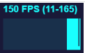

# 3D Web Development with Three.js and Next.js

https://github.com/bpbpublications/3D-Web-Development-with-Three.js-and-Next.js


代码运行前需要安装相关的依赖包

```bash
npm install --save three vite lil-gui
npm install three @react-spring/three
```


# 第1章  工业应用的发展演变

## 本章目标  
阅读本章后，你将了解工业应用的关键作用及其在各个领域中应对的挑战，探索 Three.js 和 Next.js 的历史发展，并通过实际案例了解 Three.js 在工业场景中的实用性。  


## 工业应用简介  
工业应用涵盖专为革新和优化不同工业领域运营而设计的各类解决方案与技术。这些应用通过利用技术、软件和先进系统的力量，旨在显著提升生产力、效率、安全性以及决策流程。  

工业应用的主要目标之一是优化各类工业流程。这涉及整合尖端技术（例如图 1.1 所示的虚拟现实（VR））、能源管理系统、物联网（IoT）、环境监测等多个领域，从而构建智能且互联的系统。这些互联系统能够实现不同组件之间的无缝通信与数据交换，进而增强协调性并同步工作流程。

同样，能源领域也通过工业应用实现了重大进步。  通过采用智能电网、能源管理系统和预测分析技术，能源分配效率得以提升，浪费减少，资源利用率提高。这使得能源密集型行业能够优化其能源消耗模式，实现更高的环境可持续性。  

此外，工业应用在推动医疗保健领域的变革中发挥着关键作用。医学成像技术（图 1.2），如磁共振成像（MRI）和计算机断层扫描（CT）设备，能够提供精确而详细的可视化图像，助力精准诊断和更优的治疗方案制定。同时，虚拟现实（VR）和增强现实（AR）通过提供逼真的模拟训练，正在改变医学培训方式，提升医护人员的专业技能。

除上述例子外，工业应用的影响力还延伸到了交通、建筑和物流等多个其他领域。  例如，智能交通系统利用实时数据和连接性来优化交通流量、提升公共交通效率并减少拥堵。在建筑领域，建筑信息模型（BIM）能够实现对复杂建筑结构的高效规划、设计和施工。  

总体而言，在追求更高性能、安全性和可持续性的推动下，工业应用的采用持续普及。通过利用技术进步，各行业能够克服复杂挑战，做出数据驱动的决策，并在快速变化的商业环境中成功前行。随着工业应用的不断发展，它们有望重塑各个行业，推动构建一个更高效、更互联、更具创新性的世界。 

## Three.js 与 Next.js 的发展历程

在不断演变的 Web 开发和 3D 图形领域，某些技术堪称创新征程的里程碑。本节将深入探索 Three.js 和 Next.js 的发展轨迹——这两个框架对塑造当今交互式网页体验与沉浸式 3D 视觉效果的融合起到了关键作用。

### 3D图形网页开发起源  
Three.js 是一个流行且强大的 JavaScript 库，用于在 Web 应用程序中创建 3D 图形和动画。它由 Ricardo Cabello（也被称为 Mr. Doob）于 2010 年 4 月首次发布，此后成为 3D 网页开发的主要框架之一。让我们深入探究 Three.js 的发展历程，了解它从诞生到现在的演变过程。  

Three.js 最初被构想为一个轻量级且直观的库，旨在帮助开发者使用 Web 图形库（WebGL）（图 1.3）——这是一个用于在浏览器中渲染 3D 图形的 Web 标准。当时 WebGL 还相对较新，其底层 API 复杂且难以直接使用。Three.js 的目标就是抽象掉 WebGL 的复杂性，为开发者提供一个更高级、更易用的接口来处理 3D 图形。

WebGL 是一个基于开放图形库（OpenGL）嵌入式系统（OpenGL ES）的低级 API，专门设计用于在网页浏览器中渲染二维和三维图形。尽管 WebGL 具备在网页上创建令人印象深刻的 3D 图形的能力，但由于其底层特性，直接使用 WebGL 具有较大挑战性。WebGL 要求开发者手动管理低级图形基元、着色器以及其他复杂细节，这使得缺乏丰富 3D 图形经验的新手和网页开发者难以驾驭。

WebGL 的起源可以追溯到 2006 年，当时 Mozilla 公司的 Vladimir Vukicevic（又名 Mrdoob）发起了一个名为 Canvas 3D 的实验项目。该项目旨在通过 HTML5 的 canvas 元素，为网页浏览器带来硬件加速的 3D 图形渲染能力。2009 年，负责制定图形和多媒体开放标准的行业组织 Khronos Group 成立了 WebGL 工作组。Mozilla、Google、Apple 和 Opera 等主要科技公司都积极参与了这一工作。2010 年 3 月 3 日，WebGL 工作组发布了首个公开规范，使网页开发者能够直接通过 JavaScript 访问底层图形功能，从而无需插件就能在浏览器中实现硬件加速的 3D 图形渲染。2011 年，多家浏览器开始支持 WebGL。Mozilla Firefox 和 Google Chrome 最先提供了稳定的 API 实现，随后 Safari 和 Internet Explorer 也相继跟进。WebGL 迅速在 Web 开发社区中流行起来，开发者开始利用它创建令人印象深刻的 3D 可视化效果、交互式游戏和虚拟体验。

## 工业可视化

工业应用中的可视化技术，是指运用3D模型、图表、数据图及动画等图形化手段，将复杂数据信息转化为更直观易懂的表现形式。这种技术能够帮助工程师、操作人员和决策者等利益相关方深入理解工业流程、系统及运行状况，从而做出科学决策。

在设计与原型阶段，3D可视化技术支持工程师和设计师创建工业产品、机械设备等的虚拟原型。这使得设计团队能在实体制造前对方案进行可视化评估，及时发现潜在问题并实施改进，有效缩短开发周期并降低研发成本。在工艺可视化方面，该技术能真实还原复杂工业流程，便于操作人员和工程师进行可视化监测与分析。通过沉浸式3D模拟训练系统，可为工业人员提供安全高效的设备与流程熟悉环境，显著提升操作技能和应急响应能力。在设备维护领域，3D可视化可生成精密的机械构造图，帮助技术人员掌握设备内部结构，精准定位故障部件，优化维护计划制定。当与工业物联网（IIoT）结合时，通过融合传感器实时数据构建物理资产的数字孪生体，这些虚拟映射不仅能实时监控资产状态，更能实现预测性维护和系统优化。此外，3D可视化在产品营销环节具有重要价值——通过生动立体的交互展示方式，企业能够更具吸引力地呈现产品特性与优势，帮助客户直观理解解决方案的核心价值。

我们还将重点介绍元能力最强的前沿技术——增强现实（AR）和虚拟现实（VR）技术，它们正越来越多地应用于工业领域以增强可视化效果。

总体而言，3D可视化技术能够深化对复杂系统和流程的理解，促进更优决策制定，并加速工业解决方案的研发与部署。随着技术的持续进步，3D可视化预计将变得更加精密复杂，并深度融入各个工业领域。

虽然Web应用已开始在软件开发市场中崭露头角并争夺主导地位，但我们有机会对比Three.js + Next.js组合方案与原生开发的潜力。在本书中，我们将深入探讨几个关键方面，揭示Three.js + Next.js的优势，并分析它们与传统原生开发方式的对比情况。

### 跨平台特性
跨平台兼容性意味着使用 Three.js 创建的 3D 内容可以在各种设备和操作系统上被访问和体验，无需针对特定平台进行安装或更新。这种便捷的可访问性让用户与 3D 内容进行交互变得更加方便。之所以能实现这一点，是因为 Three.js 是一个基于网络的库，要运行相关应用程序，只需一个浏览器以及任何能运行浏览器的操作系统即可。这也意味着运行应用程序时无需进行任何安装或下载软件。

### 实时交互特性
在使用网络应用程序时，我们可以轻松地利用从各种来源获取的实时数据来渲染 3D 可视化内容。在本书中，我们将使用亚马逊云科技（AWS）的发布 - 订阅（Pub/Sub）功能。AWS 发布 - 订阅功能是亚马逊简单通知服务（SNS）和亚马逊简单队列服务（SQS）协同工作，以实现发布 - 订阅消息模式。在这种模式下，发布者向某个主题发送消息，多个订阅者（队列、应用程序或端点）可以同时或选择性地接收这些消息。这使我们能够在 3D 应用程序中实现协作功能。结合该应用程序无需任何安装这一特点，基于 Three.js 的 3D 网络应用程序对于工业用途来说是一种功能强大的解决方案。 

### 低成本开发与维护

开发基于网络的3D应用通常比传统桌面应用具有更低的开发和维护成本。网络环境提供了一个标准化平台，减少了对不同操作系统和设备进行自定义配置的需求。此外，具备JavaScript知识的前端工程师数量每年都在增长。借助网络应用，更新可以无缝部署，确保用户始终能够访问最新功能和改 进。这种持续的更新过程消除了用户手动下载和安装更新的需求，从而带来更好的用户体验，并最终降低维护成本。

### 移动设备兼容性
Three.js 应用可以针对移动设备进行优化，从而在智能手机和平板电脑上提供一致且具有交互性的 3D 体验。这种移动兼容性将 3D 应用的覆盖范围扩展到了移动中的用户群体。

可视化 3D 对象并不是完成应用程序所需的唯一功能。我们还需要一个包装器（wrapper），它能够存储屏幕渲染所需的数据，同时提供包含表单、表格等元素的 UI 界面，这些元素可以让用户对 3D 模型进行操作、修改和使用。

想象一下任何允许我们操作 3D 对象的应用程序，除了模型本身之外，它还会包含很多其他元素。例如，看看 Blender3D 界面（图 1.7）。Blender 是一款免费的桌面工具，可用于创建 3D 模型、动画，甚至交互式应用程序。 

## Three.js的实际应用案例

### 页面上的体素3D图像
有许多可以创建3D图像的应用程序，如3D Max、Maya、Cinema 4D或Blender。但有一个低多边形应用程序，允许你像在Minecraft中那样使用方块来创建3D图像。这个应用程序叫做MagicaVoxel。它是免费且开源的，可以在以下地址找到：https://ephtracy.github.io/. 使用这个应用程序，我们制作了一只低多边形风格的狗，其灵感来自YouTube上的一位开发者，并将其插入到网页中（图1.9）。诀窍在于它不使用常规的文件扩展名。Three.js开箱即用支持它，并能轻松插入Vox
文件。

### 3D 力导向图  

该应用程序位于 [https://vasturiano.github.io/3d-forcegraph/](https://vasturiano.github.io/3d-forcegraph/)，它展示了三维空间中的图数据可视化效果（图 1.10）。  它可以将任何以图为导向的数据呈现在屏幕上。你可以旋转渲染出的图，每个节点都可点击，并且可以包含文本数据或链接。

### 网页3D背景  
将对象插入页面也可用于网页背景。下一个示例是一个可自定义的网页库3D背景（图1.11）。你可以在 [https://www.vantajs.com/](https://www.vantajs.com/) 获取它。 你还可以尝试不同的模板并进行个性化定制。  

### 动效设计工具  
正如我们已经了解的，向页面中插入对象有多种方式。但如果我们需要创建动画呢？使用Three.js时，我们需要手动编写运动轨迹和相机控制代码。那么有没有像Blender这类桌面应用一样，能通过可视化界面实现动画制作的工具呢？答案是肯定的。这个解决方案就是TheatreJS库（图1.13），它支持通过导入3D对象来创建华丽的动画效果。您可以通过以下网址获取：[https://www.theatrejs.com/](https://www.theatrejs.com/)  

### 基于3D网络的视觉游戏引擎

作为最后一个例子，我们将讨论用于创建游戏、视觉演示和工业应用的Web 3D引擎(图1.14)。在本书中，我们将在创建界面时依赖于该引擎提供的各种功能。尽管该引擎非常适合工业应用场景，但它的主要重心还是放在游戏开发上。因此，许多功能可能并不会被使用到，尤其是在受到应用特定场景需求限制的情况下。这种情况常常导致大量本可以用纯JavaScript创建的3D对象出现，这些对象同样会占用你电脑的资源。该引擎可从https://playcanvas.com/下载，它被称为PlayCanvas。

## 结论  

本章深入探讨了工业应用领域的广阔图景，揭示了这些应用在各行各业中的关键价值及其面临的复杂挑战。随后，我们追溯了Three.js与Next.js的技术演进历程，展现了它们对Web开发与3D图形领域带来的变革性影响。  

随着论述的展开，重点自然转向工业可视化这一核心领域——正是Three.js与Next.js的强强联合在此大放异彩。本章着重阐述了这种动态协同效应如何赋能沉浸式3D可视化的构建，为工业流程分析、仿真模拟及原型设计提供重要洞见。  

通过真实案例，我们直观见证了Three.js在工业场景中的强大实力：从制造业到医疗健康等跨行业应用，这些实践不仅彰显了其技术灵活性，更验证了其在实际业务中的落地价值，重新定义传统工业范式的可能性。  

最终，本章论证了Three.js作为工业应用革新催化剂的融合力量。当产业界追求流程优化与决策升级时，Web技术与3D图形的深度结合正崛起为一股变革性力量，注定将重塑未来工业格局。  

下一章，我们将深入探究 Web 开发工具。我们会探讨与集成、安全性相关的话题，以及借助渐进式 Web 应用（PWA）技术让 Web 应用能够离线使用的可能性。 

# 第2章 面向工业及多用途的 Web 开发能力

## 实时通信与协作  

在数字协作与通信的快节奏领域中（图2.3），Three.js 崭露头角，成为一股变革性力量，彻底改变了我们实时互动与协作的方式。这个强大的 JavaScript 库将协作的概念提升到了新的高度，为工业、教育、娱乐等众多领域开启了无限可能。  

虽然 Three.js 以其 3D 图形功能而闻名，但其潜力远不止于创建沉浸式可视化内容。它充当了一座连接全球用户的桥梁，使得在 3D 环境中实现实时协作成为可能。

### 实时协作中的关键特性  

Three.js 允许多个用户同时访问并在同一 3D 环境中进行交互。无论是虚拟教室、设计工作室还是共享游戏世界，用户都可以像身处同一物理空间般进行协作。  

用户可以实时与 3D 对象和元素进行交互。这意味着他们可以共同操控对象、在虚拟白板上绘制，或在共享实验室中进行实验。  

实时通信通过集成的语音和文字聊天系统实现。用户可以在沉浸式 3D 环境中交谈、分享想法并提供反馈。

### 各行业应用场景

Three.js 驱动的实时协作正在重新定义远程教育与培训。学生无论身处何地，均可参与虚拟课堂、协作完成作业并共同开展实验。

建筑师与设计师能基于 3D 模型及原型进行实时协作，通过讨论修改方案、迭代设计并集体决策，从而提升创造力与工作效率。

多人在线游戏与虚拟现实体验因 Three.js 实现跨越式发展。玩家可在细节丰富的 3D 世界中共同冒险、竞技及社交互动。

科研人员与工程师可利用 Three.js 创建协作式模拟实验，联合分析数据、模拟复杂现象并实时共享洞察。

随着技术进步与用户需求增长，Three.js 驱动的实时协作未来蕴含无限可能——从共享虚拟办公空间到协同科学探索，这场三维革命正在重塑数字时代的工作、学习与连接方式。它作为激动人心的前沿领域，正跨越屏幕与国界将人们凝聚，在虚拟世界中点燃创新与协作的火花。

## 安全与隐私考量  

在广阔的 Web 开发领域中，安全与隐私已从单纯的考虑因素转变为不可或缺的基石。它们的历史演进体现了人们在不断扩展的数字前沿中，保护用户数据和数字资产的坚定承诺。

Web开发的技术领域以持续创新和不断演变的威胁为特征。这一发展历程源于一个共识：安全和隐私不仅是可选项，更是不可或缺的要素。

在Web早期阶段，安全和隐私常被视为事后考虑。基础的身份验证机制和最低限度的数据加密十分普遍。这种放任自流的态度使Web应用易受攻击。

相比之下，现代Web开发采用安全优先的方法（图2.6）。开发者拥有众多工具、协议和最佳实践来抵御网络威胁。

下面是一些关键技术考量

### 数据加密
数据加密是保障传输中数据安全的基石。采用使用安全套接层/传输层安全协议（SSL/TLS）加密的超文本传输安全协议（HTTPS），可确保用户与服务器之间传输的数据保持机密且完整。此加密机制会在传输过程中将数据转换为不可读格式，即使被恶意行为者截获，这些数据也毫无价值。SSL/TLS证书的使用可验证服务器身份，向用户保证其交互网站的真实性。该技术对保护登录凭据、金融交易和个人数据等敏感信息至关重要，从而维护用户数据的机密性与完整性。 

### 认证协议
认证协议是抵御未授权访问的第一道防线。像多因素认证（MFA）和OAuth这样的强大认证机制提供了多层用户验证。多因素认证要求用户提供两个或更多认证因素（例如密码、生物识别特征或智能卡）来访问其账户，这使得恶意行为者更难攻破账户。而OAuth则允许第三方应用程序在不暴露登录凭据的情况下访问用户数据。这些协议就像数字门卫，只允许授权用户通过虚拟大门，同时阻止未授权访问。 

### 授权模型
授权模型是应用程序内数据访问的看门人。基于角色的访问控制（RBAC）和基于属性的访问控制（ABAC）是两个基本范式，能够实现对用户权限的精确控制。RBAC为用户分配角色，每个角色都有特定的权限。例如，管理员角色可能可以访问应用程序的所有区域，而用户角色只有有限的访问权限。ABAC则考虑用户的各种属性、请求的操作以及相关资源，以确定访问权限。这些模型确保只有获得授权的各方才能访问特定数据或在应用程序中执行某些操作，防止数据泄露和未授权活动。 

### 输入验证
输入验证是抵御注入攻击（包括臭名昭著的SQL注入）的盾牌。这项技术确保来自不可信来源（如用户输入）的数据在由应用程序处理之前得到彻底验证和清理。数据清理会清除用户输入中潜在的恶意代码，而参数化查询则确保SQL语句不受注入攻击的影响。通过有效过滤和验证输入数据，开发人员可以防止攻击者将恶意的SQL查询、JavaScript或其他有害代码插入到应用程序中，从而避免安全漏洞和数据泄露。

网络开发中的技术安全和隐私考虑已经从被动应对转变为主动预防。开发人员现在拥有大量措施工具箱，可以抵御不断扩大的威胁范围。随着技术的不断进步，网络应用程序抵御网络攻击的能力和对用户隐私的保护将始终至关重要。开发人员是数字领域的哨兵，他们不仅肩负着创建功能丰富的web应用程序的任务，还要确保这些应用程序安全可靠并尊重用户隐私。 

## 渐进式Web应用（PWA）
在不断发展演变的Web开发领域中，PWA已成为改变游戏规则的技术。这些应用结合了Web应用和移动应用的优势，提供离线使用能力、更快的加载速度以及类原生应用的用户体验。PWAs是能为用户带来类似传统原生移动应用体验的Web应用。它们代表着一种变革性的Web开发方式，旨在融合Web应用和原生移动应用两者的优势。PWA的发展历程是一部创新、演进以及弥合Web与原生移动应用之间差距的探索史。

2015年，谷歌工程师Alex Russell和设计师Frances Berriman创造了"渐进式Web应用（Progressive Web App）"这一术语，用于描述利用现代浏览器功能特性的Web应用。Android版Chrome是最早支持PWA的浏览器之一。

2017年，随着包括Firefox和Edge在内的更多主流浏览器开始支持使PWA成为可能的技术和标准，PWA（图2.7）的发展势头更盛。 

2018年，推特推出的PWA应用Twitter Lite以及星巴克PWA因其卓越的用户体验和性能表现备受关注。这些成功案例向企业展示了PWA的潜力。

### 渐进式Web应用（PWA）的核心优势

#### 一、跨平台兼容性
PWA采用平台无关设计，可在各类平台和设备上无缝运行：
- **桌面端**：支持Windows/macOS/Linux等操作系统，提供一致的桌面电脑使用体验
- **移动端**：完美适配智能手机和平板设备，自动响应不同屏幕尺寸与横竖屏方向
- **离线环境**：标志性特性之一，可在无网络或弱网条件下正常运行，保障内容与服务持续可用
- **多浏览器兼容**：支持Chrome/Firefox/Safari/Edge等主流浏览器，用户无需切换偏好浏览器即可访问

#### 二、类原生应用体验
致力于复现原生移动应用特有的沉浸式交互体验

#### 三、性能优化优势
通过多项关键技术实现快速响应的使用体验：
1. **极速加载**：针对内容快速呈现进行专项优化，尤其显著改善移动设备弱网环境下的等待体验
2. **资源高效处理**：采用懒加载等技术实现按需资源获取，既降低初始加载量又节省带宽消耗
3. **智能缓存机制**：通过Service Worker实现本地资源缓存，内容调用速度远超传统服务器获取方式

#### 四、离线功能支持
依托现代浏览器Service Worker技术实现的标志性离线功能特性

#### 四、免应用商店繁琐流程

PWA具有显著的分发优势，大幅简化应用分发流程：

**直接安装**：用户可直接通过网页一键安装PWA（支持移动端点击/桌面端单击操作），既无需经过应用商店审核，也不受应用商店规则限制。
**自动更新**：PWA支持后台自动更新机制，用户始终能使用最新版本，无需手动通过应用商店下载更新包。
**降低使用门槛**：省去应用商店下载与更新环节，同时减少用户操作步骤与开发者分发阻力，显著提升整体分发效率。

### 使用PWA与Three.js结合  
将强大的3D图形库Three.js与PWA集成，为创建沉浸式和交互式的3D网络体验开辟了令人兴奋的可能性。  

Three.js允许开发者创建令人惊叹的3D内容，从3D模型和动画到完整的3D场景。这些内容可以无缝集成到PWA中，为用户提供沉浸式且视觉吸引力强的体验。  

PWA本身支持响应式设计，当与Three.js结合使用时，这确保了您的3D内容能够适应不同的屏幕尺寸和方向。无论用户是在桌面、平板还是智能手机上访问您的PWA，都能享受一致且视觉效果出色的体验。  

Three.js针对性能进行了优化，非常适合PWA。它可以高效渲染复杂的3D场景、动画和交互，同时确保快速加载和流畅的用户体验。这种增强的性能有助于提升PWA的整体响应能力。  

PWA利用Service Worker实现离线功能。对于Three.js来说，这意味着您可以缓存3D资产、模型和场景，使用户即使在离线或网络状况不佳时仍能交互式地访问您的3D内容。  

Three.js使您能够在PWA中创建类原生应用的交互体验。用户可以操控3D对象、探索虚拟环境，并与交互元素互动，同时享受流畅的动画和模仿原生应用行为的操作手势。

# 第3章  工具介绍

## Three.js 库简介

- **对象的四元数（Quaternion）**：这是对象修改中最有趣的部分。四元数是对三维对象进行数学上正确的旋转。四元数有助于避免万向锁问题，这是欧拉角的一个局限性，即某些方向会导致旋转自由度损失一维。四元数可以表示任意三维旋转而不会遇到万向锁。我们将在下一章讨论万向锁，因为它在三维图形中是一个重要部分。

## Next.js 概述及其功能


## 其他工具  

由于我们将使用 Next.js 进行开发，因此需要一些额外工具来结合 React 和 Three.js 进行工作。我们需要一个名为 React Three Fiber 的 Three.js 封装库，以及一个为 Three.js 对象提供无障碍访问支持的库——React Three A11y。下面让我们深入了解一下这些库。  

### React Three Fiber  
React Three Fiber（简称 R3F）是一个 JavaScript 库，用于弥合 React 和 Three.js 之间的差距。它允许开发者使用类似 React 的声明式、基于组件的方法来创建和操作 3D 场景及对象。如图 3.4 所示，R3F 简化了 Three.js 在 React 应用中的集成，并提供了一种更直观的方式来处理 3D 图形。该库的官方网站如图 3.4 所示。  

关于 R3F 的关键要点  

- **基于组件的 3D 开发**：R3F 将 React 的组件化开发范式引入 3D 图形领域。它允许你将 3D 场景、对象、相机和灯光定义为组件，从而更轻松地管理和构建复杂的 3D 应用程序。  

- **声明式 API**：与 React 类似，R3F 提供声明式 API，让你根据应用的当前状态描述 3D 场景应有的样子。这种声明式方法通过关注预期结果而非逐步的命令式流程，简化了 3D 开发。  

- **基于 Hook 的架构**：R3F 利用 React 的 Hook（如 `useEffect` 和 `useState`）来处理 3D 组件内的生命周期事件和状态变化。这使得 3D 场景能够动态响应用户交互和数据变化，实现高度交互性。  

- **性能优化**：R3F 通过高效自动处理更新和重新渲染来优化性能。它采用类似 React 虚拟 DOM 的协调机制，仅更新 3D 场景中发生变化的部分。  

- **自定义着色器材质**：R3F 支持自定义着色器和材质，让你能够创建视觉效果惊艳且高度定制化的 3D 对象。你可以使用 OpenGL 着色语言（GLSL）编写着色器，并将其应用到组件中。  

- **物理引擎集成**：R3F 可与 Cannon.js 或 Ammo.js 等物理库结合使用，在 3D 场景中模拟真实的物理交互效果，如碰撞、重力等。  

- **VR/AR 支持**：R3F 提供对虚拟现实（VR）和增强现实（AR）的支持，适用于构建沉浸式 3D 应用，如 VR 展览、AR 导航等。  

- **跨平台兼容性**：R3F 能在不同平台和设备上稳定运行，确保你的 3D 应用能在桌面、移动端甚至 VR 设备上流畅访问。  

- **相机与视口控制**：  
  - 提供 `<Canvas>` 组件和 `useThree` 等 Hook，用于配置和管理相机参数（位置、旋转、缩放）。  
  - 通过 `OrbitControls` 组件，用户可交互式导航 3D 场景，支持旋转、缩放和平移等相机操作。  
  
- **光照与阴影**：  
  
  - 使用 `<ambientLight>`（环境光）、`<directionalLight>`（平行光）、`<spotLight>`（聚光灯）和 `<pointLight>`（点光源）等组件实现逼真光照效果。  
  - 通过 `<Canvas>` 的 `shadowMap` 属性轻松启用阴影，并利用 `castShadow`（投射阴影）和 `receiveShadow`（接收阴影）属性配置网格模型的阴影交互，增强 3D 场景的真实感。
  
  
  
### React Three A11y  

  React Three A11y 是一个为 WebGL 添加无障碍访问支持的库，它通过将 Web 内容无障碍指南（WCAG）标准集成到 R3F 组件中来实现这一目标。该库为开发者提供了以下可能性：  

  - **焦点与焦点指示**：确保用户能够清晰识别当前聚焦的 3D 元素。  
  - **Tab 键索引与键盘导航**：支持通过 Tab 键在 3D 元素间切换，并允许键盘操作导航。  
  - **屏幕阅读器支持与替代文本**：为 3D 对象提供可访问的文本描述，方便视障用户使用屏幕阅读器理解内容。  
  - **角色与光标形状**：为交互元素定义适当的无障碍角色，并调整光标形状以增强可用性。  
  - **描述性链接**：为 3D 场景中的可交互元素提供清晰的文本说明，提升导航体验。  

  通过这些工具，我们不仅能创建出色的 WebGL 应用，还能让它们适用于包括残障用户在内的更广泛人群。

## 了解 AWS Amplify

## 探索 Storybook 的优势

## Tailwind CSS 简介

# 第4章  设置所有工具以快速启动开发

运行示例代码前需要安装依赖：

```bash
npm install --save three vite
```

本地运行

```bash
npm run dev
```

## 设置 AWS Amplify CLI 工具

应用地址：https://us-east-2.console.aws.amazon.com/amplify/apps/d23ng94q2hnis0/overview

# 第5章  3D 开发入门

## 3D 图形基础概念  
在开始使用 Three.js 进行探索之前，我们需要掌握 3D 计算机图形学的基本构建模块。这将帮助我们更好地理解该库的工具和功能潜力。这些基础知识是创建沉浸式、视觉震撼的 3D 环境的基石。让我们深入探究，揭开那些能让你在 3D 图形领域大展身手的基础知识。  

### 3D 坐标系与空间  
在 3D 图形中，我们使用笛卡尔坐标系来表示三维空间中的点。最常见的系统是右手坐标系，其中：  
- **X 轴** 指向右侧  
- **Y 轴** 指向上方  
- **Z 轴** 指向正前方（朝向观察者）  

这三个轴的交点称为 **原点**，其坐标为 (0, 0, 0)。参考下图：  

在笛卡尔坐标系中，正值沿各坐标轴的正方向延伸，负值沿负方向延伸。例如，沿X轴正方向移动会增加X坐标值，而沿Y轴负方向移动会减少Y坐标值。该系统还能对三维空间中的距离、角度和位置进行精确测量，这对于准确定义三维物体的几何形状和位置至关重要。

笛卡尔坐标系对于在三维空间中实施变换操作至关重要。平移、旋转和缩放等操作通常使用这些坐标系中的矩阵和向量来表示。

最终，这会影响渲染过程。物体的笛卡尔坐标会被投影到一个二维平面（比如电脑屏幕）上，从而生成二维图像。这种投影通常采用透视投影的方式，正如我们之前提到的。

在图形学的背景下，三维空间指的是一个虚拟的三维环境，在这个环境中，物体和场景被表示、操控和渲染。理解三维空间是创建具有沉浸感、真实感和视觉吸引力的图形的基础。 

### 3D模型与物体

在3D空间中，物体被表示为3D模型。这些模型可以是简单的几何基本体，如立方体、球体和圆锥体。也包括高度复杂的结构，如角色、车辆、建筑建筑物和自然景观。3D模型由其几何体定义，包括顶点、边和面，并可能带有纹理以赋予其颜色和细节。

3D模型和物体是3D图形的基本构建块，作为3D虚拟空间中实体、角色、环境和道具的表示。理解这些模型和物体对于创建视觉引人入胜和沉浸式的体验至关重要。

让我们看看3D对象的基本类型：

- 几何体：3D模型由其几何属性定义。几何体包括顶点（3D空间中的点）、边（连接顶点的线）和面（由边定义的平面）。这些元素的排列和连接方式决定了3D模型的形状和结构。
-  网格：3D模型通常构造成由顶点、边和面组成的网格。它们有各种类型，包括多边形网格（三角形、四边形）、参数化曲面、非均匀有理B样条（NURBS）和体素网格（3D像素）。多边形网格是3D图形中最常见的结构。
- 纹理：纹理应用于3D模型以添加颜色、图案和表面细节。纹理映射涉及将2D图像包裹在3D模型的表面上以增强其外观。漫反射贴图提供颜色信息，法线贴图影响表面法线以获得更好的光照效果，其他贴图可以表示高光、反射性等。
-  材质：材质定义了光线如何与3D模型的表面相互作用。它们控制反射率、光泽度和透明度等属性。着色模型（如Lambertian（漫反射）和Blinn-Phong（高光））通常用于确定材质如何响应光照。

### 3D中的相机与视图

相机和视图是3D图形中至关重要的组成部分，它们提供了我们观察和与场景及物体互动的视角。理解相机和视图对于创造沉浸式且视觉上引人入胜的体验至关重要。

以绘画为例来说明相机视图——在这种情况下，艺术家的眼睛就相当于相机视图。举个更贴切的例子，我们可以拿一台真实的相机来讨论摄影。但说到3D图形，相机的能力不受物理模型、镜头或站位限制。在3D图形中，我们可以将相机放置在场景中的任意位置，并使用任何我们偏好的镜头规格——这种可能性是不是很棒？确实非常出色。

相机具有各种定义其属性的参数，包括位置、朝向、视场角（FOV）、近裁剪面和远裁剪面，以及宽高比。这些参数影响相机能看到什么以及场景如何投影。

相机的视场角通常表示为一个称为视锥体的金字塔。这个视锥体定义了相机可见的内容，包括其边界内的物体。参考图5.11：

在交互式3D应用程序中，通常提供相机控制功能，允许用户改变相机的位置和朝向。这可能包括平移、缩放、环绕和相机切换等功能。

一些3D应用程序使用多个相机来提供不同的视角或实现特定效果。例如，游戏可能会为后视镜使用单独的相机，而安防摄像头系统可能会使用多个相机来监控不同区域。

# 第6章 开始使用Three.js

此后，我们将无法再看到该对象。我们看不到该对象，是因为在当前设置中，我们的相机并未朝向该对象。默认情况下，相机被创建于坐标 (0,0,0) 处，与新创建的对象位置相同。稍后我们会讨论相机的特殊设置。目前，我们只需稍微移动一下相机，以便能够看到一些东西。要解决这个问题，请将代码清单 6.7 中所示的一行代码添加到您的代码中：

```js
camera.position.z = 5;
```

## 调试和故障排除

一些调试工具

- [Tweakpane](https://github.com/cocopon/tweakpane)。Tweakpane is a compact pane library for fine-tuning parameters and monitoring value changes, inspired by [dat.GUI](https://github.com/dataarts/dat.gui).
- Control-panel: (https://github.com/freeman-lab/control-panel)
- Lil-gui(https://lil-gui.georgealways.com/ ). 

### 安装并实施Lil-gui

```bash
npm install lil-gui
```

### Orbit controls  

另一个有用的补充功能是轨道控件。我们场景中看到的一切都来自摄像机。如果我们需要围绕场景旋转，但同时保持摄像机在最初创建用于调试的位置不动，我们可以创建一个轨道控件对象并将其连接到摄像机。这将允许我们通过鼠标移动来操作摄像机。请使用代码清单6.15更新您的代码，以添加轨道控件：

# 第7章  几何体与材质

## 几何体类型  
在Three.js中，几何体是构建3D对象的基本构建块。它们由两个基本要素组成：  
•  **顶点（Vertices）**：它们本质上是3D世界的基石。每个顶点代表3D空间中的一个特定点。可以将它们想象成广阔虚拟宇宙中的坐标。它们定义了该空间内各个点的位置，实际上是构建3D对象的框架。  
•  **面（Faces）**：这些是连接顶点的桥梁。它们通常由三角形组成，能高效地将顶点连接起来形成表面。可以将面视为塑造3D对象外观的结构元素。它们将分散的点（顶点）转化为连贯的表面。  

需要注意的是，几何体不仅限于在顶点中存储位置数据。虽然顶点位置至关重要，但几何体中也可以包含其他信息。两个典型的例子是UV坐标和法线。这两个主题将在“材质”部分讨论。以下是几何体的类型：

### BoxGeometry  

BoxGeometry 用于创建具有指定宽度、高度和深度的矩形长方体。当我们使用此几何体创建长方体时，它会自动以原点为中心，并且其每条边都与一个坐标轴完全对齐。

### CapsuleGeometry  

### CircleGeometry  

### ConeGeometry  

### CylinderGeometry  

### DodecahedronGeometry （十二面体几何体） 

### EdgesGeometry（边几何体）  
在Three.js中是一个实用工具类，用于创建一个新的几何体，该几何体表示现有几何体的边。当我们使用Three.js创建3D对象时，它通常由顶点（三维空间中的点）和面（三角形或多边形表面）组成。EdgesGeometry允许我们提取该对象几何体的边，并将它们单独表示出来。

### ExtrudeGeometry  

### LatheGeometry（车削几何体）  
在Three.js中是一个通过绕轴旋转二维形状来生成三维几何体的类。换句话说，它通过将二维轮廓围绕指定轴旋转来创建三维对象。

## 材质类型

```js
import * as THREE from 'three';
import { OrbitControls } from 'three/examples/jsm/controls/OrbitControls.js';
import GUI from 'lil-gui'; 

// Init Debug UI
const gui = new GUI();

// Object with default parameters
const obj = { 
    radius : 7, 
    widthSegments : 20, 
    heightSegments : 20
};
const materialProps = {
    color: '#ebebeb',
    shininess: 20,
    flatShading: false,
    roughness: 1,
    metalness: 1,
    clearcoat: 0,
    clearCoatRoughness: 0,
    wireframe: false
};
const materialTypeProps = {
    type: 'MeshBasicMaterial'
};
const currentGeometry = 'SphereGeometry';

// Init Scene
const props = {
  width: 800, 
  height: 600,
  color: 0xff0000
};
const scene = new THREE.Scene();
const camera = new THREE.PerspectiveCamera(75, props.width / props.height);
scene.add(camera);

// Object creation with special Geometry type
const initGeometry = () => {
  return new THREE[currentGeometry](...Object.values(obj));
}

const regenerateGeometry = (mesh) => {
  const newGeometry = initGeometry();
  mesh.material = new THREE[materialTypeProps.type](materialProps);
  mesh.geometry = newGeometry;
  
}
const geometry = initGeometry();
// As Circle is 2D object to color it from both sides we need to add 
// parameter `side` to have color for each side

const material = new THREE[materialTypeProps.type](materialProps);
const mesh = new THREE.Mesh(geometry, material);


// GUI elements to update parameters
const materialPropsArray = Object.keys(materialProps);
materialPropsArray.forEach(key => {
    key !== 'color' && gui.add( materialProps, key, 0, 10)
        .onChange(() => regenerateGeometry(mesh));
    key === 'color' && gui.addColor( materialProps, 'color')
        .onChange(() => regenerateGeometry(mesh));
});
        
gui.add( materialTypeProps, 'type', [ 
                'MeshBasicMaterial', 
                'MeshStandardMaterial', 
                'MeshPhysicalMaterial',
                'MeshDepthMaterial',
                'MeshNormalMaterial',
                'ShaderMaterial',
                'MeshLambertMaterial', 
                'MeshPhongMaterial', 
                'MeshToonMaterial' ] )
    .onChange(() => regenerateGeometry(mesh));

scene.add(mesh);
camera.position.z = 20;

// Simple light creation for the scene
const ambientLight = new THREE.AmbientLight(0xffffff, 0.5)
scene.add(ambientLight)
const color = 0xFFFFFF;
const intensity = 30;
const light = new THREE.DirectionalLight(color, intensity);
light.position.set(5, 5, 5);
scene.add(light);

// Setup the renderer
const canvas = document.querySelector('#container');
const renderer = new THREE.WebGLRenderer({
  canvas: canvas
});

renderer.setSize(props.width, props.height);

// Render the scene using scene and camera objects
// remove renderer below and add the function to animate 
// the scene
// renderer.render(scene, camera);
const controls = new OrbitControls( camera, renderer.domElement );
controls.update();
function animate() {

	requestAnimationFrame( animate );
  // required if controls.enableDamping or controls.autoRotate are set to true
	controls.update();
	renderer.render( scene, camera );

}
animate();
```

以下是不同材质类型的关键特性及适用场景，帮助你在3D模型中选择合适的材质：  

**MeshBasicMaterial（基础网格材质）**  

提供简单的无光照表面，呈现纯色效果。它不会响应场景中的光照条件。通常用于需要保持恒定颜色且无需阴影效果的物体，例如GUI界面元素或线框模型。  

**MeshLambertMaterial（兰伯特材质）**  

提供漫反射效果，呈现柔和均匀的阴影。这类材质会响应环境光，常用于表现哑光或非光泽表面。它们没有镜面高光，非常适合黏土雕塑或织物等物体。  

**MeshPhongMaterial（冯氏材质）**  

能够呈现镜面高光效果，可模拟更光滑的表面。它们对直射光源有响应，并产生更复杂的阴影效果。这种材质非常适合具有明显反光特性的表面，例如塑料或金属。  

**MeshStandardMaterial（标准材质）**  

专为基于物理的渲染（PBR）设计。提供广泛的属性支持，包括漫反射贴图、镜面反射贴图、法线贴图和自发光贴图等。通过调整其属性，可以表现从金属到塑料等各种现实世界中的材质。  

**MeshPhysicalMaterial（物理材质）**  

在标准材质的基础上扩展了更多高级功能。能够处理光与表面之间更复杂的交互（例如能量守恒）。这种材质类型适用于追求照片级真实感的渲染以及高度精细的场景。  

**MeshToonMaterial**: 卡通材质旨在创造卡通描边或漫画风格的外观。它们不会产生平滑渐变，而是使用有限数量的明暗层级。这些材质常用于具有风格化、非写实视觉效果的应用中。

**MeshDepthMaterial 和 MeshNormalMaterial**: 这些材质用于特定用途。MeshDepthMaterial 根据物体深度渲染对象，适用于景深等后期处理效果。MeshNormalMaterial 可视化物体表面法线，有助于调试和视觉分析。

**Shader Material**: 着色器材质允许我们编写自定义GLSL着色器，从而完全控制物体的外观。使用这种材质类型可以创建独特而复杂的视觉效果。

**MultiMaterial**: 当物体由应用于不同部分或面的多种材质组成时，使用这种材质类型。它常用于具有不同表面的复杂模型。

**RawShaderMaterial**: 原始着色器材质用于底层着色器编程，让我们完全控制渲染过程。

# 第8章 光源和阴影

## 理解三维场景中灯光的作用  

想象你身处一间昏暗的房间。你能隐约辨认出一些形状，但一切都不清晰。现在打开一盏灯——物体变得可见，阴影显现，整个空间顿时有了深度。这就是光线的魔力。  

在三维图形中，光照正是这样发挥作用的：它照亮虚拟世界，改变我们观察物体、其纹理及其位置的方式。恰当的光照能让平淡乏味的场景焕发生机，变得鲜活而具有沉浸感。  

三维图形中有几种光照模型，每种都定义了光线与表面交互的方式：  

- 兰伯特反射：该模型类似哑光表面，光线向所有方向散射，呈现柔和、无反射的外观。
- 冯氏反射：增加了镜面高光，使物体看起来更光亮，如同抛光表面。  
- 布林-冯氏反射：冯氏模型的改进版，在保持真实感的同时更节省性能。  
-  库克-托兰斯模型：模拟金属和玻璃等复杂材质的进阶方案。  

阴影是让三维场景显得真实的关键。没有阴影，场景会显得虚假而扁平。阴影赋予的深度感让所有元素都仿佛扎根于空间之中。  

因此，掌握三维图形中的光线运用？这既是一门科学，也是一门艺术。了解光照模型、阴影技术及光源类型，能帮助你创造令人惊叹的虚拟世界。此外，艺术眼光还能将这些技术知识转化为真正触动观众的作品。  

## 实现不同类型的光源

### 光源类型  

光源在现实世界或三维图形的数字领域中，对视觉效果至关重要。要在三维场景中驾驭光的力量，理解光源类型及其现实世界中的对应物非常关键。为了更易于理解，让我们以现实世界中的一个例子来类比Three.js中的光源类型。  

•  定向光(Directional Lights)：  
这类光类似于阳光。正如太阳以均匀、平行的光线照射，定向光在虚拟环境中再现了这种效果。它能产生长长的阴影，并塑造户外场景。它呈现出宁静日出的相同视觉效果——太阳投下鲜明的阴影，为一天定下基调。  

•  点光源(Point Lights)：  
在三维场景中，它们模拟现实世界中的局部光源，比如台灯或灯泡。正如桌灯照亮房间的角落，或一串串小彩灯为户外露台增添温暖光辉，点光源创造出局部、均匀的照明效果。  

•  聚光灯(Spotlights)：  
它们将光束聚焦在一个锥形区域内，突出特定物体或营造戏剧性效果。一个完美的例子是手电筒在黑暗森林中指引道路，或是大舞台上的一束追光，突出表演者。在三维中，聚光灯对于引导观众视线起着重要作用。  

•  半球光(Hemisphere Lighting)：  
它再现了天空从天顶到地平线之间色彩与亮度的动态变化。这类光源非常适合打造逼真的户外场景。正如天空在白天呈现明亮的蓝色，而在日落时转为温暖的色调，半球光捕捉到了这些变化。  

•  环境光(Ambient Light)：  
在三维中，它为整个场景提供均匀的照明，确保即使是最阴暗的角落也能获得一定程度的光线。它类似于柔和的间接光充满房间，让空间感觉温馨宜人。

#### 环境光（Ambient Light）  

在Three.js中，环境光起到为整个3D场景提供柔和、均匀照明的作用。与其他具有特定位置和方向的光源类型（如定向光或点光源）不同，环境光并非源自某个明确的发光点。相反，它为场景带来柔和且一致的照明，确保没有任何区域完全陷入黑暗。以下是环境光特别适用的几种场景：  

•  室内场景（Indoor Scenes）：  
在三维模型的室内空间中，环境光可以模拟透过窗户进入并漫射在各个表面上的柔和自然光，营造出温暖而舒适的氛围。  

•  模拟不同时段（Setting Different Times of Day）：  
通过调整环境光的参数，可以表现一天中的不同时刻。较暖的色调能够唤起日落时分的柔和光影，而较冷的色调则可以重现清晨时分的蓝调氛围，从而增强三维环境的真实感与层次感。  

•  户外场景（Outdoor Scenes）：  
在户外环境中，环境光有助于防止阴影区域显得过于黑暗。这种微妙的照明确保即便在没有直接受到其他光源照射的区域，整个场景仍保持良好的可见度。

代码：Chapter 08\ambient-lights.js

#### 半球光（Hemisphere Light）  

半球光是Three.js中的一种光源，用于提供环境光和间接照明。它模拟了现实世界中光线散射的方式——通常天空作为主光源，地面则反射光线。半球光由两个核心部分组成：  

•  天空颜色（Sky Color）：  
代表天空的颜色（通常是浅蓝色或其他日间色调），为场景提供基础的环境光照。  

•  地面颜色（Ground Color）：  
对应地面或接收间接光照的其他表面的颜色，用于增强光线反弹产生的间接照明效果。  

天空颜色贡献场景的整体环境光氛围，而地面颜色则强化光线经表面反射后的柔和间接光。半球光能显著提升3D场景的深度感和真实感，通过更自然的阴影过渡和复杂的光照交互，使画面更加生动细腻。  

代码：Chapter 08\lights.js

#### 定向光（Directional light）

为了整合这种光照，我们需要对代码进行更多修改。方向光由两部分组成：光源位置和目标点。之所以这样设计，是因为我们使用的是基于向量的光源。想象一下三维空间中的这条线，它有两个端点：起点和终点。这就是方向光的工作原理。目标点是产生光照的部分，因此每次移动向量时，我们都必须关注目标点。为了更直观地展示这种类型的光照，我们将引入一种特殊的对象，它能帮助我们更好地理解光照的工作方式。这个对象被称为辅助器（**helper**）。辅助器会在场景中生成可视化的线条，向我们展示方向光的起始位置以及其配置的方向。我们接下来要介绍的另一个工具是**归一化**。我们将在后续章节中详细介绍归一化，但在这里我们需要先简单介绍一下，因为方向光是一种基于向量的元素。

代码：Chapter 08\directional-light.js

#### 点光源（PointLight）

#### 聚光灯（Spot light）

在Three.js中，MathUtils类提供了一种简单直接的度数到弧度的转换方法。要使用此方法，只需按照代码清单8.10所示的方式应用MathUtils中的转换函数即可。这可确保基于度数的角度无缝集成到Three.js环境中。

```js
const radians = THREE.MathUtils.degToRad(<YOUR-DEGREE-NUMBER>)
```

#### 矩形区域光（RectAreaLight）

RectAreaLight 是 Three.js 中的一种光源，用于模拟矩形区域光源。这些光源从一个矩形表面均匀地发射光线，与仅从单个点或特定方向发射光线的点光源或聚光灯不同。这使得 RectAreaLight 非常适合模拟荧光灯、LED 面板，甚至建筑可视化中的窗户开口等光源。它们通常用于在 3D 场景中创建均匀而柔和的照明。以下说明了 RectAreaLight 的参数：

为了正确渲染这种类型的光源，我们还需要一个名为**RectAreaLightUniformsLib**的实用类。它是Three.js库的一部分，提供专为RectAreaLight设计的uniform（着色器输入变量）定义和初始化。这是必要的，因为3D图形中的光照是一个复杂的过程，通常涉及着色器——这些程序在GPU上运行，用于计算场景中每个像素的最终颜色。这些着色器需要各种参数，包括描述光源特征的参数，比如RectAreaLight。

我们还需要添加一个来自Three.js插件的辅助工具，名为**RectAreaLightHelper**。我们需要它，因为集成的辅助工具已经不再起作用了。由于RectAreaLight比其他光源更强大，因此需要更多关注。

### 创建逼真的阴影  

现在我们已经有了光源，接下来可以处理阴影。阴影是3D图形中至关重要的元素，能为场景增添真实感和深度感。在Three.js中，我们可以通过实现阴影来打造更具沉浸感的3D环境。  

阴影的实现依赖于投射阴影的对象、接收阴影的对象以及能产生阴影的光源。Three.js中的主要阴影类型有：  
•  硬阴影  
•  软阴影  

（我们将在后续的"阴影映射"部分详细讨论这两种阴影。）  

在Three.js中，只有三种光源支持阴影功能：点光源(Point light)、定向光(Direction light)和聚光灯(Spotlight)。  

Three.js生成阴影的默认方法是使用阴影贴图(Shadow Maps)。当我们将物体设置为可投射阴影，并使用能投射阴影的光源时，每个物体都需要针对每个可投射阴影的光源多次渲染。因此，如果有100个物体和20个启用了阴影的光源，整个场景将被绘制21次——首先为第一个光源渲染全部100个物体，然后为第二个光源渲染，依此类推，最后利用前几次渲染的数据生成实际场景。  

当使用点光源投射阴影时，情况会更加复杂。仅因为这一个光源，场景就需要被渲染超过20次。  

鉴于这种复杂性，许多开发者会寻找替代方案来避免多个光源都生成阴影。一种常见的解决方案是使用多个光源，但只指定其中一个定向光负责投射阴影。

另一种方案是预先通过光照贴图（Light Maps）或环境光遮蔽贴图（Ambient Occlusion Maps）计算光照效果。这种方法会产生静态光照或光照近似效果，但能显著提升性能。

还有一种不同的方法，即使用模拟阴影或假阴影。通过创建一个平面，并在其上应用模仿阴影效果的灰度纹理，我们可以将该平面放置在物体下方的地面上方，以此模拟阴影效果。

#### 伪阴影技术

这种技术通过在物体下方放置一个平面，并应用一张类似阴影的灰度纹理，从而营造出阴影的视觉效果。通过调整纹理的明暗和位置，这些伪阴影能在不增加实时阴影计算性能开销的情况下，有效增强场景的真实感。

```js
// We can encapsulate blocks to unnamed closures to not have
// naming intersections
{
    const skyColor = 0xB1E1FF;  // light blue
    const groundColor = 0xB97A20;  // brownish orange
    const intensity = 2;
    const light = new THREE.HemisphereLight(skyColor, groundColor, intensity);
    scene.add(light);
}

{
    const color = 0xFFFFFF;
    const intensity = 1;
    const light = new THREE.DirectionalLight(color, intensity);
    light.position.set(0, 10, 5);
    light.target.position.set(-5, 0, 0);
    scene.add(light);
    scene.add(light.target);
}
```

#### 阴影映射（Shadow mapping）

阴影映射是Three.js及其他3D渲染引擎中用于模拟3D场景内阴影投射与接收效果的技术。该技术在创建逼真且具有沉浸感的3D环境中起着关键作用。

其工作原理是：从光源的视角（观察点）将场景渲染至深度图（亦称阴影图）中。该深度图记录了场景内各物体与光源之间的距离信息。后续在从摄像机视角渲染场景时，系统会通过将每个像素的深度值与阴影图中存储的深度值进行比对，来判断该像素是否处于阴影之中。

整个处理流程包含两个步骤：

1. **渲染深度图**
从光源的视角将场景渲染至名为阴影图的纹理或帧缓冲中，此阴影图用于存储深度信息。

2. **投影阴影**
当从摄像机视角渲染场景时，每个片段（像素）会确定自身相对于光源的位置，随后对阴影图进行采样，以比对当前片段的深度与阴影图中存储的深度。若像素深度值更大（意味着离光源更远），则该像素处于阴影中；反之，则被照亮。

场景中的阴影并非由用于显示场景的主摄像机决定。相反，每个负责投射阴影的光源都有其专属的摄像机——阴影相机。该阴影相机定义了特定光源所产生的阴影的形状、范围和位置。

尽管这种设置乍看之下较为复杂，但Three.js提供了阴影相机辅助工具，以便更轻松地理解和调整场景中阴影的投影方式。借助这些辅助工具，您能够直观呈现并精细调整阴影相机的设置，从而更好地掌控最终的阴影效果。 

代码示例：Chapter 08\point-light-shadow.js


# 第9章 相机和视角

## 引言
在Three.js的世界中，我们现在将探索镜头背后的世界。相机可以被视为一个讲故事的人，它塑造着3D场景中的叙事。其艺术性与电影摄影类似，通过构图来呈现场景，从而带来沉浸式体验。

就像摄影师使用不同的镜头来实现不同的视觉效果一样，Three.js提供了多种相机类型，适用于不同的视角，从标准视角到复杂的多相机设置。本章将讨论相机控制的配置，以实现交互式体验并创建独特的视角，就像摄影师捕捉场景的精髓一样。

随着我们深入本章内容，我们将探索多相机配置，从而实现对复杂场景的编排。这种方法类似于电影导演在视觉美学与性能优化之间取得平衡。我们的目标是在不影响视觉输出质量的前提下，实现流畅的交互。

在本章中，我们将同时扮演创作者和讲述者的角色。利用相机作为工具，我们将探索Three.js的可能性，创作引人入胜的视觉叙事，旨在吸引用户并让他们沉浸在我们所创造的沉浸式世界中。 

## 相机类型

### 透视相机（Perspective Camera）
第一种类型是透视相机。在3D世界中，这种相机模拟了我们在现实中感知深度的方式。

透视相机会让远处的物体看起来比近处的物体更小，就像地平线上的山脉看起来比近处的山峰更渺小一样。

我们还可以了解一下摄像机的lookAt参数。该参数会将摄像机的视角固定到目标物体的位置上。作为参数，它会获取坐标值；以球体位置为例，无论我们选择什么位置，摄像机都会跟随球体移动。将其添加到矩阵更新之前，如代码清单9.2所示，当位置发生变化时，摄像机就会旋转到球体所在的位置：

```js
const positionFolder = gui.addFolder( 'Position' );
const positionKeysAsArray = Object.keys(cameraParams);
positionKeysAsArray.forEach(position => {
    positionFolder.add( cameraParams, position, 0, 100)
        .onChange((value) => {
            camera.position[position] = value;
            camera.lookAt( sphere.position );
            camera.updateMatrix();
        });
});
```

这句代码 [camera.updateMatrix()](file:///e:/编程/JavaScript/WebGL/Three.js/3D%20Web%20Development%20with%20Three.js%20and%20Next.js/Code%20Bundle/Chapter%2009/camera-template.js#L84-L84) 的作用是**更新相机的变换矩阵**。 在 Three.js 中，当相机的位置、旋转或缩放发生变化时，需要调用这个方法来重新计算相机的变换矩阵。这个矩阵用于确定相机在 3D 空间中的位置和方向，以及如何将 3D 场景投影到 2D 屏幕上。 具体来说： 1. 它会根据相机当前的位置、旋转和缩放属性重新计算相机的世界变换矩阵 2. 确保相机的视图矩阵（view matrix）是最新的 3. 保证渲染时相机能够正确地显示场景 通常在手动修改了相机的 [position](file:///e:/编程/JavaScript/WebGL/Three.js/3D%20Web%20Development%20with%20Three.js%20and%20Next.js/Code%20Bundle/node_modules/.three/three/src/core/Object3D.js#L156-L156)、[rotation](file:///e:/编程/JavaScript/WebGL/Three.js/3D%20Web%20Development%20with%20Three.js%20and%20Next.js/Code%20Bundle/node_modules/.three/three/src/core/Object3D.js#L174-L174) 或 [scale](file:///e:/编程/JavaScript/WebGL/Three.js/3D%20Web%20Development%20with%20Three.js%20and%20Next.js/Code%20Bundle/node_modules/.three/three/src/core/Object3D.js#L165-L165) 属性后调用此方法，以确保这些变化能正确反映在渲染结果中。

### 正交相机（Orthographic Camera）

与它的"兄弟"透视相机（模拟人眼视觉）不同，正交相机的工作方式更像是俯视地图视图。这意味着当相机位置改变时，视角不会发生变化，而且相机缩放也不会导致场景变形。

这就像测量员从上方绘制城市地图时，暂时忽略深度信息，只专注于平面布局。这正是正交相机所能实现的效果。

```js
// GUI debugger for the position and angle of the camera
const deltaFolder = gui.addFolder( 'Delta' );
const deltaKeysAsArray = Object.keys(cameraParams);
deltaKeysAsArray.forEach(delta => {
    deltaFolder.add( cameraParams, delta, 0, 100, 1)
        .onChange((value) => {
            camera.left = props.width / - value;
            camera.right = props.width / value;
            camera.top = props.height / value;
            camera.bottom = props.height / - value;

            camera.lookAt( sphere.position );
            camera.updateProjectionMatrix();
        });
});
```

这句代码 [camera.updateProjectionMatrix()](file:///e:/编程/JavaScript/WebGL/Three.js/3D%20Web%20Development%20with%20Three.js%20and%20Next.js/Code%20Bundle/Chapter%2009/camera-orthographic.js#L97-L97) 的作用是**更新相机的投影矩阵**。 在 Three.js 中，投影矩阵定义了相机如何将 3D 场景投影到 2D 屏幕上。对于正交相机（Orthographic Camera），投影矩阵包含了以下参数信息： 1. **left, right**: 水平方向的边界 2. **top, bottom**: 垂直方向的边界 3. **near, far**: 近裁剪面和远裁剪面的距离 当这些参数发生变化时（比如调整了相机的视野范围或裁剪面），就需要调用 [updateProjectionMatrix()](file:///e:/编程/JavaScript/WebGL/Three.js/3D%20Web%20Development%20with%20Three.js%20and%20Next.js/Code%20Bundle/node_modules/.three/three/src/cameras/Camera.js#L35-L48) 方法来重新计算投影矩阵，确保： - 相机的视锥体（frustum）正确反映新的参数 - 3D 对象能按照正确的投影方式渲染到屏幕上 - 裁剪和深度测试能正常工作 简单来说，这个方法确保了相机的投影设置与当前配置保持同步，是实现正确 3D 渲染的关键步骤。

正交相机的构造参数类型如下：
`OrthographicCamera( left: Number, right: Number, top: Number, bottom: Number, near: Number, far: Number )`

各参数含义：
- **left（左平面坐标）**：视锥体左侧平面的坐标值
- **right（右平面坐标）**：视锥体右侧平面的坐标值
- **top（上平面坐标）**：视锥体上侧平面的坐标值
- **bottom（下平面坐标）**：视锥体下侧平面的坐标值
- **near（近平面距离）**：到视锥体近侧平面的距离，小于此距离的物体不会被渲染
- **far（远平面距离）**：到视锥体远侧平面的距离，大于此距离的物体不会被渲染

（参数共同定义了一个长方体视锥体，只有位于这个长方体内的物体才会被正交相机渲染）

我们使用不同的方法来更新相机。之所以使用这些方法，是为了更新相机的不同参数：

- `updateProjectionMatrix` 是专用于相机的方法，它会根据相机的属性更新投影矩阵。
- `updateMatrix` 是一个更通用的对象方法，它会根据位置、旋转或缩放的变化来更新局部矩阵。

### 立体相机（Stereo Camera）

在Three.js中，立体相机是一种模拟人类视觉工作方式的专用相机，它会为左右眼分别创建独立的视图。这种技术常用于虚拟现实（VR）或沉浸式3D应用中，以提供逼真的深度感知。

立体相机、立体3D（Anaglyph 3D）和视差屏障（Parallax Barrier）是相互关联的元素，在创造沉浸式3D体验中起着关键作用。要渲染立体相机，我们会使用带有立体3D或视差屏障效果的透视相机。

### 立方体相机（CubeCamera）

立方体相机是Three.js中的一个专用相机，用于从各个方向捕捉环境信息。它会创建一个立方体贴图（cube map）。立方体贴图本质上是六张2D图像，表示从立方体中心观察到的场景画面。这个立方体贴图随后可以作为材质的环境贴图使用，从而产生反射等效果。

由于立方体相机本身不是用于显示的相机，而是用于创建效果的，因此我们仍然需要在场景中添加一个用于显示的相机。所以，我们还需要在场景中添加一个透视相机。  

```js
function animate() {
    const time =  performance.now() / 1000;

	requestAnimationFrame( animate );
    sphere.position.x = Math.cos( time + 10 ) * 30;
    sphere.position.y = Math.sin( time + 10 ) * 30;
    sphere.position.z = Math.sin( time + 10 ) * 30;

    cubeCamera.update(renderer, scene);
	renderer.render( scene, camera );

}
```

这段选中的代码是 Three.js 中的动画循环函数，用于创建动态的 3D 场景效果。让我逐行解释：

```jsx
function animate() {    const time =  performance.now() / 1000;
```

创建一个 animate 动画函数，并获取当前时间（转换为秒单位），用于后续的动画计算。

```jsx
    requestAnimationFrame( animate );
```

请求浏览器在下一次重绘之前调用 [animate](file:///E:/编程/JavaScript/WebGL/Three.js/3D Web Development with Three.js and Next.js/Code Bundle/node_modules/.three/three/src/animation/tracks/QuaternionKeyframeTrack.js#L42-L70) 函数，这是创建平滑动画的标准方法。

```jsx
sphere.position.x = Math.cos( time + 10 ) * 30;    
sphere.position.y = Math.sin( time + 10 ) * 30;    
sphere.position.z = Math.sin( time + 10 ) * 30;
```

这三行代码控制一个球体在 3D 空间中的运动轨迹：

- 使用三角函数（cos 和 sin）创建周期性运动
- 球体在 x、y、z 轴上的位置随时间变化
- 乘以 30 确定了运动的半径范围
- `time + 10` 中的 10 是相位偏移，使运动有初始偏移量

```jsx
    cubeCamera.update(renderer, scene);
```

这是关键的一行，用于更新立方体相机（Cube Camera）：

- 立方体相机通常用于创建反射或折射效果
- 它会从六个方向（前后左右上下）渲染场景
- [update(renderer, scene)](file:///E:/编程/JavaScript/WebGL/Three.js/3D Web Development with Three.js and Next.js/Code Bundle/node_modules/.three/three/src/cameras/CubeCamera.js#L48-L71) 方法会重新渲染场景到立方体纹理中，供其他材质使用

```jsx
    renderer.render( scene, camera );
```

最后渲染整个场景到屏幕上，使用主相机进行渲染。

整体效果是创建一个不断运动的球体，同时更新立方体相机以实现反射或其他基于环境的渲染效果。

### 数组相机（ArrayCamera）

在Three.js中，数组相机是一种特殊类型的相机，用于表示一组相机，每个相机捕获场景的不同视角。这种相机类型适用于创建多视角或立体效果。

要使用多个相机创建视图，我们需要创建一个相机对象数组，并通过循环来渲染它们。

```js
const cameras = [];
for ( let y = 0; y < AMOUNT; y ++ ) {
    for ( let x = 0; x < AMOUNT; x ++ ) {
        const subcamera = new THREE.PerspectiveCamera( 120, ASPECT_RATIO, 1, 1000 );
        subcamera.viewport = new THREE.Vector4( 
                Math.floor( x * WIDTH ), 
                Math.floor( y * HEIGHT ), 
                Math.ceil( WIDTH ), 
                Math.ceil( HEIGHT ) 
        );
        subcamera.lookAt( sphere.position );
        subcamera.position.set(0,0,0);
        subcamera.updateMatrixWorld();
        cameras.push( subcamera );
    }
}

// Create an ArrayCamera using the array of cameras
const arrayCamera = new THREE.ArrayCamera(cameras);
arrayCamera.position.z = 3;
```

代码的重要部分是使用视口参数。视口定义了屏幕上渲染相机视图的部分。对于 ArrayCamera，这一点尤其重要，因为它允许我们将屏幕分成多个区域，每个区域对应于数组中的不同相机。

这句代码 [subcamera.updateMatrixWorld()](file:///E:/编程/JavaScript/WebGL/Three.js/3D Web Development with Three.js and Next.js/Code Bundle/node_modules/.three/three/src/core/Object3D.js#L798-L821) 的作用是**更新子相机的世界矩阵**。

在 Three.js 中，[updateMatrixWorld()](file:///E:/编程/JavaScript/WebGL/Three.js/3D Web Development with Three.js and Next.js/Code Bundle/node_modules/.three/three/src/core/Object3D.js#L798-L821) 方法用于：

1. **计算相机的世界变换矩阵**：它会递归更新相机及其所有父对象的矩阵，确保相机在世界坐标系中的位置、旋转和缩放信息是最新的。
2. **确保渲染准确性**：在相机阵列（camera array）或复杂场景中，每个子相机的位置可能依赖于其父对象的变换。调用此方法确保相机的最终世界位置和方向正确计算。
3. **同步变换状态**：当相机或其父对象的本地变换（position、rotation、scale）发生变化时，需要调用此方法将这些变化传播到世界坐标系中。

这对于相机阵列特别重要，因为每个子相机需要准确知道它在全局空间中的位置和方向，以正确渲染场景的不同部分。

## 配置相机控件与交互  
在Three.js中，配置相机控件与交互涉及设置允许用户操纵相机位置、朝向及其他属性的机制。这对于创建引人入胜的3D场景和应用程序至关重要。  

Three.js提供了各种相机控制库，例如：  
- **OrbitControls**：用于围绕目标环绕相机  
- **FlyControls**：用于第一人称飞行体验  

这些库简化了常见相机交互和用户输入的实现。  

配置控件涉及定义用户如何与场景交互，可以包括鼠标移动、点击、触摸手势或键盘输入。  

例如，**OrbitControls**允许用户通过拖动鼠标来旋转相机，通过鼠标滚轮进行放大和缩小，以及通过右键单击并拖动来进行平移。

设置事件监听器以捕获用户输入。这包括监听鼠标移动、点击或触摸事件，并相应地更新相机。  

事件监听器可以附加到整个文档或特定的HTML元素上。  

根据应用程序需求，我们可能需要定制控制以适应特定要求。例如：调整旋转速度、限制缩放级别，或在响应用户操作时加入自定义动画。  

我们已经在前面的示例中使用了OrbitControls。现在，让我们来确定可以使用哪些交互方式。我们将采用前一章中的一个示例——假阴影块。这是一个很好的示例，因为屏幕上已经创建了多个对象。

## 相机优化与性能提升  
在Three.js应用中优化和增强相机性能，对于实现流畅且响应迅速的用户体验至关重要。以下是优化相机使用的一些策略和示例：  

- **视锥体剔除（Frustum Culling）**：  
  视锥体剔除是指排除位于相机视锥体之外（即当前场景中不可见）的对象。要启用此功能，可在相机创建后添加以下代码：  
  ```javascript
  camera.frustumCulled = true;
  ```

- **细节层次（LOD）**
  我们可以根据对象与相机的距离来添加对象的细节层次，从而提升性能。通过引入代码清单9.14中的代码，可以管理对象的细节层次。

  ```js
  const lod = new THREE.LOD();
  
  // Add different levels of detail for an object
  lod.addLevel(simpleObject, distance1);
  lod.addLevel(detailedObject, distance2);
  scene.add(lod);
  ```
  
- **相机裁剪（Camera Clipping）**  

  调整相机的近裁剪面（near）和远裁剪面（far），以控制相机可见的距离范围。这有助于剔除指定范围之外的对象。我们引入代码清单9.15中的代码来管理近裁剪面和远裁剪面。这些数值没有固定规则，每个项目都需要找到所需的平衡点：  

```js
// 调整近裁剪面和远裁剪面  
camera.near = 0.1;  
camera.far = 1000;  
camera.updateProjectionMatrix();
```

- **WebGL渲染器性能设置**（WebGLRenderer Performance settings）
  调整 WebGLRenderer 的 pixelRatio 和 antialias 属性，以平衡渲染性能与画面质量。代码清单 9.16 包含了相关设置：

```javascript
// WebGL渲染器性能设置
const renderer = new THREE.WebGLRenderer({ antialias: true });
renderer.setPixelRatio(window.devicePixelRatio);
```

- **重用相机**：我们可以使用现有相机而不是创建新相机来减少内存消耗。如前面的代码示例所示，我们始终使用camera作为变量。这个变量可以被重用，而不是创建一个新的。
- **销毁未使用的相机**：我们销毁不再需要的相机以释放资源。为此，在应用程序逻辑中，在相机不再需要时添加以下代码：`camera.dispose();`

# 第10章 纹理和贴图

## 将纹理应用于3D对象

有各种网站提供现成的免费纹理。我们将从以下网址获取一个：https://www.poliigon.com/zh


难点在于 JavaScript 语言本身的特性。如果我们像下面这样直接使用纹理加载：

```javascript
const texture = new THREE.TextureLoader().load(<some-texture>);
```

就必须确保以下几点：

1. 尽可能使用体积（以 MB 为单位）最小的纹理；
2. 确保图像的加载速度要快于其他代码的执行速度。

为了解决这一问题，我们必须采用之前的做法：通过回调函数来加载纹理，该回调函数会在纹理加载完成后被触发。一旦纹理加载完成，就可以将其应用到网格上。代码清单 10.1 是一个正确使用加载器的良好示例：

更新代码后，我们将看到一个带有石材质感的球体对象，如图 10.1 所示：

在Three.js中使用单张图像纹理是一种简单直接的方法，可简化为3D对象添加表面细节的过程。这种方法的主要优势在于其简单性。你只需加载一个图像文件，将其作为纹理应用到对象上，你的对象便会立即呈现出更丰富的细节效果。这使得它成为性能和实现便捷性优先的场景中的高效选择。为了解决这个问题，我们可以采用一种称为基于物理的渲染（PBR）的特殊技术。

### PBR 纹理的组成部分

PBR（基于物理的渲染）使用多种纹理贴图来模拟逼真的材质属性和光照交互。这些纹理定义了表面细节，例如粗糙度、金属光泽和反射效果，使得 3D 模型在各种光照条件下都能呈现出高度写实的效果。下面我们来详细解析构成 PBR 纹理的关键组成部分：

- **Albedo（基础颜色）贴图**  
  - **用途**：表示物体本身固有的颜色。  
  - 通常也称为“基础颜色贴图”（Base Color map），用于定义材质的基本颜色。
- **Metalness（金属度）贴图**  
  - **用途**：确定物体的哪些部分是金属，哪些部分是电介质（非金属）。  
  - 这是一张灰度图，其中白色代表金属区域，黑色代表非金属区域。
- **Roughness（粗糙度）贴图**  
  - **用途**：定义材质微表面的粗糙程度。  
  - 同样是一张灰度图，白色表示粗糙表面，黑色表示光滑表面。
- **Normal（法线）贴图**  
  - **用途**：通过扰动法线方向来提供额外的表面细节。  
  - 用于在不增加几何复杂度的前提下，模拟表面的精细凹凸细节。
- **Ambient Occlusion（环境光遮蔽，AO）贴图**  
  - **用途**：表示物体上接收较少环境光的区域。  
  - 通过加深缝隙和角落的阴影，增强着色的真实感。
- **Emissive（自发光）贴图**  
  - **用途**：指定材质中会发光的区域。  
  - 用于为材质添加自发光元素。

在诸如 https://3dtextures.me/ 这类资源网站上，我们可以找到各种逼真的 PBR 纹理包。接下来我们将以其中一个纹理包为例进行演示。

### LoadingManager的关键特性

虽然纹理加载器（TextureLoader）可以处理单张图像，但在管理多个纹理时，使用 `LoadingManager` 会更加高效。该工具能够简化多张图像的同时加载过程，从而优化性能和资源管理。

- **进度跟踪**：`LoadingManager` 允许我们跟踪多个加载操作的进度。在资源加载过程中，管理器会以百分比形式记录整体加载进度。
- **回调处理**：我们可以注册回调函数，在加载过程中的特定事件发生时执行，例如当某个资源、所有资源加载完成，或发生错误时。
- **依赖管理**：该管理器支持依赖关系的概念，确保某些资源在其他资源之前完成加载。这在某个资源依赖于另一个资源加载完成的情况下非常有用。

## 纹理映射技术和UV坐标

PBR 与 UV 映射使得二维纹理能够精确地应用到三维模型上，决定颜色、图案和细节如何覆盖模型的每一个面。在接下来的内容中，我们将深入探讨 UV 映射的细微之处——这些坐标精妙地定义了纹理如何无缝地包裹在三维物体的轮廓之上。

### PBR(Physically based render)

在处理纹理映射时，我们需要加载多个文件。

正如你在前一节中了解到的，基于物理的渲染（PBR）纹理分为六个部分。每个部分都需要一个特定的文件。在本节中，我们将使用代码清单 10.3，它展示了如何使用加载管理器（LoadManager）将所有需要的文件加载到应用程序中。

```js
const loadingManager = new THREE.LoadingManager();
const textureLoader = new THREE.TextureLoader(loadingManager);
const colorTexture = textureLoader.load('assets/Glass_Window_003_basecolor.jpg');
colorTexture.colorSpace = THREE.SRGBColorSpace;
const alphaTexture = textureLoader.load('assets/Glass_Window_003_opacity.jpg');
const heightTexture = textureLoader.load('assets/Glass_Window_003_height.png');
const normalTexture = textureLoader.load('assets/Glass_Window_003_normal.jpg');
const ambientOcclusionTexture = textureLoader.load('assets/Glass_Window_003_ambientOcclusion.jpg');
const metalnessTexture = textureLoader.load('assets/Glass_Window_003_metallic.jpg');
const roughnessTexture = textureLoader.load('assets/Glass_Window_003_roughness.jpg');

const geometry = new THREE.SphereGeometry();
const material = new THREE.MeshStandardMaterial( { 
    map: colorTexture,
    metalnessMap: metalnessTexture,
    roughnessMap: roughnessTexture,
    normalMap: normalTexture,
    aoMap: ambientOcclusionTexture,
    alphaMap: alphaTexture,
    heightTexture
} );

const mesh = new THREE.Mesh( geometry, material );
scene.add( mesh );
```

### UV坐标

UV 贴图是一种在 3D 计算机图形学中使用的技术，用于将 2D 纹理映射到 3D 对象上。UV 坐标 (u, v) 表示应用于表面的 2D 坐标系一个 3D 模型。为了将纹理的当前部分应用到对象，我们需要使用从纹理图像中获取的特定坐标。从技术上讲，我们将纹理分成块，就像在图 10.4然后将它们与 UV 坐标一起使用。

UV 坐标是一对值 (u, v)，分配给 3D 模型的每个顶点。这些坐标决定了 2D 纹理如何应用于模型的表面。(0, 0)点对应于纹理的左下角，(1, 1)点对应于右上角。

## 用于各种效果的纹理滤镜

在 Three.js 中，纹理滤镜（texture filters）是控制纹理在 3D 对象上显示效果的重要工具。这些滤镜会影响纹理的细节表现。由于在场景中通常难以直观察觉它们的作用，为了更好地演示，我们需要使用一些具有明显细节的简单图像。在此，我们将采用 Three.js 示例中包含彩色矩形的一张图像。

这些滤镜控制着纹理的采样方式、显示效果以及插值行为。以下是一些常用的纹理滤镜及其效果：

### Nearest filter

此滤镜使用最近像素的颜色值。它会产生一种块状、像素化的外观，适合复古或低分辨率的美学风格。

```js
// Put your code here
const texture = new THREE.TextureLoader().load('assets/low-poly-texture.png');
texture.magFilter = THREE.NearestFilter; // Initiation of the filter
texture.minFilter = THREE.NearestFilter; // Initiation of the filter

const geometry = new THREE.BoxGeometry(1, 1, 1);
const material = new THREE.MeshBasicMaterial( { map: texture } );
const cube = new THREE.Mesh( geometry, material );
scene.add( cube );

const textureNonFiltered = new THREE.TextureLoader().load('assets/low-poly-texture.png');
const nonFilteredGeometry = new THREE.BoxGeometry(1, 1, 1);
const materialNonFiltered = new THREE.MeshBasicMaterial( { map: textureNonFiltered } );
const cubeNoneFiltered = new THREE.Mesh( nonFilteredGeometry, materialNonFiltered );
cubeNoneFiltered.position.set(...[2, 0, 0]);

scene.add( cubeNoneFiltered );
```

### Linear filter

此滤镜对周围像素取加权平均值，从而在像素之间实现更平滑的过渡。它能带来更具视觉吸引力和更逼真的效果。

```js
texture.magFilter = THREE.LinearFilter;
texture.minFilter = THREE.LinearFilter;
```

### MipMap filter

MipMapping涉及创建一系列预先缩放的纹理版本。它用于防止锯齿状伪影，并在不同距离下提高渲染质量，适用于在不同视角场景中提升纹理质量。

```js
texture.magFilter = THREE.LinearFilter;
texture.minFilter = THREE.LinearMipMapLinearFilter;
```

### Anisotropic（各向异性） filter

各向异性过滤可提高斜视下的纹理清晰度。它可改善锐角表面上的纹理外观，有助于在各种视角下保持纹理质量。

```js
texture.anisotropy = renderer.capabilities.getMaxAnisotropy();
```

### Wrapping

纹理的**包裹方式**（Wrapping）决定了当 UV 坐标超出原始纹理范围时，纹理是重复还是被限制在边缘：

- **RepeatWrapping**：创建平铺重复的图案。  
- **MirroredRepeatWrapping**：以镜像方式平铺纹理。  
- **ClampToEdgeWrapping**：将纹理在边缘处进行钳制（即边缘像素向外延伸，不再重复）。

我们使用代码清单 10.13 中的代码来添加包裹（wrapping）滤镜。我们将采用重复包裹（repeat wrapping）方式，以展示如何改变盒子内部的图案。结果如图 10.16 所示：

```js
texture.wrapS = THREE.RepeatWrapping;
texture.wrapT = THREE.RepeatWrapping;

const timesToRepeatHorizontally = 4;
const timesToRepeatVertically = 2;

texture.repeat.set(timesToRepeatHorizontally, timesToRepeatVertically);
```

这段代码的作用是：

- 设置纹理在水平（S）和垂直（T）方向上重复；
- 指定水平重复 4 次，垂直重复 2 次。

### Custom filters

可以使用着色器实现自定义滤镜。它们可实现更高级、更量身定制的视觉效果。着色器使开发人员能够创建独特而复杂的纹理操作。

要在实际中使用此着色器，我们采用代码列表10.14中的代码。我们必须牢记，这是着色器的基本用法。我们可以在https://thebookofshaders.com/上了解更多关于着色器的信息。

```js
const geometry = new THREE.BoxGeometry(1, 1, 1, 10, 10, 10);
const texture =  new THREE.TextureLoader().load('assets/uv_mapping.jpg');
const uniforms = {
  "tex": { value: texture }   
};
const vertexShader = `
varying vec2 vUv;
void main() {
  vUv = uv;
  gl_Position = projectionMatrix * modelViewMatrix * vec4(position, 1.0);
}
`;

const customFilterShader = `
varying vec2 vUv;
uniform sampler2D tex;

void main()
{
    vec4 color = texture2D(tex, vUv);
    gl_FragColor = color;
}
`;

const material = new THREE.ShaderMaterial({
  uniforms,
  fragmentShader: customFilterShader,
  vertexShader: vertexShader
});

const cube = new THREE.Mesh( geometry, material ); 
scene.add( cube );
```


# 第11章 交互与用户输入

## 通过鼠标和触摸事件处理用户交互

用户交互是编织数字体验的丝线。鼠标和触摸事件如同画笔笔触，让用户能够导航和参与3D场景。这些交互为虚拟世界注入生命力，带来更优质的用户体验。

由于我们将在 Canvas 中使用 3D 对象，因此无法直接将事件绑定到对象上。为了在 Three.js 中实现这一功能，我们引入了射线投射器（**raycaster**）。

在 Three.js 中，射线投射器是一个强大的工具，能够实现对 3D 场景的精确交互。你可以将其想象成一条从相机延伸进入场景的虚拟光束。它允许我们发射射线并检测与场景中对象的相交情况，从而成为处理用户交互（例如拾取或点击对象）的核心组件。

其工作原理如下：

- **原点（Origin）**：光线投射器从一个指定的原点开始发射，通常是相机的位置。  
- **方向（Direction）**：它具有一个明确的方向，该方向由相机的朝向决定。  
- **发射光线（Casting rays）**：当我们使用 `raycaster.intersectObjects(objects)` 方法时，它会向场景中发射光线，并检查与指定对象的交点。  
- **交点信息（Intersections）**：如果检测到交点，我们将获得被击中的对象、交点位置等相关信息。这一机制对于诸如“对象拾取”（object picking）这样的场景至关重要，能帮助我们确定用户正在与哪个3D对象交互。  

另一个我们会用到的对象叫做 **userData**。在Three.js中，`userData` 属性允许我们为Three.js对象附加自定义数据，并直接对这些对象进行修改。它的优势包括：  

• **自定义信息存储**：我们可以为对象存储任何非其固有属性的自定义信息，例如用户专属数据、应用相关元数据或其他任意细节。  

• **状态维护**：利用 `userData` 可以保存对象的状态。例如在处理用户交互时，若需记录对象的某些属性或状态，`userData` 提供了一种便捷的存储与检索方式。  

• **简单易用**：这是一种直接关联数据到对象的简便方法。存储的数据可以是任意类型，因而能灵活适配多种使用场景。  


正如在初始代码中那样，我们有一个用于生成随机颜色的函数。我们将利用该函数来实现点击（on-click）功能：每当用户点击立方体对象时，我们就改变它的颜色。

要将这一用户事件添加到你的代码中，我们需要将**代码清单 11.1**中的代码插入到预期放置事件监听器代码的位置：

```js
    cube.userData.onClick = function (object) {
        // Your click event logic here
        object.material.color.set(getRandomColor());
        console.log('Box clicked!');
    };
```

当我们使用对象作为函数参数时，会将立方体以对象的形式传入其中。这种逻辑是必要的，因为在 `userData` 部分，我们无法直接访问对象本身，只能附加额外的参数。

在点击事件的处理函数中，我们将使用**代码清单 11.2**中的代码：

```js
// Handle mouse click
function onMouseClick(event) {
    // Calculate mouse position in normalized device coordinates
    mouse.set( 
        ( event.clientX / props.width) * 2 - 1, 
        - ( event.clientY / props.height) * 2 + 1 );

    // Check for intersections
    // We need an array of objects that will intersect
    const intersects = raycaster.intersectObjects([cube], false); 
    if (intersects.length > 0) {
        // Trigger the click event
        intersects[0].object.userData.onClick(intersects[0].object);
        render();
    }
}
```

这个函数乍看可能让人困惑——它会对坐标进行归一化处理，因为我们并非直接操作屏幕或DOM元素，而是在WebGL引擎创建的Canvas中进行工作。  

将坐标乘以2再加减1的操作，是为了把鼠标的屏幕坐标转换成WebGL所需的标准化设备坐标（NDC），其范围是[-1, 1]，这样才能保证交互的精确性。具体原因如下：  

为什么需要这样的坐标转换？  

**• 乘以2的原因：**  
- 在WebGL和Three.js使用的NDC坐标系中，x和y轴的可显示范围是[-1, 1]。  
- 原始的窗口或Canvas坐标范围通常比这个小，乘以2可以将坐标范围扩展至[-2, 2]，为后续调整做准备。  

**• 加减1的原因：**  
- 乘以2之后，坐标范围变成了[-2, 2]，此时减去1，就能把范围调整到[-1, 1]，符合NDC的要求。  
- 对于y坐标，除了乘以2和减1之外，还需要对结果取负值（即再做一次减法操作：`- (y * 2 - 1)`）。这是因为：  
  - 普通屏幕坐标的原点(0, 0)在左上角，y轴向下为正；  
  - 而NDC坐标系的原点通常在屏幕中央，y轴向上为正。  
  - 所以通过减1和取负值的组合操作，可以完成从屏幕坐标系到NDC坐标系的转换。  

---

最后但同样重要的是，我们需要在点击时检查鼠标是否与任何对象相交。难点在于，我们不能像在传统 DOM 中那样直接将点击事件绑定到对象上，而必须主动检测鼠标是否与目标对象相交。

正如你所见，在代码的这一部分，我们指定了用于检测相交的对象：

```javascript
const intersects = raycaster.intersectObjects([cube], false);
```

由于此处只有一个对象，我们可以使用简单的逻辑：取相交结果数组中的第一个对象（如果存在），并调用相应函数。之后，我们需要重新渲染场景。

在本示例中，我们不会使用动画循环（animation loop），因此必须手动重新渲染场景。

如果你启动项目并尝试点击立方体，什么也不会发生，而且相交结果数组将为空，如图 11.1 所示：


这是因为，在每次鼠标移动时，我们并未获得经过归一化处理的鼠标坐标。正如我们在初始代码中所见，我们还有一个 `onMouseMove` 函数。在该函数中，我们将放入**代码清单 11.3**中的代码：

```js
function onMouseMove( event ) {
    mouse.set(
        ( event.clientX / props.width ) * 2 - 1,
        - ( event.clientY / props.height ) * 2 + 1
    );
    // The raycaster is required here to align the mouse to the camera
    raycaster.setFromCamera( mouse, camera );
}
```

完成上述步骤后，我们就可以尝试点击立方体了。每次点击都会改变场景中立方体的颜色，从而实现将点击事件绑定到场景中的任意对象上。

## 实现相机运动控制

在Three.js中实现相机控制功能，对于打造可交互、沉浸式的3D场景至关重要。我们可以借助各种控制库来简化用户输入（比如鼠标移动、触摸手势）的处理，从而轻松操控相机视角。Three.js生态提供了多个内置库来实现相机的控制功能，接下来我们将从最基础的一个——OrbitControls（轨道控制器）入手。通过它，我们可以响应鼠标事件来控制相机的位置和角度。

在此基础上，我们将基于之前的代码，添加一些逻辑：当用户点击Box（立方体）对象时，触发相机的移动操作。

### OrbitControl  

还有一种行为略有不同的类似控制器，称为 `TrackballControls`。

`TrackballControls` 允许用户以自由形式对 3D 场景进行旋转、缩放和平移操作。它支持无限制的相机运动，提供自然流畅的探索体验，非常适合需要完全交互自由度的应用场景，例如科学可视化或游戏。

与 `OrbitControls` 的对比：

- **旋转方式**：`TrackballControls` 支持自由且无约束的旋转；而 `OrbitControls` 将旋转限制在特定的极角范围内。  
- **易用性**：`OrbitControls` 更加简单直观、用户友好；`TrackballControls` 因其高度自由，使用起来可能略显复杂。  
- **适用场景**：`TrackballControls` 适用于需要无限制探索的场景，而 `OrbitControls` 更适合围绕特定对象进行定向观察。

请根据练习要求动手尝试使用它。

### FlyControls  

Three.js 中的 `FlyControls` 是一种控制方案，它使相机能够像飞行一样移动，提供第一人称视角，并支持在所有方向上自由移动。我们按照**代码清单 11.9**将其添加到场景中：

当场景重新启动时，我们可以使用鼠标和键盘在场景中飞行。我们可以使用WSAD键（就像在电子游戏中一样）来移动相机，使用Q和E键来旋转相机。鼠标移动将与相机视角对齐，单击鼠标则会使相机向前或向后移动。

### PointerLockControls  

PointerLockControls通过将鼠标光标锁定到画布上，可实现沉浸式的第一人称导航体验。这对于希望提供 FPS 风格导航的应用程序尤其有用。

## 注意事项

- 有一系列控制器的工作方式与本章介绍的类似。请参考练习部分进行尝试。完整列表如下：
  - `ArcballControls`  
  - `TrackballControls`  
  - `OrbitControls`  
  - `DragControls`  
  - `FlyControls`  
  - `MapControls`  
  - `PointerLockControls`
- Three.js 目前**没有对移动端事件（如触摸和设备方向）提供完善的原生支持**。在最近一次更新中，相关功能已被完全移除。这是因为在不同设备上使用这些功能时出现了大量兼容性问题。不幸的是，针对每种具体场景，我们都必须根据设备需求自行实现相应的解决方案。

### 上述控件的作用

在 Three.js 中，这些控件（Controls）用于简化用户与 3D 场景的交互。以下是各控件的核心作用和典型使用场景：

------

### 1. **OrbitControls**（轨道控制器）

- **作用**：允许相机围绕一个目标点（通常是场景中心）进行旋转、缩放和平移。

- 特点

  ：

  - 旋转被限制在极角范围内（可配置），避免“翻转”。
  - 常用于产品展示、模型查看等需要稳定环绕视角的场景。

- **交互方式**：鼠标拖拽旋转、滚轮缩放、右键/中键平移。

------

### 2. **TrackballControls**（轨迹球控制器）

- **作用**：提供更自由的相机运动，模拟一个虚拟的轨迹球，支持任意方向的旋转。

- 特点

  ：

  - 无极角限制，可实现全自由度旋转（包括上下翻转）。
  - 相机不固定于某一轨道，运动更“物理”但可能不够直观。

- **适用场景**：科学可视化、自由探索型应用。

> ⚠️ 注意：`TrackballControls` 已从 Three.js 核心库中移除，需从 `three/examples/jsm/controls/TrackballControls.js` 单独引入。

------

### 3. **ArcballControls**（弧形球控制器）

- **作用**：改进版的轨道控制，基于“弧形球”数学模型，提供更自然、稳定的旋转体验。

- 特点

  ：

  - 避免万向节死锁（gimbal lock）。
  - 支持约束旋转轴、平滑过渡等高级功能。
  - 比 `OrbitControls` 更适合高精度交互（如 CAD、医疗成像）。

- **状态**：相对较新，也在 `examples` 中提供。

------

### 4. **DragControls**（拖拽控制器）

- **作用**：允许用户通过鼠标拖拽场景中的特定 3D 对象（而非移动相机）。

- 特点

  ：

  - 通常配合射线投射（Raycaster）使用。
  - 适用于需要直接操作物体的场景，如布局编辑器、拼图游戏等。

- **注意**：仅控制对象位置，不控制相机。

------

### 5. **FlyControls**（飞行控制器）

- **作用**：模拟第一人称飞行或行走视角，相机可在三维空间中自由前进、后退、上升、下降、左右平移和转向。

- 特点

  ：

  - 类似 FPS（第一人称射击）游戏的移动方式。
  - 常用于虚拟漫游、建筑可视化、游戏原型。

- **交互**：通常使用 WASD 键 + 鼠标控制方向。

------

### 6. **MapControls**（地图控制器）

- **作用**：专为俯视视角（如地图、2.5D 场景）设计的相机控制器。

- 特点

  ：

  - 禁用垂直旋转（锁定俯仰角），只允许水平旋转和平移。
  - 缩放行为针对地图优化（如保持朝上方向）。

- **适用场景**：GIS 应用、城市建模、策略游戏。

------

### 7. **PointerLockControls**（指针锁定控制器）

- **作用**：启用指针锁定（Pointer Lock API），将鼠标隐藏并持续捕获相对移动，用于第一人称视角控制。

- 特点

  ：

  - 鼠标不会离开画布，适合沉浸式体验。
  - 通常与自定义移动逻辑（如键盘控制）结合使用。

- **典型应用**：Web 上的 FPS 游戏、VR 预览。

------

### 总结对比表：

| 控件名称              | 相机运动方式         | 典型用途                | 是否控制物体 |
| --------------------- | -------------------- | ----------------------- | ------------ |
| `OrbitControls`       | 围绕目标点旋转       | 模型查看、产品展示      | ❌            |
| `TrackballControls`   | 自由球面旋转         | 科学可视化、自由探索    | ❌            |
| `ArcballControls`     | 弧形球旋转（防死锁） | 高精度交互（CAD、医疗） | ❌            |
| `DragControls`        | —                    | 拖拽场景中的对象        | ✅            |
| `FlyControls`         | 第一人称自由飞行     | 虚拟漫游、游戏          | ❌            |
| `MapControls`         | 俯视平面操作         | 地图、2.5D 场景         | ❌            |
| `PointerLockControls` | 锁定鼠标的第一人称   | FPS 游戏、沉浸式体验    | ❌（需配合）  |

> 💡 所有控件均位于 `three/examples/jsm/controls/` 目录下，需单独导入使用。

如需进一步实践，建议参考 Three.js 官方示例（https://threejs.org/examples/）。

# 第12 章 动画和粒子系统

## 补间动画

补间动画是“in-betweening”的缩写，是一种动画技术，它能在两个关键帧之间生成中间帧，从而实现从一种状态到另一种状态的优雅而无缝的过渡。

本质上，补间动画将静态场景转化为动态叙事。它弥合了关键帧之间的差距，确保从A点到B点的过渡过程（图12.1）流畅、优雅且视觉上令人愉悦。一个球滚下山坡，或一个角色从步行优雅地过渡到奔跑，都是补间动画技术的成果。

在动画领域，补间是定义关键帧之间过渡的具体实例或序列。这些序列规定了某个属性或一组属性如何演变。无论是对象的位置、光线的强度，还是表面的颜色，补间都掌控着变化的舞步。

在Three.js开发中，我们没有内置工具来制作补间动画。不过，我们可以引入第三方工具，这些工具能很好地支持画布，并且在我们的案例中，也能很好地支持Three.js。

Tween.js（你可以通过此链接 https://tweenjs.github.io/tween.js/ 获取，或使用下方提供的 CLI 命令）是一个功能强大且灵活的库，用于实现补间动画。它兼容多种渲染引擎，简化了定义和执行补间动画的过程。凭借其轻量级特性和简洁直观的语法，Tween.js 成为开发者创建引人入胜动画时的首选工具，仅需极少的工作量即可实现流畅效果。

要将该库添加到项目中，请使用 npm install（或 yarn，任选其一）：

```bash
npm install -D @tweenjs/tween.js
```

### 创建动画的函数

## 粒子系统

### 粒子效果和发射器

### 粒子动画

粒子的动画与其他对象的动画并无区别。在场景中加入粒子动画可以极大地增强氛围感。例如，让我们尝试为上一个示例中已经创建的粒子添加一个旋转动画。我们将向 Buffer Attribute 中写入数字 3，以增加体积感。

我们可以使用代码清单 12.8 中的代码来更新动画函数：

```js
function animate() {
    requestAnimationFrame( animate );
    controls.update();
    particles.rotation.x += 0.005;
    particles.rotation.y += 0.005;
    renderer.render( scene, camera );
}
```

现在，当我们重新启动项目时，可以看到深邃的太空布满繁星，摄像机会围绕场景旋转，仿佛我们正在这片浩瀚空间中飞行。

## 高级动画技术

在Three.js中，AnimationClip是一个用于存储动画数据的容器。它通过为位置、旋转和缩放等各种属性指定一组关键帧，定义了对象随时间变化的方式。本质上，它是一种描述对象在动画过程中应经历的一系列变换或变化的方法。

以下是 AnimationClip 的关键组件:

•  名称：动画片段的标识符。

•  持续时间：动画所用的总时间。

•  轨道：它定义了对象的特定属性随时间的变化方式。例如，你可能有一个位置轨道、一个旋转轨道和一个缩放轨道。每个轨道负责特定属性的动画。

•  插值：插值决定了如何计算关键帧之间的值。常见的类型包括线性插值、阶跃插值和平滑插值。

Three.js 中的对象可以是复杂的，也可以来自 3D 建模软件。在另一个示例中，我们也有像 Three.js 中的骨骼这样的复杂对象。对于骨骼，我们大多使用从文件（如 Blender 或 3DsMax）导出的 3D 模型对象，但这也是一种可能性。在这两种情况下，使用第三方软件进行动画制作都可能变得不可行。对于这些情况，采用 AnimationClip 方法会更加方便。

要制作第一个动画片段，请使用代码列表12.9中的代码:


# 第13章 Next.js 与 Three.js 集成入门

## 引言

在 Web 开发领域，我接触 React 的经历就像发现了一门全新的语言——它富有表现力、模块化，最重要的是具备强大的可扩展性。得益于 React 声明式的编程范式以及组件化的架构，构建交互式、动态的用户界面变成了一件令人兴奋的事。

随着项目页面越来越多，我逐渐意识到，React Fiber 架构的调度机制是一个真正的变革。它就像一场流畅的演出，让复杂精致的用户界面在屏幕上轻盈舞动。React Fiber 优化了渲染流程，使得开发者能够构建出既复杂又灵活的应用程序。

本章将探讨 React、Three.js 和 Next.js 三者的融合，介绍 React Fiber 在服务端渲染与 3D 可视化结合中所扮演的独特角色。通过 R3F（React Three Fiber，即 Three.js 的 React 绑定库），我们将深入体验 React 的高可组合性与 Three.js 强大视觉表现力相结合所带来的沉浸式开发体验。

在本章中，我们将学习如何将 React 熟悉的语法、Next.js 高效的开发流程，以及 Three.js 如画般的渲染画布，三者和谐地集成在一起。React 与 Three.js 的结合，为 Web 开发开启了一个全新的维度。 

## 搭建舞台

本节内容犹如一个舞台，React、Next.js 和 Three.js 在这里和谐共舞，共同呈现一场数字技术的精彩表演。我们首先简要概述 Next.js，并介绍 R3F（React Three Fiber）——这个将 Three.js 与 React 绑定的关键库。随后，我们将深入探讨这一技术组合为何如此强大：Next.js 负责协调服务端渲染，而 R3F 则充当桥梁，将 React 和 Three.js 无缝融合。二者强强联手，形成一对黄金组合，带来流畅的集成体验，将 3D 开发的潜力提升到全新高度。

### Next.js 与 R3F库简介

Next.js 是一个流行的 React 框架，用于构建快速、可扩展的 Web 应用程序，具有服务端渲染和静态站点生成等功能。而 React Three Fiber（R3F）则是一个基于 React 的库，用于集成 Three.js，能够直接在 React 组件中创建令人惊叹的 3D 视觉效果。二者结合，简化了沉浸式、高性能 3D 网页体验的开发。 

#### Next.js 功能

由于我们将使用 Three.js 作为生成 canvas 的库，因此需要大量 Next.js 的功能，**但不包括服务端渲染（基本上，我们无法制作动画或动态 3D 内容并仅渲染一次）**。以下是我们将从 Next.js 中使用到的功能列表：

#### React Fiber（R3F）库的能力

R3F（React Three Fiber）就像一位技术艺术家。通过<Canvas>和<OrbitControls>等组件，R3F将我们的数字画布转变为交互式的杰作。<Canvas>组件类似于一座空舞台，是我们构建3D场景的地方。而<OrbitControls>则让观众（用户）参与其中，他们可以像参观艺术装置一样导航和交互场景。

### 使用 Next.js 与 Three.js 构建交互式 3D 网页应用

Next.js 与 Three.js 的协同带来了叙事方式的革新。想象一座数字博物馆，其中每个展品都由 Three.js 驱动，在客户端渲染下栩栩如生。借助 Next.js 的动态路由功能，用户漫步于这座博物馆中，无缝探索编织在每个 3D 杰作中的叙事。

学完本章后，您不仅会理解这些工具，还能高效运用它们创建沉浸式的数字体验画廊。动态路由、客户端渲染与交互式 3D 场景将和谐共存，打造一场模糊用户与观众界限的虚拟表演。

## 设置开发环境

要初始化 Next.js 项目，请按照第4章"Setting up all tools for the QuickStart of the development"的说明操作。下一步是将 React Fiber 库添加到项目中。要在项目中添加 React Fiber 库，我们需要在项目根目录下输入以下命令：

```sh
npm install three @types/three @react-three/fiber

// 当前应该用这个命令
npm install three @types/three @react-three/fiber@^8.0.0
npm install @react-spring/three
npm install @react-three/drei@^9.0.0
```

或

```sh
yarn add three @types/three @react-three/fiber
```

由于我们使用的是 Next.js 且当前版本为 14（或更高），我们需要向配置文件中添加一行代码。没有这行代码也能工作，但出于优化原因，强烈建议添加。在 next.config.js 文件中，请像这样在配置部分添加这一行：

```js
const nextConfig = {
transpilePackages: ['three']
};
module.exports = nextConfig;
```

下一步需要的工具是 Drei。这是工业应用领域中最重要的辅助工具集合。它包含许多实用工具，比如我们已经熟悉的控制器（如轨道控制器）或相机，以及特殊元素（如portals），这些元素允许我们使用一个渲染器通过多个相机渲染一个场景。

要将此工具添加到项目中，请使用以下命令：
```bash
npm install @react-three/drei
```
或
```bash
yarn add @react-three/drei
```

## R3F 基础与 React 环境中的 Three.js

本节我们将学习使用 R3F 库在 React 环境中操作 Three.js 的核心概念。以下是关键组件和实践方法：

### 将 Three.js 概念转换为 React 组件
我们从基础开始，首先了解 canvas 对象。正如前几章所述，过去需要手动调整场景与渲染器的画布尺寸匹配。而使用 R3F 库可以节省时间——它会自动采用父元素的尺寸并实现 100% 填充。


React Fiber 中的每个组件都包含大量属性。但我们之所以关注 `Canvas`，是因为该库中使用了 React Hooks。
重要提示：React Fiber 的 Hooks 只能在 `Canvas` 内部使用，因为我们依赖于 Canvas 的上下文环境。因此，若要使用这些 Hook，我们需要创建一个包含它的组件，如下所示：

```jsx
function HookActor() {
  const { size } = useThree();
  // ...
}
<main className="h-screen border-8 border-neutral-50">
  <Canvas className="border-rose-700 border-8">
    <HookActor />
    {/* 此处为原有代码 */}
  </Canvas>
</main>
```

此后，我们就可以通过 `HookActor` 组件按需操作 `Canvas` 了。这一限制最终反而促成了良好的架构设计。

## 将 Three.js 场景集成到 Next.js 页面中

本节将详细介绍如何将Next.js与R3F相结合，以打造动态且交互式的页面。我们将学习如何轻松地将3D场景融入Next.js应用，从搭建开发环境，到操作3D对象并添加动画效果。

### 将动态 3D 场景创建为 React 组件

本节的核心目标是创建一个包含多个 3D 对象的 Next.js 页面。我们将探讨集成流程，并研究在不同场景下如何在单个页面上为多个 3D 对象共用同一个渲染器。

为了便于教学并保持良好的代码结构，我们将在 `src` 目录下创建一个 `components` 文件夹，用于集中存放所有 React 组件。最终的文件夹结构应如图 13.4 所示：

### 将场景连接到 Next.js 页面

我们已经取得了很好的成果，能够在页面上渲染多个 canvas 元素。但从优化的角度来看，这样做会让浏览器负担过重。有一种方法可以使用一个渲染器来处理多个对象，这就是来自 Drei 库的 Portals 功能。多个对象可以通过 Portals 来使用。在我们的例子中，我们将使用 Views 组件。

Views 组件利用了 **gl.scissor（原生的 WEB GL 函数）**来划分视口为多个部分。我们将一个视图与一个跟踪 div 相关联，这个 div 负责管理视口的位置和边界。这种方法允许通过单一高效的 canvas 创建多个视图。这些视图能够无缝地追踪其对应的元素，适应滚动、调整大小等操作。

建议重新建立事件系统与包含 canvas 和 HTML 内容的父元素之间的连接。这确保了两者都可以被访问和选择。此外，这也允许将控件挂载到视图中或更深层次地集成进视图。

使用 Views 可以将几个独立的场景连接到页面上。在页面上，我们会看到 canvas 包含了所有页面，但会在不同位置加载场景的小部分。

这将使我们能够创建一个包含多个 3D 元素的页面，或者对同一个元素使用多个摄像机角度。

正如前文所述，Views 组件会使用 `gl.scissor` 方法。Drei 库中有一个包可以实现这一功能，名为 `tunnel-rat`。`tunnel-rat` 包的逻辑和隧道的原理很相似，有入口（IN）和出口（OUT）。在这个库中，它可以有多个入口和一个出口，这意味着我们可以为每个模型打开一个"隧道"，最后将它们渲染到一个地方。

在进行代码重构时，首先需要修改的是 `layout.js` 文件。我们需要用类似下面的组件包裹子元素：
```jsx
<body>
  <CanvasLayout>
    {children}
  </CanvasLayout>
</body>
```

如我们所见，这里还引入了另一个依赖项，称为 tunnel（隧道）。该组件正是我们之前提到的“内部开放隧道”。代码清单 13.6 有助于跟踪新的代码结构。接下来的更新将位于 `Model.jsx` 文件中：

从视觉上看，这些盒子与之前并无区别。但如果我们现在打开开发者工具，就会发现 Canvas 覆盖了整个页面，而每个盒子都在复用它。这意味着我们在浏览器中节省了大量内存，从而可以将更多资源投入到模型细节和光照效果上。

## 使用 R3F 操纵 3D 对象

对 3D 对象的操纵是通过一个叫做 Raycaster 的对象实现的（前几章已经学习过）。由于我们现在处于 React 环境中，这些操作将更容易实现。

### React 环境中的基本对象交互

当鼠标悬停在页面上的盒子上时，我们会改变材质的颜色。我们将材质的颜色与一个变量关联起来，这个变量会在鼠标事件发生时改变，就像在任何 React 组件中一样。按照代码清单 10.8 为 3D 对象添加交互操作：

```jsx
'use client';
import { Model, General } from "@/components/Model";
import { useState, useRef } from 'react';
import { useSpring, animated, config } from "@react-spring/three";

export default function Block({ reverse }) {
  const ref = useRef();
  const [hover, setHover] = useState(false);
  const [clicked, click] = useState(false);
  const { scale } = useSpring({
    scale: clicked ? 1.5 : 1,
    config: config.wobbly
  });

  const pointerAction = (e, state) => {
    e.stopPropagation(); 
    setHover(state);
  }

  return (
    <div className={`my-6 flex items-center ${reverse ? 'flex-row-reverse' : ''}`}>
        <div>
            <h1>Lorem ipsum Header</h1>
            <p>
                Lorem ipsum text Lorem ipsum text
                Lorem ipsum text Lorem ipsum text
                Lorem ipsum text Lorem ipsum text
            </p>
        </div>
        <div className='w-full text-center md:w-3/5'>
            scale: {clicked ? 1 : 0}
            <Model orbit className='flex h-96 w-full flex-col items-center justify-center'>
                <General />
                <animated.mesh
                    scale={scale}
                    position={[-1.2, 0, 0]}
                    rotation={[Math.PI / 2, 0, 0]}
                    onClick={() => click(!clicked)}
                    ref={ref}
                    onPointerOver={(e) => pointerAction(e, true)}
                    onPointerOut={(e) =>  pointerAction(e, false)}
                >
                    <boxGeometry args={[4, 4, 4]} />
                    <meshStandardMaterial color={hover ? 'blue' : 'orange'} />
                </animated.mesh>
            </Model>
        </div>
    </div>
  )
};
```

### 使用 R3F 实现动画与补间效果

不建议在隧道（tunnels）中使用动画，因为这可能会引发大量性能问题。隧道的用途非常明确——仅用于在页面内渲染元素，而复杂的交互最终需要通过隧道传递动画数据，这会显著加重页面负担。

要添加动画所需的依赖包，请运行以下命令：

```bash
npm install three @react-spring/three
```

或

```bash
yarn add three @react-spring/three
```

为了尝试动画效果，我们将在 Next.js 中创建一个新页面，命名为 `basic-animations`。为此，我们在 `pages` 目录下新建一个 `basic-animations` 文件夹，并在其中放置一个 `page.js` 文件。基本动画示例请参见代码清单 13.9：

```jsx
'use client';
import { useState, useRef } from 'react';
import { Canvas, useFrame } from "@react-three/fiber";
import { useSpring, animated, config } from "@react-spring/three";

function RotatingBox() {
    const mesh = useRef();
    const [active, setActive] = useState(false);
    const [y, setY] = useState(0);
  
    const { scale } = useSpring({
      scale: active ? 1.5 : 1,
      config: config.wobbly,
    });
  
    useFrame(({ clock }) => {
      const a = clock.getElapsedTime();
      mesh.current.rotation.x = a;
    });

    // setInterval(() => {
    //     setY(Date.now()/1000);
    // }, 1);
  
    return (
      <animated.mesh
        scale={scale}
        onClick={() => { setActive(!active); console.log(active)}}
        ref={mesh}
        rotation={[1, y, 4]}
      >
        <boxGeometry args={[2, 2, 2]} />
        <meshPhongMaterial color="orange" />
      </animated.mesh>
    );
  }

export default function BasicAnimations() {
  return (
    <main className="max-w-[1000px] m-auto">
     <div className="App">
      <Canvas>
        <RotatingBox />
        <ambientLight intensity={0.1} />
        <directionalLight />
      </Canvas>
    </div>
    </main>
  )
}
```

以下是重要代码部分，这是屏幕上盒子的旋转钩子：

```jsx
    useFrame(({ clock }) => {
      const a = clock.getElapsedTime();
      mesh.current.rotation.x = a;
    });
```

我们只能在作为 `Canvas` 子组件的独立组件中使用此 Hook。在其他情况下使用会导致问题。这也是为什么我们无法在隧道（tunnels）中使用此类动画的原因——因为这些组件最初是在 Canvas 外部渲染的，随后才通过隧道移入其中。

如我们所见，这里展示了另一种基于点击事件、使用 React Spring 库实现的动画。这种动画可以自由地在任何地方使用，甚至在隧道中也可以（请根据练习要求，在之前的页面上尝试该功能）。

你可以用于动画的一个技巧是管理时间。你可以直接获取时间，或者连接到帧更新（ticks），具体取决于你的需求。该技巧的示例请参见代码清单 13.10：

```jsx
    setInterval(() => {
        setY(Date.now()/1000);
    }, 1);
```

可以看到盒子正在旋转。这种动画技巧同样适用于隧道，因为它不依赖于 Canvas 对象。

## 上传和操作 3D 模型  

在利用 Three.js 开发 Web 应用的创作过程中，我们并不总是使用形状基元。这里有一个任务：将 3D 模型上传到场景中并进行管理。  

（运行代码，需要开启全局代理，不然有个资源文件访问不到）

### 导入外部 3D 模型到场景  

将 3D 模型导入场景有两种方式。第一种支持多种文件类型：GLTF、FBX 和 OBJ。我们以 *.gltf 文件为例尝试导入。为了做个示例，我们将创建一个新页面。对于这个新页面，我们需要创建一个名为 upload-model 的文件夹，其中必须包含一个 page.js 文件（这是 Next.js 的规则）。下载并将文件放入 public 文件夹。我们将我们的文件命名为 scene.gltf。按照代码清单 13.11 渲染上传的文件到屏幕上：

```js
'use client';
import { Canvas, useLoader } from "@react-three/fiber";
import { Environment, OrbitControls, useFBX } from "@react-three/drei";
import { GLTFLoader } from "three/examples/jsm/loaders/GLTFLoader";
import { Suspense } from "react";
import { useSpring, animated, config } from "@react-spring/three";
import { useState, useRef } from 'react';

const Model = () => {
    const ref = useRef();
    const [clicked, click] = useState(false);
    const { scale } = useSpring({
        scale: clicked ? 0.003 : 0.0005,
        config: config.wobbly
    });

    const gltf = useLoader(GLTFLoader, "./scene.gltf");
    return (
      <>
        <animated.mesh 
            scale={scale} 
            onClick={() => click(!clicked)}
            ref={ref}
        >
            <primitive 
                receiveShadow
                castShadow
                object={gltf.scene} 
                />
        </animated.mesh>
      </>
    );
    // const fbx = useFBX('/room.fbx');
    // return <animated.mesh 
    //             onClick={() => click(!clicked)}
    //             ref={ref}
    //             scale={scale}><primitive object={fbx} /></animated.mesh>;
  };

export default function UploadModel() {
  return (
    <main className="w-full h-svh m-auto">
      <Canvas>
        <Suspense fallback={null}>
                <Model />
                <ambientLight intensity={0.1} />
                <directionalLight />
                <OrbitControls />
                <Environment preset="city" background />
        </Suspense>
      </Canvas>
    </main>
  )
}
```

这段代码中有几个重要注意事项：  
● 在官方文档示例中，我们会看到直接使用 `<primitive />` 对象的情况。但如果不包裹在 `<mesh />` 内使用，将无法启用鼠标交互事件。  
● `<Environment />` 对象是一个非常实用的工具，它能帮助我们为场景创建背景。本例中使用的是开箱即用的图片背景方案，但实际上你可以上传任意图片，甚至整个场景作为环境贴图。以下是其用法示例：

### 操控与动画化导入的模型

当场景中包含3D模型后，我们通常需要对它进行一些操控。运用我们在处理基础几何体时掌握的知识，这些操作同样适用于导入的模型文件。

首先是集成轨道控制器（OrbitControls）。要实现更新，只需在Canvas组件中光源对象之后添加它，如下所示：
```jsx
<Model />
<ambientLight intensity={0.1} />
<directionalLight />
<OrbitControls />
<Environment preset="city" background />
```
这样配置后，我们就能通过鼠标旋转场景了。下一步是集成React Spring动画。为此，我们需要使用代码清单13.12中的代码来更新Model对象。

项目重启后，我们就能像操作立方体那样点击该对象，从而平滑地放大网格模型的比例了。

## 总结  
本章深入探讨了 Next.js 与 Three.js 的融合应用。这两种技术能创造无限可能——无论是构建虚拟环境，还是打造交互式产品展示，Next.js 与 Three.js 的组合都能提供实现创意所需的工具与灵活性。  

下一章将聚焦 Next.js 基础，涵盖文件约定、基于文件的路由系统、处理请求的中间件，以及用于创建无服务器端点的 API 路由等内容。

## 要点总结
● Helper 库几乎包含了我们在浏览器中创建干净、有创意的3D场景所需的一切，绝不能忽视它。
● 有多种方法可以为场景添加动画，每种方法都有其优点和缺点。在React中，我们主要会使用Spring 动画，但如果我们需要使用tick动画，则需要对代码库进行组织以避免出现隧道效应。对于tick动画，最好避免出现隧道效应。 

# 第14章 Next.js 基础教程

## 简介

## 结构

## 目标

## Next.js 基础

### 文件约定

### 路由

用于路由的下一个强大工具是**并行路由（Parallel Routes）**。使用并行路由，我们可以动态地在页面上加载几个微型应用程序。这是一个使用 Next.js 创建微前端架构（Micro Frontend Architecture）的良好工具。需要记住的一件重要事情是，微前端仅仅是一种架构，这意味着在项目中使用这种架构并不自动意味着可以使用不同的框架。它意味着我们可以将我们的应用程序拆分为几个较小的应用程序，并动态地实现它们。
以下是创建并行路由的步骤：
1、路由名称是一个将在布局中实现的命名插槽（Named Slot）。
2、该名称必须包含 @ 符号，并且必须作为第一个字符。
3、路由文件夹应该包含 default.js 或 default.jsx 文件，因为如果我们手动重新加载页面，这是必需的。

### 中间件

中间件可在请求完成之前执行代码。随后，借助传入的请求，我们可以通过重写、重定向、调整请求或响应头，或直接提供响应等操作来修改响应。

要为我们的项目创建中间件，我们需要在根目录下创建middleware.js（或ts）文件（这意味着该文件应与package.json位于同一级别）。代码清单14.6有助于我们创建第一个中间件：

### API 路由

**路由处理器（Route Handlers）** 能够利用 Web 的请求和响应 API，为特定路由创建自定义的请求处理器。在 Next.js 中，项目创建有两种方式：一种是使用 `app` 文件夹，另一种是使用 `pages` 文件夹。

对于 `app` 文件夹，我们需要定义一个 `route.js`（或 `.ts`）文件。该文件的规则是，它可以遵循我们想要的任何路由，但该路径下不应包含 `page.js`（或 `.ts`）文件。它可以位于 `API` 文件夹中，或者使用任何其他名称。

例如，我们可以在路由文件中编写如**代码清单 14.8** 所示的 GET 请求：

```javascript
export async function GET() {
  const data = 'some data'; 
  return Response.json({ data })
}
```

**代码清单 14.8：** 使用 App 路由器编写 GET 请求的简单代码

函数名称与 HTTP 方法相对应，包括 GET、POST、PUT、PATCH、DELETE、HEAD 和 OPTIONS。如果调用了不支持的方法，Next.js 将返回 405 Method Not Allowed（405 方法不允许）状态。

对于 `pages` 文件夹选项，我们需要在 `api` 文件夹中创建定义路由的文件。例如，`/api/hello-world`。作为代码示例，我们可以参见**代码清单 14.9**：

```javascript
import type { NextApiRequest, NextApiResponse } from 'next'

export default function handler(req, res) {
  res.status(200).json({ message: 'Hello World!' });
}
```

**代码清单 14.9：** 使用 Pages 路由器编写 GET 请求的简单代码

这将自动创建 GET 请求。如果要在此处处理其他类型的请求，我们需要像**代码清单 14.10** 那样更新代码：

```javascript
import type { NextApiRequest, NextApiResponse } from 'next'

export default function handler(req, res) {
  if (req.method === 'POST') {
    // 执行 POST 请求
  }

  res.status(200).json({ message: 'Hello World!' });
}
```

**代码清单 14.10：** 使用 Pages 路由器编写 POST 请求的简单代码

## 结论

## 需要记住的要点

## 练习

# 第15章 Next.js 中的数据管理和状态

## 在 Next.js 应用程序中管理数据和状态

示例运行需要开启全局代理

http://localhost:3000/data-fetch

http://localhost:3000/data-fetch-client

http://localhost:3000/data-fetch-swr

### 在 Next.js 中获取数据

数据获取是应用程序开发中的一个核心环节。本节将探讨在 React 和 Next.js 中进行数据获取、缓存以及重新验证数据的流程。

以下是四种主要的数据获取方法：

- 使用内置的 `fetch` 函数进行服务器端获取。
- 使用第三方库进行服务器端获取。
- 客户端获取。
- 使用第三方库进行客户端获取。

让我们从**服务器端获取数据**开始。Next.js 扩展了原生的 `fetch` Web API，以便针对服务器上的每个获取请求，自定义其缓存和重新验证行为。此外，React 还扩展了 `fetch`，使其能够在 React 组件树的渲染过程中自动缓存获取请求。

假设我们要构建一个应用程序，用于展示工厂工具中的每一个项目作为 3D 对象。这个 3D 对象包含一些信息，例如型号及其状态。在我们的工厂中，有许多这样的元素需要进行监控和管理。开发此类应用程序的需求是：创建一个页面，该页面包含此类元素的列表，并显示每个元素的数据，同时允许用户进入单个项目进行编辑。我们不需要在此页面上展示任何交互式元素，因此我们可以利用 Next.js 的服务器端渲染页面功能。

此类示例的逻辑结构如下所示：

```js
async function getData() {
  const res = await fetch("some-api-url")
  return res.json()
}

export default async function Page() {
  const data = await getData()
  return <main></main>
}
```


### Data manipulation and mutations

除了知道如何获取数据，我们还需要知道如何将数据发送回去。实现这一点有两种方法。我们可以使用与客户端相同的方式，即使用 `fetch`（或像 Axios 这样的第三方库），也可以使用 Next.js 提供的一个更现代的功能——服务端动作（Server Actions）。

我们将创建一个名为 `data-manipulation` 的新页面（请按照上一个模块中的指南进行操作：创建文件夹和页面文件）。

我们需要完成以下步骤：

- 获取列表数据：沿用之前的获取数据示例来获取列表。
  - **将获取数据的函数保留在组件外部**：为了展示这种做法的可行性，我们将获取数据的函数放在组件外部（也可以放在另一个文件或特定的结构中）。
- **添加输入框**：用于输入新数据。
- **添加按钮**：点击该按钮将调用 API，并向列表中添加数据。
- **更新列表**：添加数据后，刷新并展示最新的列表。

要更新 API 端点，请按照以下步骤操作：

### 数据上下文（Data context）

在 Next.js 中，数据上下文是一项功能，它使我们能够管理全局状态，并在组件之间共享数据，而无需手动通过组件树的每一层传递 props。这对于管理需要被多个组件访问的应用级状态尤其有用。

（即react 中 Context模式）

Chapter 15\src\app\data-context.js

```js
// The data context will work only on the client side. This flag is mandatory
"use client";

import React, { createContext, useState } from "react";
const DataContext = createContext();

export default function DataContextAPI({ children }) {
  const [data, setData] = useState("Initial Data");

  return (
    <DataContext.Provider value={{ data, setData }}>
      {children}
    </DataContext.Provider>
  );
}
```

现在，我们可以将数据传递到上下文中，并从该上下文中获取数据。这种机制看起来像任何第三方状态库，比如 Redux，但使用起来更简单。如果我们不需要任何复杂的数据共享解决方案，上下文将是最佳选择。

## 在组件之间通信和共享数据

示例：http://localhost:3000/data-share

## 结论

## 要点

- Next.js 支持服务器端和客户端数据获取，每种方式都有特定的使用场景——服务器端用于性能/SEO，客户端用于交互性。

- 缓存和重新验证功能内置于 Next.js fetch 中，允许您通过使用 cache: 'no-store' 或 revalidate 选项来控制数据的新鲜度。

- Next.js 中的服务器端操作（实验性）允许直接从表单操作进行安全的、服务器端的数据变更，并结合路径重新验证以实现 UI 的实时更新。

- React Context 是一种用于全局状态管理的简单内置解决方案，适用于在不使用 Redux 等额外库的情况下跨组件共享状态。

- Next.js 可以与 Three.js 无缝集成，利用上下文在 UI 组件和 3D 模型之间共享数据，实现动态视觉交互。

# 第16章 用户交互和控件

## 实现交互式相机和对象控制

### 相机控制和相机导航

由于我们将使用外部 3D 对象，因此我们需要实现它们。我们可以使用上一章的指南将对象插入到场景中。在这里，我们将看到一种使用特殊 NPM 包的便捷实现方法。这个包名为gltfjsx可以从这个存储库中获取https://github.com/pmndrs/gltfjsx. 要使用它，我们需要npx命令，所以不需要手动安装；脚本会自动完成。该脚本支持可以从Blender等3D建模软件中获取的各种文件类型（。glb或。gltf). 这不是强制性的，我们仍然可以使用前面的章节作为手动插入3D对象的指南。

要使用该脚本，请运行以下命令：

```sh
npx gltfjsx <PATH-TO-YOUR-FILE/FILE-NAME> --transform
```

该脚本将自动生成组件。该脚本将在同一位置生成一个新的模型对象，其中包含一个归一化坐标对象。我们可以重命名它，也可以保持原样。我们将主对象组件命名为BoxModel.jsx (代码清单16.6），并将其放入components文件夹中。最后，components文件夹应如图16.4所示:


我们在代码清单 16.1 中添加了带编号的标记，以便于解释：

- /*1*/ 此处我们使用了 `PresentationControls` 包装器。正如在第 9 章“相机与透视”中提到的，在 Three.js 中，我们有诸如 `OrbitControls` 等不同的相机控制方式。而此处我们使用的是来自 `@react-three/drei` 库的控件。它允许我们创建一种平滑转动相机的可能性，随后相机将自动回到初始位置。利用此功能，我们将能够创建平滑的相机移动动画。我们默认将旋转角度设置为展示确切的楼层。考虑到这些控制仅允许我们围绕中心旋转相机，若要改变相机在 Y 轴上的位置，我们需要拥有一台相机。
- /*2*/ 此处我们添加了相机，这将允许我们改变视图在 Y 轴上的位置，这意味着我们能够看到比第一层更高的楼层。
- /*3*/ 此处我们为场景添加了环境光。该对象用于简化场景。在练习中，我们本需要手动向场景添加灯光和背景，而 `Environment` 对象会自动添加背景和灯光。
- /*4*/ 我们向场景中添加了 HTML 控件，这使我们能够管理用于渲染场景的参数。
- /*5*/ 此处我们监听上下文数据的变化，并将数值应用到场景中。由于我们将使用数组来存储默认值，因此我们将使用每一层的编号减去 1 作为数组的索引。


**运行注意**

```sh
npm install @react-three/a11y
```

需要开启全局代理

### 对象操作与变换

### 交互式UI元素

## 可访问性和包容性的用户交互与控制

我们将使用另一个名为React Three A11y的辅助库，可从以下仓库获取：https://github.com/pmndrs/react-three-a11y。必须通过npm或yarn将其添加到项目中。该库将使我们能够将这些功能添加到场景中：

•  焦点与焦点指示

•  选项卡索引和键盘导航

•  屏幕阅读器支持和替代文本

•  角色和光标形状

•  描述性链接


## 使用 React Spring 添加过渡效果

```bash
npm install three @react-spring/three 

#or yarn add three @react-spring/three
```

React Spring 是一个用于在 React 应用程序中创建动画的 JavaScript 库。它构建于基于弹簧物理原理的动画库之上，为 React 中的组件和元素动画提供了简单且灵活的 API。它的主要用途包括：

- **基于物理特性的动画**：React Spring 利用基于物理特性的动画系统，与传统的线性或缓动动画相比，它能实现更自然、更流畅的动画效果。该系统模拟了现实世界中的物理原理，例如质量、弹簧力和摩擦力，从而让动画效果看起来更加逼真。
- **插值运算**：该库支持对动画值进行插值运算，允许开发者在不同的状态或数值之间随时间平滑过渡。这对于创建需要同步多个组件或属性的复杂动画尤为有用。
- **Hooks 和组件**：React Spring 提供了与 React 函数式组件和类组件无缝集成的 Hooks 和组件。其中包括 `useSpring`、`useTransition` 和 `useTrail` 等 Hooks，以及 `<Spring>`、`<Transition>` 和 `<Trail>` 等组件。这使得开发者只需极少的样板代码，就能轻松地为 React 应用程序添加动画。

**补充说明**

- `@react-spring/three` 是 `react-spring` 的 **官方插件包**，属于同一生态。
- 如果你只做普通网页动画，只需安装 `react-spring`。
- 如果你在用 `@react-three/fiber` 做 3D 开发，并想加动画，就额外安装 `@react-spring/three`。


我们在代码清单 16.17 中添加了带编号的标记，以便让解释更加清晰：

-  /*1*/ 这是最核心的部分。在这里，我们创建了一个 Hook，并设置了将在对象中使用和进行动画处理的参数。我们并不直接物理地改变对象，而是改变其数值。我们设置了缩放（scale）值。缩放值只是一个变量名，因此它并不直接关联到真实的缩放属性，我们可以将其命名为任何我们喜欢的名字。之后，我们设置了将要使用的动画键（key）。这在我们拥有多个对象且需要为它们设置不同动画时非常必要。质量（mass）和摩擦力（friction）参数属于动画的一部分。质量指的是物体在物理上的重量感，而摩擦力则与弹跳过程相关。
- /*2*/ 我们设置了将新状态与动作对齐的函数。如果我们悬停在对象上，就将缩放值增加到 1.1。该值将根据配置中的质量值平滑地改变。复原过程的工作原理也是如此。
- /*3*/ 我们将 Spring 对象的属性与缩放值对齐。它将在每次鼠标悬停和移出时发生改变。
- /*4*/ 我们定义了在鼠标进入（enter）和离开（leave）事件时将触发哪个函数。之后，我们将触发来自 /*2*/ 点的动画过程。

最终，我们将看到箭头对象在每次鼠标进入和离开时产生弹跳动画效果。

## 结论

本章全面探讨了在Three.js应用程序中实现交互式控件、对象操作、UI元素、无障碍考虑以及过渡效果。

我们首先深入研究了相机控制和导航技术，使用户能够流畅地在3D场景中进行导航。随后，我们又探索了对象操作与变换，让用户能够与场景中的对象互动并对其进行动态修改。

该章节还涵盖了交互式UI元素的集成，以增强用户参与度，并为各种功能提供直观的控件。此外，我们讨论了可访问性和包容性用户交互的重要性，确保我们的应用程序对所有用户都可访问。另外，我们探讨了如何使用React Spring添加平滑的过渡和动画效果，从而提升视觉吸引力以及我们Three.js应用程序的用户体验。

在下一章中，我们将讨论Three.js应用程序中性能剖析和调试的关键方面。我们将探讨有助于识别瓶颈的性能监控工具，研究针对各种设备优化应用程序性能的策略，并解决移动性能方面的注意事项。此外，我们还将讨论如何确保浏览器兼容性、有效测试应用程序，以及总结最佳实践，以维护高性能且稳健的Web 3D项目。

## 要点


# 第17章 优化和性能考虑

运行注意：

```bash
npm install three @types/three @react-three/fiber@^8.0.0
npm install @react-spring/three
npm install @react-three/drei@^9.0.0
npm install @react-three/offscreen
```

## 简介

优化对于确保 React 应用程序的流畅和高效运行至关重要。随着应用程序复杂性和规模的增长，优化其性能变得愈发重要，以提供无缝的用户体验。在本章中，我们将探讨 React Fiber 中优化技术的基础知识，并研究优化 React 应用程序以获得更佳性能的重要性。

## 结构

在本章中，我们将讨论以下主题：

•  性能剖析与调试

•  应用性能

•  移动性能

•  浏览器兼容性

•  测试应用程序

## 目标

到本章结束时，我们将对组件复用、组件记忆、性能剖析和调试等关键主题有扎实的理解和实践经验。此外，我们还将探讨优化应用程序性能的重要考虑因素，尤其是在移动设备上，以确保跨平台的用户体验更加流畅和高效。

## 性能分析和调试

### 性能监控工具

#### Stats

首先，我们可以使用 Drei 插件中已有的一个辅助工具，该工具之前是用于 React Fiber 的。这个辅助工具名为 `Stats`。`Stats` 辅助工具是一个组件，它会创建一个包含性能信息的特殊屏幕布局。为了实际查看它的效果，我们将创建一个新页面。

在该页面上，我们必须创建一个用于测量性能的对象。如果只是将该对象放在页面上，它不会产生太多的性能信息。

为了测试此功能，请将代码清单 17.1 中的代码添加到新创建的页面中。请确保你已完成第 13 章《Next.js 与 Three.js 集成简介》中的所有安装步骤。在第 13 章中，你将了解到如何安装 Drei 和 Fiber 包。



#### R3-Perf

另一个有用的工具是我们可以使用的名为R3-Perf的库。该库可通过以下链接获取：https://github.com/utsuboco/r3f-perf。要将其添加到项目中，请使用此命令：

```bash
npm install r3f-perf --save-dev 

#or yarn add install r3f-perf --save-dev
```

这个库将比 Stats 提供更多的信息。它包含以下几点：

•  GPU 信息
•  CPU 信息
•  FPS 信息
•  有助于调试的调用次数
•  页面上的三角形数量（因为任何物体都是由三角形构成的）
•  页面上的几何体数量
•  页面上的纹理数量
•  页面上的着色器数量
•  线条数量
•  点的数量

结果如图 17.2 所示：


正如我们所见，它包含了最全面的信息，有助于我们测量和调试场景的性能。

#### Spector.js

另一个用于调试 WebGL 应用程序的有用工具是一个 Chrome（或 Firefox）扩展程序，Spector.js（https://chromewebstore.google.com/detail/denbgaamihkadbghdceggmchnflmhpmk）。

这个扩展程序会录制画布，并提供所有所需的信息以及所有可能的截图。我们之前使用的性能工具也会创建画布，因此为了避免混淆，如果使用此扩展程序，则需要将它们从场景中移除。

还需要考虑的一点是，这个工具与 React Three Fiber（R3F）或 Three.js 无关；它是一个 WebGL 调试工具，当我们在这一层面上发现可能存在问题时会使用它。结果屏幕的一个示例可以在图 17.3 中看到：

## 应用程序性能

### useMemo

提高应用程序性能的第一个技术是使用useMemo钩子来初始化几何体。这种方法不仅可以节省一些内存，还可以帮助我们改变几何体本身，而无需在组件中硬性使用内存。

下一个与 React 相关的更新将是将组件本身包装在React.memo 中功能。如果我们在属性或组件本身中没有做任何更改，这也可以使我们免于重新渲染操作。

当useMemoReact中的hook可以通过避免不必要的重新计算来提高性能，但它不是一个万能的解决方案，尤其是在使用Three.js应用程序的上下文中@react-three/fiber.

在 Three.js 中，场景通常依赖于持续更新和动态值。动画、用户交互和基于物理的变化通常发生在每一帧。在这些情况下，过度使用 useMemo 可能会导致代码混乱，而没有任何有意义的性能提升。

想象一下，你正在构建一个粒子系统，其中每个粒子的位置每一帧都会根据速度、重力或用户交互而改变。如果你将粒子数据包装在useMemo认为这会优化系统，你会锁定数据并阻止它正确更新。里面的值useMemo只有当它们的依赖项发生变化时才会重新计算，这可能不会发生在每一帧。这会导致过时的值和错误的行为。

此外，即使在不太动态的情况下，如果计算成本很低（比如设置一个简单的颜色或向量），记忆化它会增加不必要的复杂性，而没有明显的好处。React的渲染已经很快了；除非性能分析显示存在瓶颈，否则最好保持逻辑简单明了。

useMemo最好将它保留给静态或半静态的值，例如几何定义、配置对象或不经常更改的纹理。例如，如果您只创建一次自定义几何体并在重新渲染时重复使用它，那么记忆化可以防止重新实例化并节省内存。

>注意：
>
>对于昂贵的计算或大型静态对象，请使用 useMemo。避免将其用于每帧都在变化或依赖于动画的值。

### useCallback

组件的另一个更新将使用 `useCallback` 钩子来处理动画变化。这也可以节省一些内存中的代码字节。`useCallback` 钩子用于记忆一个回调函数，确保该函数在重新渲染时不会被不必要地重新创建。这有助于防止意外行为，并通过隔离函数，除非其依赖项明确发生变化，从而提高性能。在与动画并行执行操作（例如点击对象）时，它非常有帮助。这就是我们将要添加到场景中的内容。点击盒子将导致几何形状变为圆环。这些更改的源代码如代码清单 17.5 所示：


这种方法可能会增加组件未被优化并出现优化问题的几率。在其他情况下，性能提升可能非常有限。即使是微小的性能改进也很重要，这将引导我们进入下一个部分。

`useCallback` 钩子通常被介绍为一种通过记忆化函数定义来防止不必要的重新渲染的方法。虽然在某些情况下这可能很有用，但在像 Three.js 这样的实时渲染环境中过度使用 `useCallback`，可能会导致代码难以阅读，而实际上并没有任何性能提升。

假设你在处理鼠标移动以旋转相机或触发动画。你可能会被诱惑将处理程序包装在 `useCallback` 中以“优化”它。然而，当函数内部的任何值发生变化时，比如相机状态、动画计时或指针位置，这个函数可能需要改变。在实践中，这通常会导致列出许多依赖项，但仍然会在每次渲染时重新创建该函数，从而失去了记忆化的目的。

在动画密集的上下文中或在 `useFrame` 中，这些函数通常是短暂且轻量级的。与正确管理它们的依赖项相比，重新声明它们的成本微不足道。

什么时候值得使用 `useCallback`？如果你将一个函数传递到组件树的深层——尤其是传递到记忆化或纯组件中——`useCallback` 可以帮助防止不必要的重新渲染。例如，如果你将一个事件处理程序传递到不需要因回调变化而重新渲染的 Canvas 覆盖层或 UI 组件中，记忆化该函数可能是有益的。

但在大多数情况下，如果函数是在本地声明和使用的（在同一个组件或附近逻辑中），则没有性能优势。

> 注意：在将稳定的函数传递到记忆化的子组件时使用 `useCallback`。避免将其用于频繁变化或不会触发重新渲染的短暂本地函数。

### React Fiber offscreen

另一种有助于优化应用程序的技术是使用 React Fiber Offscreen。这将允许我们将大量的 CPU 操作移至 Web Worker 中。

Web Worker 是浏览器的一个特性，它允许在后台并发执行 JavaScript 代码，与网页的主线程分开运行。它们提供了一种执行计算密集型任务（如数据处理）的方法，而不会阻塞用户界面或导致主线程变慢。

要将这一功能添加到我们的项目中，我们使用以下命令：

```bash
npm install @react-three/offscreen
```

或者

```bash
yarn add @react-three/offscreen
```

Chapter 17\src\components\renderer.js

```js
const worker = new Worker(new URL("./worker.js", import.meta.url), {
    type: "module",
});
```

这句代码创建了一个 Web Worker，用于在后台线程中执行 JavaScript 代码。让我逐部分解释：

```jsx
const worker = new Worker(new URL("./worker.js", import.meta.url), {    type: "module", });
```

1. `new Worker(...)` - 创建一个新的 Web Worker 实例

2. ```
   new URL("./worker.js", import.meta.url)
   ```

    \- 构造 worker.js 文件的绝对 URL

   - `import.meta.url` 提供当前模块的 URL
   - `new URL("./worker.js", import.meta.url)` 将相对路径 "./worker.js" 解析为相对于当前模块的绝对 URL

3. `type: "module"` - 指定 Worker 应该作为 ES6 模块加载，这样 worker.js 可以使用 import/export 语法

这种模式常用于：

- 在 Next.js 或其他现代 JavaScript 项目中动态创建 Web Worker
- 确保正确的模块解析和路径处理
- 允许 worker.js 文件使用 ES6 模块功能

Web Worker 的主要优势是能够在后台线程中执行计算密集型任务，而不会阻塞主线程，从而保持用户界面的响应性。


在我们使用 Web Worker 构建项目后，出现了一个错误，提示“window is not defined”。目前没有方法可以解决这个错误。这是因为在 Next.js 构建阶段，我们在配置文件中添加了一个额外的选项。打开 `next.config.js` 文件，查看 `transpilePackages: ['three']` 这一行。我们将其移除，因为它与 Web Worker 选项冲突。一些额外的包可能需要这个选项，因此我们只有在性能不佳或其他需求的情况下才使用这种优化方法。

## 移动设备性能

大多数用户通过手机或平板电脑使用 Web 应用程序。尽管这些设备在渲染和使用 Web 上的 3D 图形方面拥有大量资源，但它们的电池续航能力有限，这与资源使用直接相关。因此，对于移动设备，我们需要考虑减少所有可能的资源使用，以节省设备电池。

除了我们在上一节中学到的方法外，还有几种其他技术可以用来减少资源和电池的使用：

- **使用低多边形模型**：与桌面计算机相比，移动设备的资源有限，因此使用顶点较少、几何形状更简单的低多边形模型至关重要。避免使用可能会对设备的 GPU 和 CPU 造成负担的高度详细模型。

- **最小化纹理尺寸**：降低用于 3D 模型的纹理分辨率和尺寸，以节省内存并缩短加载时间。使用 JPEG 或 WebP 等纹理压缩格式，可以在不降低质量的情况下进一步减小文件大小。例如：

  ```javascript
  const texture = useLoader(THREE.TextureLoader, 'texture.jpg');
  texture.encoding = THREE.sRGBEncoding;
  texture.anisotropy = 4;
  ```

  **代码清单 17.10**：配置纹理以降低细节

- **优化渲染管线**：实现视锥体裁剪、遮挡剔除和细节层次（LOD）等技术，以优化渲染管线。这些技术有助于减少屏幕上渲染的对象和多边形数量，从而提高移动设备上的性能。为此，我们可以使用 Drei 辅助工具中的特殊组件并降低细节级别。这是 Three.js 细节层次模块的一个封装。使用示例可以在 **代码清单 17.11** 中找到。在示例中，我们使用距离作为属性来切换细节层次。我们可以使用在 React 组件中可以创建的任何属性。

  ```jsx
  <Detailed distances={[0, 10, 20]} {...props}>
    <mesh geometry={highDetail} />
    <mesh geometry={mediumDetail} />
    <mesh geometry={lowDetail} />
  </Detailed>
  ```

  **代码清单 17.11**：使用 Drei 辅助工具的细节层次

- **避免使用复杂的着色器**：复杂的着色器可能会对移动设备的 GPU 造成负担，从而导致性能问题。使用计算量较少的简单着色器，并且除非必要，否则避免使用反射、折射和实时阴影等功能。

## 浏览器兼容性

在使用 R3F 开发应用程序时，确保浏览器兼容性至关重要，尤其是对于基于 Web 的 3D 体验。使用 R3F、Three.js 或直接使用 WebGL 时，可能会遇到与浏览器兼容性相关的问题。

首先，我们必须确保目标浏览器支持 WebGL。我们可以通过不同的工具来实现这一点，例如 webglreport.com。在目标浏览器中打开此链接，将引导我们进入一个页面，页面上会显示当前时间点 WebGL 的新增或更新内容的报告。对我们来说最重要的信息将是支持性。我们将看到如图 17.7 所示的顶部布局：


图 17.7：浏览器兼容性检查

如果出现浏览器不支持该功能的错误，我们可以尝试使用特殊的 polyfill。以下是一些我们可以使用的 polyfill 示例的简短列表：

- **core-js**：一个模块化的 JavaScript 标准库，包含 ECMAScript 特性的 polyfill。

- **Babel polyfill**：一组 polyfill，用于复制现代 ECMAScript 特性的浏览器 API。

- **Web components polyfills**：Web Components API 的 polyfill，某些 R3F 组件或功能可能需要这些。

另一个重要的是，React Three Fiber 使用了 Web Worker，R3F 使用它来卸载昂贵的计算。你可以使用像 Comlink 这样的 polyfill 来为不原生支持它的浏览器添加 Web Worker 的支持。

## 测试应用程序

与其他应用程序类似，测试在应用程序的发布过程中起着至关重要的作用，确保其在上线前的可靠性和质量。使用 R3F 时，我们可以利用 React Three Test Renderer 来完成这项任务。

使用 R3F，我们将拥有一个普通的 React 应用程序，因此可以使用我们用于测试它的相同技术。

在 React + Three.js 环境中进行测试时，Jest 广泛被采用并推荐为一个基础的测试库。它提供了一个强大且灵活的框架，能够很好地与现代 JavaScript 应用程序集成，尤其是使用 React 构建的应用程序。

以下是选择 Jest 的原因：

- **Jest 是 React 生态系统中的标准选择**。它由 React 背后的团队维护，这确保了其兼容性和长期支持。

- **它支持快照测试和 DOM 测试**，与 @testing-library/react 等工具配合良好，用于验证组件输出和用户交互。

- **测试运行快速且独立**，这在持续集成工作流和本地开发中特别有益。

- **Jest 拥有强大的插件生态系统**，可以轻松扩展，支持模拟工具、代码覆盖率报告或视觉测试工具。

对于 **React Three Fiber** 组件的测试，我们还需要一种在测试环境中渲染 3D 组件的方法。由于这些组件依赖于 WebGL 上下文，传统的 React 测试设置将不足以满足需求。这就是 @react-three/test-renderer 包的用武之地——它允许你在虚拟场景中预渲染 3D 组件，而无需实际的画布。要添加它，我们使用以下命令：

```bash
npm install @react-three/test-renderer --save-dev
```

或者

```bash
yarn add @react-three/test-renderer --save-dev
```

## 结论

在本章中，我们深入探讨了一个重要主题：R3F 应用程序中的性能剖析与调试。我们探索了各种性能监控工具，以深入了解应用程序的性能并确定需要优化的领域。通过关注应用程序和移动设备的性能，并确保浏览器兼容性，我们做好了充分准备。

具备创建高性能且易于访问的3D网络应用程序所需的知识和工具。

此外，我们强调了测试应用程序的重要性，以确保其可靠性和健壮性，并利用诸如 React Three Test Renderer 等工具来简化测试流程。

必须认识到，性能优化和测试是一项持续进行的工作。通过将这些实践融入我们的开发流程，我们可以在不同设备和浏览器上打造身临其境且引人入胜的3D体验。

在下一章中，我们将探讨 AWS Amplify 及其在简化云端应用开发方面的作用。我们首先将介绍 AWS Amplify，然后提供一个逐步指南，指导您如何为项目进行设置。此外，我们还将涵盖一些重要主题，例如安全性和访问控制，以保护您的应用程序，并深入探讨 Amplify 强大的扩展功能和集成方案，以提升功能性和可扩展性。

# 第18章 AWS Amplify 简介

# 第19章 使用 AWS Amplify 托管 Web 应用程序

# 第20章 使用 AWS Amplify 进行用户身份验证

## 用户登录和注册的实现

这里有两种使用 Amplify 实现注册和登录的方法。第一种是使用 API，第二种是使用更便捷的 React UI 组件。为了在应用程序中实现用户授权功能，我们需要遵循以下步骤：

1. 我们需要一个 React UI 库，并将 Amplify 连接到项目中。如果没有，请使用以下命令：
   `npm install @aws-amplify/ui-react aws-amplify`
   或
   `yarn add @aws-amplify/ui-react aws-amplify`
2. 下一步是创建一个私有页面，该页面将通过登录/注册流程进行保护。为此，我们在应用程序中创建一个包含页面文件的新文件夹，就像之前一样。为了用授权功能将其包裹起来，我们将创建与此页面相关的布局文件。文件结构将与图 20.6 相同：

# 第21章 AWS Amplify 中的数据存储与管理

## 简介

在前面的章节中，我们学习了设置 AWS Amplify 服务和管理用户身份验证的基本知识。现在，我们将回到我们的核心重点：3D 开发。本章专门介绍如何掌握数据存储与管理，特别是针对 Next.js 和 Three.js 应用程序中的 3D 对象处理。

我们将首先探讨如何设计和实现模型模式，以有效地组织我们的3D数据。我们将学习利用各种AWS服务，无缝地创建、读取、更新和删除（CRUD）3D对象。此外，我们还将研究使用AWS S3进行文件存储的复杂性，确保3D模型文件得到安全存储并易于访问。

## 结构

在本章中，我们将讨论以下主题：

•介绍数据存储与管理

•  模型模式与设计

•3D 对象的 CRUD 操作

•3D对象的文件存储

## 目标

到本章结束时，您将深入理解如何为3D对象设计和实现模型模式，从而确保应用程序中数据结构的高效性。您将学习如何利用AWS服务对3D对象执行基本的CRUD操作，实现动态灵活的数据管理。此外，我们还将探讨如何集成AWS S3以实现安全且可扩展的文件存储，从而无缝处理3D模型文件。最后，我们将逐步指导您开发一个全面的CRUD界面，让您能够轻松地与3D对象及其相关数据进行交互。这些知识将为您使用Next.js和AWS Amplify构建和管理3D应用奠定坚实的基础。

## 介绍数据存储和管理

数据存储与管理是任何软件开发过程中的基本环节。有效的数据管理可确保信息得到高效存储、检索和更新，为动态和交互式应用提供坚实基础。在Web应用领域，尤其是那些使用Three.js进行3D图形处理的应用中，强大的数据存储的重要性怎么强调都不为过。

在我们的Web应用程序允许用户创建和操作3D模型的场景中，我们需要一种可靠的数据存储解决方案来保存用户模型、跟踪更改并管理不同版本，以实现这一目标。AWS Amplify提供了一套全面的工具，使这一过程无缝且可扩展。

## 模型模式与设计

# 第22章 使用 AWS Amplify 实现实时功能