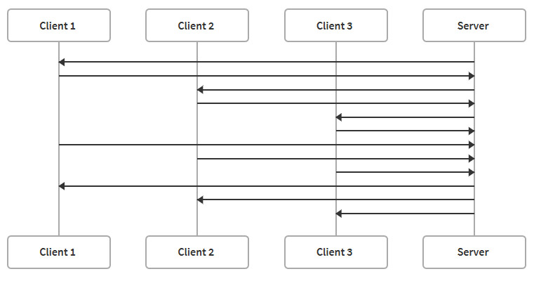

# **Three.js and TypeScript**

https://sbcode.net/threejs/

## Install the Three.js Typescript Boilerplate

```sh
git clone https://github.com/Sean-Bradley/Three.js-TypeScript-Boilerplate.git
cd Three.js-TypeScript-Boilerplate
npm install
npm run dev
```

## Dat GUI

https://sbcode.net/threejs/dat-gui/

安装依赖

```bash
npm install dat.gui --save-dev
npm install @types/dat.gui --save-dev
```

引用

```typescript
import { GUI } from 'dat.gui'
```

## Object3D Hierarchy

https://sbcode.net/threejs/object-hierarchy/

获取 Object3D 变换，例如位置、旋转/四元数和比例，将返回局部变换空间中的值。 如果 Object3D 是场景的直接后代，那么世界空间值将是相同的。

如果你的 Object3D 是另一个已经是场景子级的 Object3D 的子级，那么世界变换值也将考虑其父级、祖父母、曾祖父母等的变换。


要获得对象的世界变换，

```typescript
const objectsWorldPosition = new THREE.Vector3()
object.getWorldPosition(objectsWorldPosition)

const objectsWorldDirection = new THREE.Vector3()
object.getWorldDirection(objectsWorldDirection)

const objectsWorldQuaternion = new THREE.Quaternion()
object.getWorldQuaternion(objectsWorldQuaternion)

const objectsWorldScale = new THREE.Vector3()
object.getWorldScale(objectsWorldScale)
```

## Geometries

https://sbcode.net/threejs/geometries/


## Updating THREE.Geometry to THREE.BufferGeometry

https://sbcode.net/threejs/geometry-to-buffergeometry/

> BufferGeometry is a more efficient way of representing meshes since it stores the data as typed arrays.

## Materials

https://sbcode.net/threejs/materials/

## MeshBasicMaterial

## MeshNormalMaterial

## MeshLambertMaterial

在本讲座中，我们使用 Three.js MeshLambertMaterial 进行实验。

朗伯反射率是定义理想无光泽或漫反射表面的属性。

例子可以是木头或石头。 通常物体不发光，但仍受光照影响。

## MeshPhongMaterial

在本次讲座中，我们使用 Three.js MeshPhongMaterial 进行实验。

它使用 Blinn-Phong 反射模型，

它可用于模拟闪亮的物体，例如抛光的木头。

它比 MeshLambertMaterial、MeshNormalMaterial 和 MeshBasicMaterial 的计算成本更高，因此如果需要考虑性能，那么你可以选择仅在必要时使用它。

## MeshStandardMaterial

在本讲座中，我们使用 Three.js MeshStandardMaterial 进行实验。

它使用基于物理的渲染 (PBR) 模型。

它创建的外观比 MeshLambertMaterial 或 MeshPhongMaterial 更逼真。 它的计算成本也更高。

## MeshPhysicalMaterial

在本次讲座中，我们使用 Three.js MeshPhysicalMaterial 进行实验。

它是 MeshStandardMaterial 的扩展，提供更多反射率选项。

## MeshMatcapMaterial

在本讲座中，我们使用 Three.js MeshMatcapMaterial 进行实验。

MatCap（材质捕获）着色器使用球体图像作为视图空间环境贴图。 图像包含预烘焙的颜色和阴影。

## MeshToonMaterial

Toon shading 或 Cel shading 是一种非真实感渲染技术，旨在通过使用较少的阴影颜色而不是平滑的渐变效果来使 3D 计算机图形看起来更卡通化。

## SpecularMap（高光贴图）

SpecularMap 是一个纹理图像，它影响 MeshLambertMaterial 和 MeshPhongMaterial 材质上的镜面高光。

要调整镜面高光的强度，请在 MeshPhongMaterial 上使用镜面反射和光泽度属性。

同样在 MeshPhongMaterial 上，要调整环境贴图强度，请使用材质反射率属性。

# RoughnessMap and MetalnessMap（粗糙度贴图和金属度贴图）

roughnessMap 和 metalnessMap 是 MeshStandardMaterial 和 MeshPhysicalMaterial 材质的 specularMap 等效项。

## BumpMap（凹凸贴图）

## NormalMap（法线贴图）

比凹凸贴图更令人印象深刻的是法线贴图。
法线贴图使用图像的 rgb 值来影响光照。

它还模拟与灯光相关的感知深度，但使用不同的算法来指示在上/下和左/右方向上改变照明的程度。

使用 `normalScale` 属性来改变感知深度。 `normalScale` 需要一个 `THREE.Vector2`。 通常， `normalScale` 的 `x,y` 值将介于 `0` 和 `1.0` 之间。 在我的示例中，我的值高达 `10`，以使其更加极端。

下面是用作法线贴图的图像。

## DisplacementMap

位移贴图是可用于改变网格几何形状的图像。 每个像素的值用于改变网格顶点的位置。

使用位移贴图时，请确保你使用的网格几何体（例如平面）具有许多顶点。 位移贴图正在修改顶点。 拥有的顶点越多，位移的细节就越详细。

出现了DEM的效果（*）


[置换贴图也常作为高度图来生成地形，并结合凹凸贴图实现丰富的地形效果。](https://zhuanlan.zhihu.com/p/260973533?utm_medium=social&utm_oi=726478653495468032)

## DisplacementMap with NormalMap

添加法线贴图可以得到更好的结果。

与上一页中的位移贴图相比，此示例使用的是 [MeshPhongMaterial](https://sbcode.net/threejs/meshphongmaterial/)。

出现了DEM的效果（*）

https://sbcode.net/extra_html/displacement_and_normal_maps.html

## Material Repeat and Center

可以通过更改其 UV 坐标来更改材质纹理位于几何体上的位置。 它也可以被拉伸、重复、旋转和偏移。

在本视频中，我演示了通过使用`repeat`和 `center` 材质选项更改纹理 UV 坐标来放大我们的 3D 世界平面。

https://sbcode.net/extra_html/materialrepeatcenter.html

开启了 `wireframe`，有 Delauny 三角网的效果。

材质(Material) 的几个属性值：

### .alphaTest : Float

设置运行alphaTest时要使用的alpha值。如果不透明度低于此值，则不会渲染材质。默认值为**0**。


AlphaTest —— Alpha 测试，是阻止片元被写到屏幕上的最后机会。

在最终渲染出的颜色被计算出来之后，可以通过将颜色的透明度，和一个固定值进行比较。

```
如果该颜色 的透明度 alpha，满足条件，则通过测试，绘制此片元；否则丢弃此片元，不进行绘制。
```


### .depthTest : Boolean

是否在渲染此材质时启用深度测试。默认为 **true**。

[深度测试](https://learnopengl-cn.readthedocs.io/zh/latest/04%20Advanced%20OpenGL/01%20Depth%20testing/)

### .depthWrite : Boolean

渲染此材质是否对深度缓冲区有任何影响。默认为**true**。

在绘制2D叠加时，将多个事物分层在一起而不创建z-index时，禁用深度写入会很有用。

## Texture Mipmaps

### 描述

Mipmapping 是一种基于每个纹理应用的纹理渲染技术。

当启用 mipmapping（默认）时，GPU 将使用不同大小的纹理版本来渲染表面，具体取决于它与相机的距离。

### Magnification Filters

定义当被纹理化的像素映射到小于或等于一个纹理元素 (texel) 的区域时要使用的纹理放大功能。

```js
texture.magFilter =
```

- THREE.NearestFilter
- THREE.LinearFilter (Default)

### Minification Filters

定义当被纹理化的像素映射到大于一个纹理元素 (texel) 的区域时使用的纹理缩小函数。

```
texture.minFilter =
```

- THREE.NearestFilter
- THREE.NearestMipmapNearestFilter
- THREE.NearestMipmapLinearFilter
- THREE.LinearFilter
- THREE.LinearMipmapNearestFilter
- THREE.LinearMipmapLinearFilter (Default)

创建两个场景

```ts
function render() {
    renderer.setScissorTest(true)

    renderer.setScissor(0, 0, window.innerWidth / 2 - 2, window.innerHeight)
    renderer.render(scene1, camera)

    renderer.setScissor(
        window.innerWidth / 2,
        0,
        window.innerWidth / 2 - 2,
        window.innerHeight
    )
    renderer.render(scene2, camera)

    renderer.setScissorTest(false)
}
```

其中，

- setScissor ( x : Integer, y : Integer, width : Integer, height : Integer ) : undefined

将剪裁区域设为(x, y)到(x + width, y + height) Sets the scissor area from

- setScissorTest ( boolean : Boolean ) : undefined

启用或禁用剪裁检测. 若启用，则只有在所定义的裁剪区域内的像素才会受之后的渲染器影响。

## Custom Mipmaps

你可以根据与相机的距离以及是否需要缩小或放大纹理像素来创建自己的自定义 mipmap，以便在绘制纹理像素时使用。

```js
const mipmap = (size: number, color: string) => {
    const imageCanvas = document.createElement('canvas') as HTMLCanvasElement
    const context = imageCanvas.getContext('2d') as CanvasRenderingContext2D
    imageCanvas.width = size
    imageCanvas.height = size
    context.fillStyle = '#888888'
    context.fillRect(0, 0, size, size)
    context.fillStyle = color
    context.fillRect(0, 0, size / 2, size / 2)
    context.fillRect(size / 2, size / 2, size / 2, size / 2)
    return imageCanvas
}

const blankCanvas = document.createElement('canvas') as HTMLCanvasElement
blankCanvas.width = 128
blankCanvas.height = 128

const texture1 = new THREE.CanvasTexture(blankCanvas)
texture1.mipmaps[0] = mipmap(128, '#ff0000')
texture1.mipmaps[1] = mipmap(64, '#00ff00')
texture1.mipmaps[2] = mipmap(32, '#0000ff')
texture1.mipmaps[3] = mipmap(16, '#880000')
texture1.mipmaps[4] = mipmap(8, '#008800')
texture1.mipmaps[5] = mipmap(4, '#000088')
texture1.mipmaps[6] = mipmap(2, '#008888')
texture1.mipmaps[7] = mipmap(1, '#880088')
texture1.repeat.set(5, 5)
texture1.wrapS = THREE.RepeatWrapping
texture1.wrapT = THREE.RepeatWrapping

const texture2 = texture1.clone()
texture2.minFilter = THREE.NearestFilter
texture2.magFilter = THREE.NearestFilter

const material1 = new THREE.MeshBasicMaterial({ map: texture1 })
const material2 = new THREE.MeshBasicMaterial({ map: texture2 })

const plane1 = new THREE.Mesh(planeGeometry1, material1)
const plane2 = new THREE.Mesh(planeGeometry2, material2)

scene1.add(plane1)
scene2.add(plane2)
```

## Anistropic Filtering

各向异性过滤

各向异性过滤允许我们提高 MIP 贴图的质量。

```ts
const gui = new GUI()
const textureFolder = gui.addFolder('THREE.Texture')
textureFolder
    .add(texture2, 'minFilter', options.minFilters)
    .onChange(() => updateMinFilter())
textureFolder
    .add(texture2, 'magFilter', options.magFilters)
    .onChange(() => updateMagFilter())
textureFolder
    .add(texture2, 'anisotropy', 1, renderer.capabilities.getMaxAnisotropy())
    .onChange(() => updateAnistropy())
textureFolder.open()

function updateAnistropy() {
    // for Three r137 and earlier
    // texture2.needsUpdate = true

    // for Three r138 and later
    material2.map = texture2.clone()
}
```

## Lights

### 描述

Threejs中有各种各样的光源。

它们都从 THREE.Light 基类扩展而来，而后者又从 Object3D 基类扩展而来。

基类属性

- 颜色

- 强度

- isLight（只读）

  光源为你提供了更多选项来更改场景中网格的外观。 网格需要添加材料才能使光照调整生效。

如果场景没有光源，大多数材质将不可见。 [MeshBasicMaterial](https://sbcode.net/threejs/meshbasicmaterial/)、[MeshNormalMaterial](https://sbcode.net/threejs/meshnormalmaterial/) 和 [MeshMatcapMaterial](https://sbcode.net/threejs/meshmatcapmaterial/) 是自发光的，因此它们不需要在场景中可见光照，但大多数其他材质都需要，例如 [MeshLambertMaterial](https://sbcode.net/threejs/meshlambertmaterial/)、[MeshPhongMaterial](https://sbcode.net/threejs/meshphongmaterial/)、[MeshStandardMaterial](https://sbcode.net/threejs/meshstandardmaterial/)、[MeshPhysicalMaterial](https://sbcode.net/threejs/meshphysicalmaterial/) 和 [MeshToonMaterial](https://sbcode.net/threejs/meshtoonmaterial/)。

在接下来的示例中，我将演示不同的光照如何影响不同的材质。

## Ambient Light

### 描述

- 平等地照亮场景中的所有对象，除了 MeshBasicMaterial、MeshNormalMaterial 和 MeshMatcapMaterial 等自发光对象。
- 不投射阴影。
- 光线在所有方向和距离上均等地传播。 因此，将灯光与 [0, 0, 0] 的默认位置不同的位置没有任何区别。
- 材质不会根据几何法线显示阴影，也不会产生镜面反射效果，因此如果其他网格前面的网格具有相同的材质甚至是单一颜色贴图纹理，则它们将不可见。

## Directional Light

### 描述

将平行光想象为 `OrthographicCamera`，而不是 `PerspectiveCamera`。 来自 `DirectionalLight` 的光线在方向上是平行的。

## Hemisphere Light（半球光）

Threejs 半球光非常像平行光，但也可以设置以反向投射光线。 我还演示了半球光辅助对象。

## Point Light（点光源）

从一个点向各个方向发出的光

- distance - 光源的最大范围。 默认值为 0（无限制）。
- 衰减 - 光沿着光的距离变暗的量。 默认值为 1。

## Spot Light

## Spot Light Shadow

## Directional Light Shadow

Directional Light Shadow 使用 OrthographicCamera 来计算阴影，而不是 PerspectiveCamera。 这是因为来自 DirectionalLight 的光线是平行的。

## DisplacementMap with Shadow

从 Three r132 开始，置换贴图现在支持自阴影。 确保你的网格（例如平面）同时投射和接收阴影。 如果你看到阴影伪影，你将需要管理 light.shadow.bias。

此示例使用带有 [MeshStandardMaterial]() 的平行光阴影

## Orbit Controls

Orbit controls allow the camera to orbit around a target.

## Trackball Controls

TrackballControls 类似于 OrbitControls。 但是，它不保持恒定的相机向上矢量。 这意味着相机可以绕过它的极地极端（ polar extremes）。 它不会翻转以保持右侧向上。

https://sbcode.net/extra_html/trackballcontrols.html

## PointerLockControls

PointerLockControls 实现了内置的浏览器指针锁定 API。 它提供基于鼠标随时间移动的输入方法（即增量），而不仅仅是鼠标光标在视口中的绝对位置。 它使你可以访问原始鼠标移动，将鼠标事件的目标锁定到单个元素，消除对鼠标在单个方向上移动距离的限制，并从视图中移除光标。 例如，它非常适合第一人称 3D 游戏。

代码中，添加了W、A、S、D键监听，用来移动。

```ts
const onKeyDown = function (event: KeyboardEvent) {
    switch (event.code) {
        case 'KeyW':
            controls.moveForward(0.25)
            break
        case 'KeyA':
            controls.moveRight(-0.25)
            break
        case 'KeyS':
            controls.moveForward(-0.25)
            break
        case 'KeyD':
            controls.moveRight(0.25)
            break
    }
}
document.addEventListener('keydown', onKeyDown, false)
```

该类的实现是基于[Pointer Lock API](https://developer.mozilla.org/en-US/docs/Web/API/Pointer_Lock_API)的。 对于第一人称3D游戏来说， PointerLockControls 是一个非常完美的选择。

## DragControls

用于为场景中的对象提供拖放交互。

https://sbcode.net/extra_html/dragcontrols.html

```typescript
const controls = new DragControls(cubes, camera, renderer.domElement)
```

## Transform Controls

允许你更改场景中对象的变换。

你将控件附加到对象，然后将控件添加到场景中，以便交互句柄可见。

然后你可以在场景中重新缩放、旋转和定位对象。

```typescript
const controls = new TransformControls(camera, renderer.domElement)
controls.attach(cube)
scene.add(controls)
```

## OBJ Model Loader

```typescript
// const material = new THREE.MeshBasicMaterial({ color: 0x00ff00, wireframe: false })

const objLoader = new OBJLoader()
objLoader.load(
    'models/cube.obj',
    (object) => {
        // (object.children[0] as THREE.Mesh).material = material
        // object.traverse(function (child) {
        //     if ((child as THREE.Mesh).isMesh) {
        //         (child as THREE.Mesh).material = material
        //     }
        // })
        scene.add(object)
    },
    (xhr) => {
        console.log((xhr.loaded / xhr.total) * 100 + '% loaded')
    },
    (error) => {
        console.log(error)
    }
)
```

## MTL Loader

MTL 是 OBJ 文件使用的材质信息。 你可以设置颜色、高光（specular）、自发光、alpha、平滑度、图像贴图和坐标。

由于默认是[MeshPhongMaterial](https://sbcode.net/threejs/meshphongmaterial/)，我们只能设置影响meshPhongMaterial的属性。

如果你使用 Blender 创建你的 OBJ 和 MTL，那么你可以更改

- Base Color
- Specular
- Emission
- Alpha
- Smooth/Flat Shaded


```typescript
const mtlLoader = new MTLLoader()
mtlLoader.load(
    'models/monkey.mtl',
    (materials) => {
        materials.preload()

        const objLoader = new OBJLoader()
        objLoader.setMaterials(materials)
        objLoader.load(
            'models/monkey.obj',
            (object) => {
                scene.add(object)
            },
            (xhr) => {
                console.log((xhr.loaded / xhr.total) * 100 + '% loaded')
            },
            (error) => {
                console.log('An error happened')
            }
        )
    },
    (xhr) => {
        console.log((xhr.loaded / xhr.total) * 100 + '% loaded')
    },
    (error) => {
        console.log('An error happened')
    }
)
```

## GLTF Model Loader

用于将 [glTF](https://www.khronos.org/gltf/) 模型加载到 Threejs 场景中的加载器。

glTF 是一种用于高效传输和加载 3D 场景和模型的规范。

glTF 最小化了 3D 资产的大小，以及解压和使用这些资产所需的运行时处理。

一个 glTF 文件可能包含一个或多个场景、网格、材质、纹理、皮肤、骨架、变形目标、动画、灯光和相机。

资产可以 JSON (.gltf) 或二进制 (.glb) 格式提供。

```typescript
const loader = new GLTFLoader()
loader.load(
    'models/monkey.glb',
    function (gltf) {
        gltf.scene.traverse(function (child) {
            if ((child as THREE.Mesh).isMesh) {
                const m = child as THREE.Mesh
                m.receiveShadow = true
                m.castShadow = true
            }
            if ((child as THREE.Light).isLight) {
                const l = child as THREE.Light
                l.castShadow = true
                l.shadow.bias = -0.003
                l.shadow.mapSize.width = 2048
                l.shadow.mapSize.height = 2048
            }
        })
        scene.add(gltf.scene)
    },
    (xhr) => {
        console.log((xhr.loaded / xhr.total) * 100 + '% loaded')
    },
    (error) => {
        console.log(error)
    }
)
```

## DRACO Loader

DRACO 加载器用于加载用 Draco 库压缩的几何图形。

Draco 是一个开源库，用于压缩和解压缩 3D 网格和点云。

glTF 文件也可以使用 DRACO 库进行压缩，也可以使用 glTF 加载器进行加载。 在这种情况下，我们可以将 glTF 加载器配置为使用 DRACOLoader 来解压文件。

压缩后的几何图形可以小得多，但代价是客户端浏览器上的额外解码时间。

https://github.com/google/draco

## Textured GLTF

在本视频中，我演示了向 glTF 模型添加纹理并修改其 UV 坐标。 默认情况下，当你从 blender 导出纹理时，纹理会嵌入到模型中。 与使用 OBJ 和 MTL 相比，这使得创建和使用纹理模型更容易。

```js
const loader = new GLTFLoader()
loader.load(
    'models/monkey_textured.glb',
    function (gltf) {
        gltf.scene.traverse(function (child) {
            if ((child as THREE.Mesh).isMesh) {
                const m = child as THREE.Mesh
                m.receiveShadow = true
                m.castShadow = true
            }
            if ((child as THREE.Light).isLight) {
                const l = child as THREE.Light
                l.castShadow = true
                l.shadow.bias = -0.003
                l.shadow.mapSize.width = 2048
                l.shadow.mapSize.height = 2048
            }
        })
        scene.add(gltf.scene)
    },
    (xhr) => {
        console.log((xhr.loaded / xhr.total) * 100 + '% loaded')
    },
    (error) => {
        console.log(error)
    }
)
```

## PLY Model Loader

## STL Model Loader

STL 模型格式广泛用于快速原型制作、3D 打印和计算机辅助制造。

STL 文件仅描述 3D 对象的表面几何形状，没有任何颜色、纹理或其他常见 3D 建模属性的表示。

## FBX Model Loader

FBX 格式用于提供数字内容创建应用程序和游戏引擎（如 Blender、Maya、Autodesk、Unity、Unreal 等）之间的互操作性。 它支持许多功能，例如 3D 模型、场景层次结构、材质、照明、动画、骨骼等等。

## FBX Animations

在本练习中，我们导入了一个不同的 FBX 模型，并且我们还为该模型导入了几个动画剪辑。 然后，我们创建按钮以在每个动画剪辑之间平滑过渡模型。

## GLTF Animations

在本课中，我们将创建与 FBX 动画课中创建的项目等效的 GLTF。

我们使用 Blender 将主要的 FBX 模型及其相关动画文件转换为 GLB 文件。

## GLTF Custom Animations

我们不需要从其他网站下载动画，我们可以创建自己的。

使用 Blender，你可以创建模型，然后通过在时间线编辑器上创建关键帧来调整其部件的位置、比例和旋转。

使用 Blender 中时间线编辑器上的播放选项来测试你的动画作品，然后将你的模型导出为 GLB（首选）或 GLTF，并为导出选择动画选项。

导出模型后，你可以将 GLB/GLTF 文件从文件系统拖到下面的示例场景中。 它将读取文件并为它找到的每个动画剪辑创建一个新的复选框。 你可以单独启用/禁用每个动画。

## 带有 GLTF 动画的 DragControls

使用动画导出的 GLTF 模型通常不适用于 DragControl，因此解决该问题的一种方法是创建一个辅助对象，例如立方体，并将 DragControl 绑定到该对象。 然后将模型组的位置调整到被拖动立方体的新位置。

在此示例中，你可以使用 DragControls 拖动动画 GLTF 模型。

https://sbcode.net/extra_html/dragcontrols-animated-gltf.html

拳击游戏角色，可以拖动到场景的不同位置。

### 资源

对于这个例子，我已经下载了 Eve By J.Gonzales 模型，其中包含拳击动画。 在 [Mixamo](https://www.mixamo.com/) 中，我选择了 Eve 角色，然后选择了动画选项卡并选择了 Punching 动画。

## TransformControls with GLTF Animations

这是一个使用变换控件操作动画 GLTF 的示例。

在本例中，你可以变换动画模型的位置、旋转和大小。

https://sbcode.net/extra_html/transformcontrols-animated-gltf.html

拳击游戏角色，可以平移、旋转和缩放角色。

## Reflector（反射器）

包含在 Threejs 示例子文件夹中的 Reflector 对象可用于创建镜像。

下面的示例使用带有多个镜像的 [GLTF 动画扩展 DragControls](https://sbcode.net/threejs/gltf-animations-drag/)。

反射器对象将仅在一个方向上镜像。 如果要创建无限远镜，可以在现有反射器前面放置另一个反射器，但在它前面放置一段距离并背对第一个反射器。 反射器只会反映它们在当前渲染过程中看到的内容。 所以一开始你不会得到逼真的无限镜效果。 由于反射器仅在一个方向反射，因此你可以将另一个反射器串联放置在现有反射器后面，你将在另一个反射器中获得三次反射，反射回串联放置的其他两个反射器。 在上面的示例中，我有 4 个反射器，它们都互相看着。 2个向前看，2个向后看。 并且都在不同的距离。 请注意，使用此技术创建无限镜将需要更多 CPU 用于添加到场景中的每个新反射器。

## CubeCamera Reflections

CubeCamera 对象可用于在体积对象（例如球体、立方体和其他对象）上创建更逼真的反射。

https://sbcode.net/extra_html/cubecamera.html

实现球体反射环境的倒影。

pivot：枢，旋转。

## CubeCamera Refractions

`THREE.CubeCamera` 对象也可用于创建逼真的折射效果。

使用 `THREE.CubeCamera` 进行折射时的额外注意事项是，

- 将 `CubeRenderTargets texture.mapping` 设置为 `THREE.CubeRefractionMapping`
- 将 `refractionRatio` 属性添加到你的材质中

https://sbcode.net/extra_html/cubecamera-refractions.html

## Raycaster

光线投射允许你从场景中的 3D 点创建矢量，并检测矢量相交的对象。

raycasting 类几乎总是用于 3D 场景中的鼠标拾取对象。

我们可以使用 `set` 或 `setFromCamera` 方法设置光线投射器的位置和方向，然后调用它的 `intersectObject` 或 `intersectObjects` 方法来告诉我们许多与光线相交的场景对象的信息，包括：

- 交点与光线投射器位置的距离，
- 3D场景中的交叉点位置，
- 相交对象的面，
- 面法线的方向，
- 面上相交的 UV 坐标
- 以及对相交对象本身的引用。

## Raycaster Collision Detection

虽然光线投射几乎总是用于 3D 场景中的鼠标拾取对象，但它也可用于简单的碰撞检测。

在这个例子中，我检测轨道控件是否会穿透另一个物体并调整相机位置，使其保持在外面。

本质上，我正在创建从相机目标到相机位置的射线。 如果两者之间有相交的对象，则将相机位置调整到相交点。 这可以防止相机进入墙壁后面，或进入盒子或地板，或作为正在测试相交的对象数组的一部分的任何对象。


此外，在目标和自身发生碰撞的情况下，我可以修改对象之间的不透明度，而不是移动相机，而不是使用光线投射器找到新的点来定位相机。 旋转相机并注意相机目标和相机本身之间的任何对象是如何变得透明的。

## Raycaster Mouse Picking

这是使用 Raycaster 鼠标拾取场景中对象的基本示例。

遍历场景并将所有单个对象添加到 [Raycaster](https://sbcode.net/threejs/raycaster/) 使用的 **pickableObjects** 数组中。 球体和平面被故意排除在外，因此它们不会被鼠标选中。

平面也会收到阴影，而其他一切都只会投射阴影。

这个例子展示，

- 加载 GLB 场景，遍历子对象以单独添加和/或复制属性以供以后使用。
- 使用 [Raycaster](https://sbcode.net/threejs/raycaster/) 检测鼠标是否在某些对象上并更改那里的材质。

## Raycaster Measurements

使用 Raycaster 辅助测量点之间的距离。

这个例子展示，

- 使用 [Raycaster](https://sbcode.net/threejs/raycaster/) 以及鼠标事件开始并绘制从 A 点到 B 点的线。
- 使用 CSS2DRenderer 和 CSS2DObject 创建测量标签。
- 使用 [Vector3.lerpVectors](https://sbcode.net/threejs/vector3-lerp/) 在 2 个点之间定位标签。

## Using tweens.js

https://sbcode.net/extra_html/tween.html

Tweenjs 是一个 JavaScript 补间引擎。

补间（来自中间）A tween (from *in-between*) 是一个概念，它允许你以平滑的方式更改对象的属性值。 我们可以决定需要多长时间，是否应该有延迟，每次补间更新时要做什么，是否应该重复等等。

## Using tween.js with the THREE.AnimationMixer

https://sbcode.net/extra_html/tween-animation-mixer.html

在本课中，我将演示如何混合使用上一课 GLTF 动画、Raycaster、tween.js 和 SpotLight Shadow 中演示的概念

我将导入一个 GLTF 模型，导入几个动画剪辑，添加 RayCaster 并将 GLTF 模型的位置补间到单击的鼠标坐标，以便模型动画到新位置。

页面中代码有问题，正确代码参考 gitee 仓库。

## Using tween.js with OrbitControls

在这个例子中，我演示了混合使用之前课程 GLTF Loader、Raycaster、tween.js 和 Orbit Controls 中演示的概念。

移动 Orbit 控件目标的概念在使用 tweens.js 视频课程中进行了讨论和演示。

在此示例中，导入了 glTF 场景，当你双击地板或猴头时，Orbit Controls 将补间目标定位到新位置。 请参阅下面代码中的 onDoubleClick 函数。

## Vector3

关于vector3和一些常见用途案例。

Vector3可用于描述位置，方向，动量或仅系列3个值的系列。 vector3的值为`x`，`y`和`z`。

我将演示的第一个vector3方法是`normalize()`方法。 它将采用3个数字，并 scale 它们，以使其在0,0,0和其位置中包含的值之间的距离为x，y，z的长度为1。

即，当归一化时，{x：1，y：1，z：0}的向量将变为{x：0.7071067811865475，y：0.7071067811865475，z：0}。 0.7071067811865475也恰好等于45度的正弦。

如果你有一个带有许多段的立方体，则可以将该几何体中的所有点标准化，然后最终会得到一个球体。

https://sbcode.net/extra_html/vector3-0.html

https://sbcode.net/extra_html/vector3-1.html

## Vector3 Lerp

> lerp：线性插值（Linear Interpolation）

有时你只需要一个简单的位置变换随时间发生。 tween 库运行良好，但如果你实际上并不需要它提供的所有功能，它可能会过度设计。

如果你只想将对象从 A 移动到 B 并且没有其他内容，则可以使用 `Vector3 .lerp` 和 `.lerpVectors` 方法。

```typescript
(method) Vector3.lerp(v1: THREE.Vector3, alpha: number): THREE.Vector3

(method) Vector3.lerpVectors(v1: THREE.Vector3, v2: THREE.Vector3, alpha: number): THREE.Vector3
```

例如，

```typescript
cube.position.lerp(new THREE.Vector3(1, 2, 3), 0.05)
```

**v1** :  Is the vector to lerp towards.

**alpha** ：是从当前向量到 v1 的直线距离的百分比。

**v2** ：If using *.lerpVectors*, then you can set an alternate start vector3 to lerp from rather that the current vector3.

在动画循环期间调用 **.lerp** 似乎会模仿使用 TWEEN.Easing.Cubic.Out 的 Tween

如果要根据 alpha 值沿任意线滑动对象，则调用 **.lerpVectors** 很有用。 除其他外。

将 alpha 设置为较低的数字，例如 0.1，向量会显得更慢，随着它接近目标向量而减慢。

将 alpha 设置为 1.0，补间将在一个渲染周期内立即发生。

双击示例中的地板以查看较慢的 lerp。 然后用 alpha 进行实验以查看更快的 lerp，并沿着第一个立方体和起始位置之间的线滑动第二个立方体。

## Physics with Cannon

### 描述

动画也可以使用物理库来实现。 我们可以使用一个名为 Cannon.js 的库。 但是，与其使用不再维护的原始 Cannon.js，我们可以安装一个名为 Cannon-es 的新分支。

Cannon 物理库非常适合模拟刚体。 你不必将它与 Three.js 一起使用，但它最初是为与 Three.js 一起使用而构建的，因此在你的项目中开始使用它会很容易。

我们将使用它来使对象以更真实的方式移动和交互，并提供碰撞检测的可能性。

### 基本概念

- 形状：用于物理计算的几何形状，例如球体，立方体或平面。
- 刚体：刚体具有形状和计算中使用的许多其他特性，例如质量和惯性。
- 约束：一个3D 物体具有6个自由度，3个描述位置，3个用于描述旋转矢量的自由度。 约束是对自由度之一的限制。
- Contact constraint（接触约束）：一种模拟摩擦和恢复的约束。 这些就像应用了约束的对象的面。
- 世界：相互作用的物体和约束的集合。。
- Solver：通过物体和约束来计算物理属性并相应地调整它们的算法。

### 碰撞检测

碰撞检测算法确定哪些对象对可能发生碰撞。 碰撞检测是一个计算量很大的过程，因此可以使用各种方法来简化碰撞检测。

- Narrowphase：直接的物体与物体的碰撞检测。 这是计算成本最高的。
- Broadphase：是对 Narrowphase 的一种折衷方案，可以使用各种其他技术来提高碰撞检测性能。

Cannon 提供了多种`Broadphase`检测选项。

| Phase           | Description                                                  |
| --------------- | ------------------------------------------------------------ |
| NaiveBroadphase | **默认值**。 NaiveBroadphase 无限制地查看所有可能的对，因此它的复杂度为 N^2。 它类似于 Narrowphase 技术，不同之处在于它首先确定物体是否足够接近，然后再检查是否有物体接触。 NaiveBroadphase 是默认设置，适用于最常见的用例，但如果物理世界中有很多对象，则性能会降低。 |
| SAPBroadphase   | Sweep and Prune 算法沿轴对物体进行排序，然后通过查看物体大小和下一个物体的位置来向下移动该列表以查找对。 为了获得最佳性能，请选择一个轴，使物体分布更多。 X 轴设置为 0，Y 轴设置为 1，Z 轴设置为 2。 默认**axisIndex**为0（X轴）。 ; 例如。，// TypeScript` `world.broadphase = new CANNON.SAPBroadphase(world)` `;(world.broadphase as CANNON.SAPBroadphase).axisIndex = 2 |
| GridBroadphase  | 轴对齐的均匀网格 broadphase。 将空间划分为单元格网格。 物体被放置在它们重叠的单元格中，并且同一单元格中的物体被配对。 GridBroadphase 需要提前知道空间的大小。 创建对象时设置单元格数。 默认单元数为 X = 10、Y = 10、Z = 10。 |

### 迭代

Solver 算法决定向接触的物体添加什么力。 Solver 是迭代的，这意味着它在每个动画通道上逐步求解方程。 它将更接近循环期间每次迭代的解决方案。 Solver 迭代的数字太低会导致接触力越来越不准确，这可能表现为对象上的抖动或振动，而更高的数字会提高精度和稳定性，但也会影响性能。

默认求解器迭代次数为 10。

```typescript
//JavaScript (Cannon.js version)
world.solver.iterations = 10

//TypeScript (Cannon-es version)
;(world.solver as CANNON.GSSolver).iterations = 10
```

### 支持的 Cannon.js 形状碰撞


### Setup

Install Cannon-es

```sh
npm install cannon-es --save-dev
```

## Cannon Debug Renderer

最初的 Cannon.js 还包含一个脚本来帮助调试物理世界所看到的内容。 我已经将该脚本重新编写为一个 TypeScript 文件，我们可以将其添加到我们的项目中，以便我们可以更好地可视化物理形状。

## Trimesh、凸多面体和复合形状

在本视频中，我将演示使用多种不同类型的 Cannon 形状（例如 Trimeshes、ConvexPolyhedrons 和 Compound 形状）的性能。

Three.js 中的几何体可能包含许多顶点和面，因此如果在物理引擎中使用相同的几何形状，你将不会始终获得最佳性能。 你可能需要更有创意并优化可提供最佳折衷的形状。 这种自定义形状有时也称为碰撞边界或网格。

在定位复合形状的各个部分时，你可以使用 3D 图形工具来帮助估计定位。 重要的是要知道，如果你使用 Blender，请注意默认情况下 Blender 使用不同的坐标系。 在 Blender 中，Z 为 UP，Y 轴用于 Near/Far，与 Threejs 相比也是负数。 因此，你需要交换 Y 和 Z 的坐标并否定新的 Z。

要从默认 Threejs 相机的角度定位对象，俯视 Z 轴，上轴 [0,1,0]，请参见转换表。

| Axis       | Threejs | Blender |
| ---------- | ------- | ------- |
| Up/Down    | Y / -Y  | Z / -Z  |
| Left/Right | -X / X  | -X / X  |
| Near/Far   | Z / -Z  | -Y / Y  |

## ConvexObjectBreaker

在此示例中，我使用 Threejs misc 文件夹中的 ConvexObjectBreaker 类来粉碎一些现有的网格。 我在网格上射一个球，如果发生碰撞，我将网格、碰撞坐标和法线传递给 ConvexObjectBreakers prepareBreakableObject 和 subdivideByImpact 方法。 这会将网格分割成许多较小的网格。 我可以删除原始网格并将新的较小网格添加到场景中。

在此示例中，我还将它与 Cannon 结合使用。 每个网格碎片还具有从新网格计算并添加到物理世界的新 ConvexPolyhedron。

请注意，ConvexPolyhedrons 是 cpu 密集型计算物理属性，因此当网格是具有很少顶点的简单图元时，这最有效。

https://sbcode.net/extra_html/convexobjectbreaker.html

更详细地说，对于我射出的每个球，我都会注册一个碰撞事件监听器。 当发生碰撞时，它将传入 CANNON.ICollisionEvent。 我需要的关于被碰撞的物体的信息，以及它的接触属性。

使用 CANNON.Body，我检索了一些自定义用户数据，我可以使用这些数据将这个物体与一个网格链接起来，以及这个网格被分割成碎片的次数。

使用 CANNON.ICollisionEvent，我将 bj.position 和 rj 相加，然后将其转换为局部网格位置，然后从被击中对象的角度给出碰撞位置。

```typescript
const poi = bodies[contactId].pointToLocalFrame((contact.bj.position as CANNON.Vec3).vadd(contact.rj))
```


现在计算出碰撞位置和法线，然后我可以将其传递给 ConvexObjectBreaker.subdivideByImpact 方法。 请注意，当你击中顶部或底部的对象时，分片是相对于被击中的位置的，而分片仍然是随机的。 这个方法返回一个新的网格数组，我可以用它来添加到场景中，并计算物理体。

在创建一个可以细分的Mesh时，首先传入ConvexObjectBreaker.prepareBreakableObject方法。 然后可以使用 ConvexObjectBreaker.subdivideByImpact 对其进行细分。 请注意，从子分区创建的新网格不需要重新传递到 ConvexObjectBreaker.prepareBreakableObject 方法。

## Constructive Solid Geometry


## 使用 OBB 进行碰撞检测

如果你不需要物理模拟，但仍需要某种碰撞检测，你可以选择使用 Oriented Bounding Box (OBB)。

## Examples 

### Glasses

https://sbcode.net/extra_html/glasses.html

这个例子展示了，

- 使用 [Reflector](https://sbcode.net/threejs/reflector/)  镜像其上方的场景。
- 使用 CSS2DRenderer 和 CSS2DObject 创建文字标注。
- 在移动对象上展示文字标注。
- 从 Blender 导出的 glTF 自定义属性中提取标注信息。
- 使用 ConvexBufferGeometry 在可用作物理体的更复杂的网格周围创建凸包。
- 使用 Cannon.js 作为物理引擎
- 使用 MeshPhysicalMaterial 和 CubeCamera 在眼镜架上创建折射效果。
- 使用 GLTFLoader 并有选择地将材质应用到加载的几何体。

### RNG

https://sbcode.net/extra_html/rng.html

演示使用物理容器和复合形状。

这个例子展示，

- 使用 Cannon.js 作为物理引擎
- 创建一个容器物理对象，其他对象在里面滚动。
- 从加载的几何体创建 CANNON.Trimeshes 以用作物理体。
- 演示 OBJLoader 并遍历加载的几何图形。

### Bender

演示 Threejs 中的弯曲 BufferGeometries。

Bender GitHub 存储库：https://github.com/Sean-Bradley/Bender

这个例子展示，

- 弯曲一个 THREE.BoxGeometry
- 弯曲 TextGeometry
- 在运行时替换网格几何体
- 在运行时替换 TextGeometry 的文本
- 使用字体加载器

### CSG with a GLTF

在 glTF 上演示 CSG 操作。

GSGMesh GitHub 存储库：https://github.com/Sean-Bradley/THREE-CSGMesh

这个例子展示，

- 遍历 gTLF 并仅提取所需的几何图形。
- CSG 对 glTF 模型的几何图形进行减法、联合和相交操作。
- 在应用操作之前沿轴平移 CSG 几何。
- 使用 THREE.GridHelper。

https://sbcode.net/extra_html/csg-gltf.html

### Engraving（雕刻）

实时圆形文字雕刻。

这个例子展示，https://sbcode.net/extra_html/engraving.html

- 使用 CSG Subtract 创建一个较大的 CylinderGeometry 并从中减去一个较小的 CylinderGeometry 来创建一个环。
- 使用字体加载器。
- 使用带有 dblclick 事件的 Raycaster 将控件目标聚焦到网格上单击的点。
- 在运行时替换网格几何体
- 围绕半径弯曲网格
- 使用 CSG Subtract 从环几何图形中减去生成的文本几何图形以创建雕刻文本效果

### Shiny Refraction（闪亮折射）

这个例子展示，

- 使用 EffectComposer 添加景深 (DOF) 效果。
- 根据相机和球的距离动态改变自由度。
- 使用 GUI 更改 MeshPhysicalMaterial 属性。

### Cascaded Shadow Maps (CSM)

https://sbcode.net/extra_html/csm.html

级联阴影贴图是一个概念，其中在相机附近使用更高分辨率的阴影，在更远的地方使用更低的分辨率。

The default CSM object creates 4 frustums with 4 directional lights with shadows and different shadow map sizes.

当你想在一个非常大的区域投射阴影时，它是一个很好的解决方案，其中有很多物体。

展示了很多树木，类似常见的三维GIS展示效果（*）。3种树苗是用不同的glb模型。

### LOD (Level Of Detail)

使用 LOD 根据与相机的距离显示/隐藏不同质量的网格。

在这个例子中，我加载了 3 种不同类型的树，每一种都有高、中、低 3 个细节级别。

当你放大和缩小一棵树时，你可以看到模型根据与相机的距离而变化。

https://sbcode.net/extra_html/lod.html

```typescript
for (let i = 0; i < treeCount / treesTypes.length; i++) {
    const lod = new THREE.LOD()
    let mesh = treeHighDetail.clone()
    mesh.scale.copy(scales[treeCounter])
    lod.addLevel(mesh, 5)

    mesh = treeMediumDetail.clone()
    mesh.scale.copy(scales[treeCounter])
    lod.addLevel(mesh, 10)

    mesh = treeLowDetail.clone()
    mesh.scale.copy(scales[treeCounter])
    lod.addLevel(mesh, 30)

    lod.position.copy(positions[treeCounter])
    scene.add(lod)

    treeCounter++
}
```

### Car Physics

这个例子展示了，https://sbcode.net/extra_html/physics-car.html

- 使用 Cannon.js 作为物理引擎。

- 使用 CANNON.HingeConstraint 模拟轮轴、发动机和悬架。

- 使用 Vector3.lerpVectors 实现跟随相机。

- 使用 Directional Light Shadow 和 Helper 的阴影。

- 使用键盘事件来控制汽车。

- 使用 Cannon.js 调试渲染器

  

  有关基于上述示例以及本课程中学到的其他内容的更复杂的版本，请访问 First Car Shooter (https://fcs.sbcode.net/)

### Helicopter Physics

这个例子表明，

- 使用 Cannon.js 作为物理引擎。
- 使用 CANNON.PointToPointConstraint 来模拟悬挂在旋翼桨叶上的直升机机身。
- 使用 Vector3.lerpVectors 实现跟随相机。
- 使用 Directional Light Shadow 和 Helper 的阴影。
- 使用键盘事件来控制直升机。
- 使用 Cannon.js 调试渲染器

https://sbcode.net/extra_html/physics-heli.html

直升机飞行效果，实现了前进后退，仰俯冲，左右倾斜

### Finger Physics

这个例子表明，

- 使用 Cannon.js 作为物理引擎
- 使用 CANNON.Heightfield
- 使用 THREE.Raycaster 自动生成 CANNON.Heightfield 以在加载到场景中时查找对象的高度。

### 点对点约束

这个例子表明，

- 使用 Cannon.js 作为物理引擎。
- 使用 CANNON.PointToPointConstraint 来限制球的运动。
- 使用 CANNON.Body 上的拖动控件。

### 滚动动画

滚动时，进度以百分比计算。 根据滚动在哪个百分比范围内，执行不同的动画脚本。

你可以在选定的滚动百分比范围内设置属性、运行连续动画或在两个值之间运行线性插值。

如果使用线性插值，并且它不打算在整个 100% 的滚动中运行，那么你还必须对其进行缩放，以便它以指定的滚动百分比开始和结束。 有关几种不同类型动画的示例，请参见代码。

### FFT

演示如何使用 HTML5 音频 API 从麦克风生成 FFT，然后使用它生成置换贴图，然后用于扭曲平面几何图形。

这个例子表明，

- 使用 HTML5 音频分析器从连接的麦克风获取字节频率数据。
- 从 FFT 数据生成屏幕外画布并将其用作置换贴图。

### Sharing Animation Clips

你可以加载单个 THREE.AnimationClip 并在两个不同的模型中使用它。

在此示例中，加载了两个不同的模型文件以及三个不同的动画剪辑。

还创建了一个自定义动画剪辑，该剪辑首先从其他动画剪辑之一克隆，并且所有关键轨迹都被删除，除了少数几个。 请参阅 clonedRightArm 按钮。

相同的动画剪辑可以应用于任一模型。 这是可能的，因为动画剪辑中的关键轨迹引用了已加载模型中已存在的命名骨骼。

每个模型骨架中包含的骨骼共享相同的层次结构和命名。

### Gerstner Water（*）

使用 Gerstner/Trichoidal 算法置换经典 Three.js Ocean 着色器示例的几何体。

这是未完成的工作，但它就在这里，以便无论如何都可以预览它。

### 玻璃透射

THREE.MeshPhysicalMaterial 可以很好地模拟玻璃。

此示例演示使用自定义的 THREE.MeshPhysicalMaterial 覆盖在导出的 glTF 中设置的材质。

https://sbcode.net/extra_html/glass-transmission.html

### Convex Geometry to CANNON.Trimesh

演示使用 ConvexGeometry 类创建可用于 Cannon 物理的简化对象形状。

这个例子，

- 加载模型，在这种情况下为 OBJ。
- 从模型中获取几何图形，将其转换为 THREE.Vector3 数组，然后从中创建凸包网格。
- 然后将 Convex Hull 转换为 CANNON.Trimesh 并添加到 CANNON.World。

### Kick Boxing（跆拳道，踢箱子）

将 CANNON.Body 附加到动画 gLTF 模型的一部分。

为模型设置动画时，Cannon body会随之移动，并与场景中的其他 Cannon body发生碰撞。

请注意，我还添加了一个与 Cannon body匹配的线框球体，以便你可以更轻松地看到它的位置。

### Random Puncher

随机播放动画片段，一次一个。

### Globe

在球体上使用置换贴图。

有高低起伏山脉的地球。

### 重心

你可以通过消除世界重力并向你希望新模拟重力所在的点施加力来模拟指向 3D 点的重力。

这个例子创建了许多球体，它们都被点 0,0,0 吸引。 在这个例子中，每个物体都被施加了一个与它自己的世界位置相对的力，相对于 0,0,0。

请注意，在此示例中，世界重力设置为 0,-1,0，而不是完全取消它为 0,0,0。 这样一来，物体仍然会对表面摩擦做出反应，并且球体在它们翻滚或相互撞击时会出现旋转。 如果你确实将世界重力设置为 0,0,0，那么 Cannon 中的表面摩擦计算将等于 0，并且球体在碰撞时不会出现旋转。 在 Cannon 中，当物体发生碰撞时，如果任一物体的质量为 0 或世界重力为 0,0,0，则任何摩擦乘积都等于 0。

### 透明阴影

这是一个我尝试从透明纹理创建阴影的实验。 通过使用灰度图像作为 Alpha 贴图，我能够达到我想要实现的目标的一半。 然后，我可以根据材料的 alphaTest 属性以一定的灰度进行裁剪。 在示例中滑动 alphaTest 滑块。 警告，可能有更好的方法来做到这一点，我还没有尝试过。

### 柔和的阴影

通过编辑radius和blurSamples的阴影参数可以快速实现软阴影。 请参阅阴影类的 LightShadow 基类。

根据渲染器使用的 shadowMap.type，你将获得不同质量的模糊。 你还可以编辑阴影使用的 mapSize。

在下面的示例中，我在渲染器中使用了 VSMShadowMap filter和相对较小的 256x256 的 mapSize。 这是渲染质量和速度之间的良好折衷。

### Follow Cam（类似一个跳箱子的游戏）

在follow cam的这个自定义实现中，我有一个相机枢轴，我将它附加到我想要跟随的对象上。 可以通过向左、向右、向上和向下移动鼠标来旋转枢轴。

另一个 THREE.Object3D 连接到枢轴，但在后面或前面的几个单位处。 可以使用滚轮更改距离。

枢轴跟随我场景的主角。 场景相机 lerps 和 slerps 到附加到枢轴的 Object3D。

### 补间材料属性

动画材质属性是可能的。 在此示例中，如果你将鼠标悬停在多边形上，则颜色以及其他几个材质属性将被补间到新设置。 这发生在 100 毫秒的时间内。

你也可以单击多边形，其大小会增加或减少，具体取决于上次单击之前它是如何离开的。

If you consider Tweening over-engineering, then you also have the option of using Lerp to transition a property over time.

## 部署到生产

在接下来的几节课中，我将向你展示在 Internet 上托管 Threejs 项目的不同方式。

下一课将涵盖，

- 设置 Webpack 生产配置
- 使用 GitHub 页面托管
- 使用 GitLab 页面托管
- 主机使用 Nginx 服务器
- 设置和指向域名
- 安装 SSL 证书
- 使用 Node.js 和 Express 的服务器端功能
- Socket.IO 与 Node.js、Express 和 Webpack
- 将 Nginx 设置为反向代理
- [The Ballgame](https://sbcode.net/threejs/ballgame-deployment/)（球赛）

## 设置 Webpack 生产配置

到目前为止，我们在每节课中都在使用 Webpack-Dev-Server。

Webpack-Dev-Server 在运行时为我们动态生成一个 bundle.js，它也在 HMR 模式下运行。

这个 bundle.js 生成速度很快，我们可以立即在浏览器中预览它，但与特定于生产环境的 bundle.js 版本相比，它非常大。

我们将使用 Webpack 生成特定于生产环境的 bundle.js 版本

生产版本不会包含 HMR 选项使用的额外代码，因为我们不会直接在生产环境中进行开发。

现在，虽然 bundle.js 的生产版本要小得多，但它确实需要更长的时间来生成，因此在开发中使用它并没有那么有利，因为你需要在每次更改之间等待一些额外的时间才能预览 它。

bundle.js 的生产版本也将作为一个新文件直接保存到文件系统中，因此我们可以稍后手动将其复制到我们自己的生产 Web 服务器。

## 使用 GitHub Pages 托管

### 描述

前提是 Three.js 项目只需下载静态文件（例如 index.html、bundle.js 和可能的一些额外资源，例如图像、3D 模型、静态 JSON、CSS、其他 HTML）就可以在 Web 浏览器中完全在客户端运行 和 JavaScript 文件，然后我们可以使用 GitHub 页面免费托管 ./dist/client/ 文件夹的内容。

GitHub Pages 就像一个静态 HTTP Web 服务器，但使用 GitHub 网址和 SSL 证书。

### 使用 gh-pages 部署

GitHub 提供了另一种部署方法，你可以在其中将名为 gh-pages 的额外库安装到项目中，允许你将选择的分发文件夹部署到存储库的 GitHub pages 部分。

请注意，在开始之前，你的项目应该已经在其自己的存储库中提交到 GitHub。 我在这个例子中使用了我的官方样板，我将部署 `./dist/client` 文件夹以通过 GitHub 页面提供服务。

在你的项目中，安装 gh-pages 依赖项。

```bash
npm install gh-pages --save-dev
```

向 `package.json` 添加一个名为 `deploy` 的新脚本命令

```json
{
...
  "scripts": {
    "build": "webpack --config ./src/client/webpack.prod.js",
    "start": "node ./dist/server/server.js",
    "dev": "webpack serve --config ./src/client/webpack.dev.js",
    "test": "echo \"Error: no test specified\" && exit 1",
    "deploy": "gh-pages -d ./dist/client"
  },
...
```

现在使用 webpack 生产配置构建你的 bundle.js 的生产版本。

```bash
npm run build
```

现在使用 gh-pages 部署

```bash
npm run deploy
```

一两分钟后，你的 GitHub 页面站点将上线。 查看项目 GitHub 存储库中的 **Settings --> Pages** 部分以验证你的公共 GitHub 页面网址的 URL。

我的网站托管在

https://sean-bradley.github.io/Three.js-TypeScript-Boilerplate/

## 使用 GitLab 页面托管

GitLab Pages 就像一个静态 HTTP Web 服务器，但使用 GitLab 网址和 SSL 证书。

bespoke（定制的）

## 使用 Nginx 服务器托管

### 描述

在本视频中，我们将设置一个简单的 Nginx 配置来提供静态 Web 内容。

我将在 Internet 上使用可公开访问的服务器，以便与公众和我的朋友分享我的示例 Three.js 项目。

我将使用带有 Ubuntu 20.04 LTS 操作系统的 Linux 服务器，并将使用 Digital Ocean（免费 50 美元 - 30 天信用）作为云提供商进行设置。

或者，我还有一张 Hetzner Cloud 优惠券，你将在其中获得 20 欧元的新注册免费积分。

你还可以使用来自许多不同云提供商的其他互联网连接服务器，例如 GCP、Azure、AWS、Vultr 等等。

在 Digital Ocean 上，我将使用每月 5 美元的标准 Ubuntu 20.04 64 位 LTS。

### 安装 Nginx

现在使用 SSH 客户端连接到你的全新服务器。 在 Windows 上，我们可以使用 Putty 作为 SSH 客户端。 SSH 表示“Secure Shell”。

首先要做的是运行 **apt update** 以确保你的服务器具有所有可用的最新软件包的最新列表。

## 指向一个域名

### 描述

我已经有一个域，并且可以向其中添加子域，因此我将为 my-project.sbcode.net 创建一个新的子域。

在我的域名提供商中，我将为我的主域 sbcode.net 创建一个名为 my-project 的新 A 名称记录，它将指向新服务器的 IP 地址。

请注意，你将使用你自己管理的域名，而不是 sbcode.net。

给它一些时间来传播，然后访问

http://my-project.your-domain.tld

或者你只是将主域指向你的 IP 地址，然后你可以在没有子域的情况下访问你的网站，例如，

http://your-domain.tld

如果你打算在你的服务器上使用同一个端口上的域名托管多个项目，例如，如本例所示的端口 80，那么请确保在你的网站的 Nginx 配置中设置 server_name 属性。

例如。 我更新的 Nginx my-project.conf，

```conf
server {
        listen 80;
        listen [::]:80;
        server_name my-project.sbcode.net;

        root /var/www/my-project;
        index index.html;

        location / {
                try_files $uri $uri/ =404;
        }
}
```

### 购买域名

如果你没有域名，并且你的同事不能借给你或为你创建子域，那么你可以从 Namecheap 获得便宜的域名

Namecheap 还有一个高级 DNS 配置工具，允许你创建子域。 下图中的 @ 符号是正在管理的主域的别名。

## 添加 SSL

## 使用 Node.js 和 Express 的服务器端功能

### 描述

如果你想在你的应用程序中加入服务器端功能，你可以选择使用 Node.js 和 Express。

我的 Ballgame 和 SocketIO 的官方样板分支都需要服务器端功能才能工作。 他们都使用 Socket.io，并且 Ballgame 分支也使用 Cannon 演示了服务器端物理。


注意：

请注意，我们只使用了 `npm start` 而不是 `npm run start`。 `run` 选项不是必需的。 `npm start` 是 `npm run start` 的别名。 如果你愿意，可以使用更长的版本。

你可能会看到偶尔使用的其他别名是，

`npm test`

`npm restart`

`npm stop`

## Socket.IO 与 Node.js、Express 和 Webpack

我们现在将设置一个使用 Socket.IO 的 Threejs 小示例。 Socket.IO 将使用我们在上一课中设置的 Node.js 和 Express 服务器提供服务。 我们的 Web 客户端仍将使用 Webpack 进行打包。

Socket.IO 支持浏览器客户端和 Node.js 服务器之间的实时、双向和基于事件的通信。



在此示例中，每个客户端将连接并不断向服务器广播其位置和旋转。

然后，服务器会不断更新所有连接的客户端，其中包含每个其他连接的客户端的位置和旋转。

场景将为每个连接显示一个新立方体，并在实时变化时显示其位置和旋转。 每个客户端将 `camera.lookAt()` 他们自己的立方体。

## 将 Nginx 设置为反向代理

### 描述

虽然可以直接使用 Nodejs 和 Express 服务器将你的应用程序托管在生产服务器上，但将它们托管在反向代理之后也是有益的，例如 Nginx 配置。

使用 Nginx 进行反向代理还可以让我们轻松绑定域名、SSL 证书，并且以后有更多选项来修改压缩、负载平衡、传递请求标头等，以备你需要，并且独立于你的应用程序项目代码。

We will set up the Socket.IO example from the previous lesson, [Socket.IO with Node.js, Express and Webpack](https://sbcode.net/threejs/socketio-setup/), on the same production server that we created in the lesson [Host using an Nginx Server](https://sbcode.net/threejs/nginx-host/)

### 构建生产版本

### 将文件复制到生产服务器

## The Ballgame

### 描述

这个例子是本课程中学到的许多东西的集合，所有这些都最终形成了一个使用 Threejs、Socket.io 和服务器端 Cannon 物理的多人游戏。

在生产环境中托管此示例可以通过匹配我们在前几节课中托管 Threejs/Socket.IO 示例时学到的内容来完成，因为它还需要使用 Nodejs 和 Express 启动服务器端并托管在 Nginx 反向代理后面 如果你还想更轻松地绑定域名和 SSL 证书。

https://ballgame.sbcode.net

Ballgame 代码是我的官方样板的一个分支。

## 将 JavaScript Threejs 示例转换为 TypeScript 项目

Threejs 官方示例网站 https://threejs.org/examples/ 上有很多很棒的 Threejs 示例

它们是用 JavaScript 编写的，你可能有一天想将 Threejs JavaScript 项目转换为 TypeScript 项目，所以在视频中我演示了我将如何去做。

我将 Threejs 示例 [Ocean](https://threejs.org/examples/#webgl_shaders_ocean) 转换为与该示例等效的 TypeScript。（人工转换）

总之，

- 我将新项目基于我的样板的 [statsgui](https://github.com/Sean-Bradley/Three.js-TypeScript-Boilerplate/tree/statsgui) 分支，因为它已经包含 Stats 和 DAT.gui 面板。
- 我使项目达到了 JavaScript 代码在 client.ts 文件中运行的程度，几乎没有改变。
- 我确保脚本所需的所有资源都可用，例如示例 html 中引用的任何资源，或者也需要放在项目 dist 文件夹中的图像/模型/纹理。
- 然后我将类型添加到所有变量中，直到不再有 TypeScript 警告。

示例中的水波纹是用`waternormals.jpg`图片实现的。


## Threejs TypeScript 样板分支

### SocketIO 分支

#### 描述

### Cannon.js 分支

### Webcam 分支（网络摄像头）

网络摄像头分支演示，

- 使用网络摄像头视频源作为 THREE.Mesh 的纹理，
- 使用 THREE.ShaderMaterial 调整颜色以应用绿屏选项，允许你选择关键颜色、相似性和平滑度以在纹理中创建 Alpha 通道。
- 使用 Dat.GUI 实时修改 THREE.ShaderMaterial 属性。

### Constellations BSC5 分支

星座 BSC5 分支

星座示例展示了，https://sbcode.net/extra_html/constellations.html

- 使用 CSS2DRenderer 为星星和星座生成标签，
- 使用 THREE.Points 和 THREE.BufferGeometry 创建星星网格，
- 使用 THREE.ShaderMaterial 以不同的颜色和大小渲染星星，
- 使用 THREE.Line 和 THREE.LineBasicMaterial 绘制星座线，
- 使用 XMLHttpRequest 对象将星星和星座数据等资源加载到项目中。

To load the Constellations example, checkout the **bsc5** branch.


https://ballgame.sbcode.net

### Annotations分支（*）

房间模型场景，点击左侧菜单栏缩放至指定的对象范围。

### Constructive Solid Geometry (CSG)

### WebXR 分支

WebXR 分支演示了，

- 浏览器中的虚拟现实
- WebXR 中的 Cannon 物理
- StatsVR、TeleportVR 和 GrabVR

### SSR Branch

SSR 分支演示，

- 使用 Threejs 和 headless-gl 的服务器端渲染 (SSR)。
- 使用 Socket.IO 向所有客户端广播图像数据
- 使用 OBJLoader.parse 方法从服务器本地文件系统加载 OBJ。

Three.js 是一个设计为首先在客户端浏览器中运行的渲染器，因此使其在服务器端工作需要不同的思考方式。

你的服务器需要能够呈现 WebGL，并且你可以使用 [headless-gl](https://www.npmjs.com/package/gl) 库来启用此功能。

另请注意，大多数服务器没有能够硬件加速 WebGL 的 GPU，因此 3D 渲染是使用 CPU 完成的。这将对你的服务器提出很大的要求，尤其是在场景庞大且复杂的情况下。

可以使用特定于模型格式的加载器解析方法将资源（例如模型）加载到 Three.js 中。

由于代码在服务器端运行，因此不需要通过 http 连接加载资源，例如在浏览器中运行加载程序时发生的情况。

你在上面的示例中看到的图像几乎在你现在看到它的同时呈现在服务器端。最新日期已作为文本写入图像，然后将其发送到你现在使用的客户端浏览器。

在这个例子中，three.js 没有在客户端加载到浏览器中，而是将来自服务器画布的图像绘制到浏览器画布中。有 1 个服务器端画布共享给尽可能多的客户端画布，因为你的服务器可以支持将图像数据发送到。

SSR 的一种可能用例是当你不想将几何数据发送到客户端时。在这个例子中，没有几何数据被发送到客户端，只有一个在服务器端生成的 2D PNG 格式的图像。

## StatsVR

StatsVR 是性能统计 HUD，专门用于使用 HMD 的 WebVR 和 THREE.js 项目，例如 Oculus Rift

StatsVR 的目的是在开发和运行应用程序时监控你的计算机性能，这样你就无需取下耳机进行检查。

https://github.com/Sean-Bradley/StatsVR

你可以下载项目并查看示例。

```sh
git clone https://github.com/Sean-Bradley/StatsVR.git
cd StatsVR
npm install
npm run dev
```

访问 https://127.0.0.1:8080/

请注意，上面的 URL 是 HTTPS。 在本地开发 WebVR 时，你将需要 SSL 证书。 此项目会自动创建一个自签名证书，你在浏览器中访问开发 URL 时需要接受该证书。

## TeleportVR

用于 WebVR 和 THREE.js 项目的 Teleport 模块。

TeleportVR 的目的是提供一种在 Threejs VR 场景中导航的直观方法，同时最大限度地减少恶心或晕车的可能性。

https://github.com/Sean-Bradley/TeleportVR

你可以下载项目并查看示例。


git 克隆 https://github.com/Sean-Bradley/TeleportVR.git
cd TeleportVR
npm 安装
npm 运行开发
访问 https://127.0.0.1:8080/

请注意，上面的 URL 是 HTTPS。 在本地开发 WebVR 时，你将需要 SSL 证书。 此项目会自动创建一个自签名证书，你在浏览器中访问开发 URL 时需要接受该证书。

## GrabVR

用于在 WebVR Three.js 项目中抓取对象的模块

GrabVR 的目的是提供一个在 VR 环境中选择和移动对象的示例。

https://github.com/Sean-Bradley/GrabVR

你可以下载项目并查看示例。

## ButtonVR

用于 VR 的最小按钮。

Triggered just by looking at it.

它使用 3D 对象作为按钮。

https://github.com/Sean-Bradley/ButtonVR

你可以下载项目并查看示例。

## 故障排除

3D 图形是一门巨大的学科，它提供了一个机会，可以在使用 2D 解决的数百万和数十亿个问题之上解决无限数量的新问题。

如果你正在开发一个项目并且遇到一些你无法解决的问题，我建议你在 Threejs 论坛上提问，网址为 https://discourse.threejs.org/

我每天都读它，有时如果没有人比我更能回答问题。

当提出问题时，提供屏幕抓取，尤其是使用 CodeSandbox、JSFiddle 或其他在线 JS 开发工具的问题的工作示例很有用。

### 关于 TypeScript 或 Node.js 的问题

通过打开下面的链接并分叉，使用 CodeSandbox 上本课程的样板。

https://codesandbox.io/s/hungry-poincare-0g8v2?file=/src/client/client.ts

这是 dat.gui、stats.js 和 OrbitControls 的样板。

此外，如果 TypeScript 在开发时让你分心，那么我也有一个仅 JavaScript 版本的样板文件

https://github.com/Sean-Bradley/Threejs-Boilerplate

你还可以使用此链接在 CodeSandBox 上启动仅 JavaScript 的简化版本。

https://codesandbox.io/s/github/Sean-Bradley/Threejs-Boilerplate/tree/master/

### 关于 JavaScript 或 Threejs 特性的问题

通过创建一个更明确地显示你的问题的示例而不是上传需要 Node.js 服务器或 TypeScript 编译器的整个项目，更具体地演示你使用 JavaScript 或 Threejs 遇到的特定问题可能更容易。

为此，我推荐从这个 JSFiddle 模板开始。

它是我的样板输出的纯 JavaScript 版本，带有 stats.js、dat.gui 和 OrbitControls。 你可以分叉它并为你的问题创建一个示例。

### 概括

使用这些 CodeSandbox 和 JSFiddle 模板，你将有希望以更简单的方式来展示你的特定问题。

请注意，CodeSandbox 对单个文件有文件大小限制，因此请将你的纹理和模型分别保持在 2MB 以下。

另请注意，如果 JavaScript 是你的首选选项，那么本课程中的所有示例在文档页面上都有 JavaScript 版本。 在工作示例视图中按 <> 按钮以查看源代码。

谢谢

肖恩