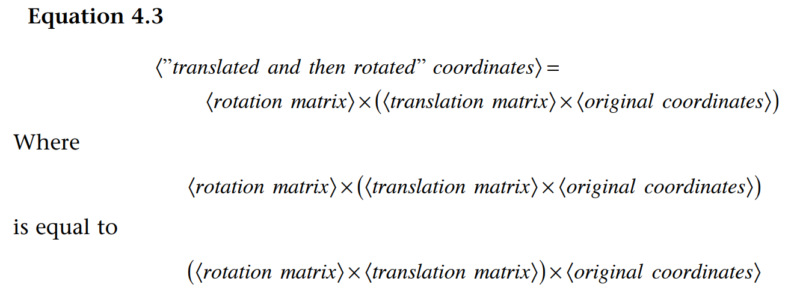
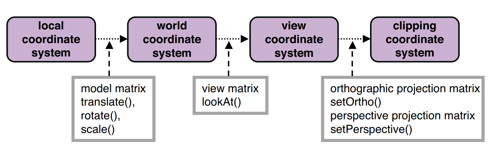

# WebGL编程指南

示例代码

https://sites.google.com/site/webglbook

勘误

https://sites.google.com/site/webglbook/home/webgl-pg-errata

# 第1章 WebGL概述

在正式学习 GLSL ES 之前，我们先大概了解下以下内容：

- OpenGL

OpenGL 全称为 Open Graphics Library（开放图形库）。

是**用于渲染 2D 或 3D 图像的跨语言跨平台的应用程序编程接口**。

- OpenGL ES

OpenGL ES 全称为 OpenGL for Embedded Systems（嵌入式系统开放图形库）。

**OpenGL ES 是 OpenGL 的子集**，主要针对**嵌入式系统**设计，去除了 Open GL 中非必要的特性。

- GLSL

GLSL 全称为 OpenGL Shading Language（OpenGL 着色语言），是一款在 OpenGL 着色器（Shader）中使用的编程语言。

- GLSL ES

GLSL ES 全称为 OpenGL ES Shading Language（OpenGL ES 着色语言），就是用于 OpenGL ES 着色器的编程语言。

# 第2章 WebGL入门

## 绘制一个点

### 顶点着色器

控制点的位置和大小。

### 片元着色器

控制点的颜色。**片元**就是显示在屏幕上的一个像素（严格意义上来说，片元包括这个像素的位置、颜色和其他信息）。

## 绘制一个点（版本2）

### 使用attribute变量

## 改变点的颜色

### uniform变量

只有顶点着色器才能使用attribute变量，使用片元着色器时，需要使用uniform变量。

```js
// Fragment shader program
var FSHADER_SOURCE =
  'precision mediump float;\n' +
  'uniform vec4 u_FragColor;\n' +  // uniform変数
  'void main() {\n' +
  '  gl_FragColor = u_FragColor;\n' +
  '}\n';
```

第3行使用**精度限定词**（precision qualifier）来指定变量的范围（最大值与最小值）和精度，本例中为中等精度。

# 第3章 绘制和变换三角形

## 绘制多个点

构成三维模型的基本单位是三角形。

**缓冲区对象**（buffer object）

### 类型化数组

注意，与普通的`Array`数组不同，类型化数组不支持`push()`和`pop()`方法。

注意，创建类型化数组的唯一方法就是使用`new`运算符，不能使用`[]`运算符（那样创建的就是普通数组）。

## Hello Triangle  

## 移动、旋转和缩放

### 平移

修改应当发生在顶点着色器。

### 旋转

### 变换矩阵：旋转

变换矩阵（transformation matrix  ）

### 变换矩阵：平移

### 示例程序 (RotatedTriangle_Matrix.js)  

WebGL和OpenGL一样，矩阵元素是按列主序存储在数组中的。

### 平移：相同的策略

### 变换矩阵：缩放

# 第4章 高级变换与动画基础

## 平移，然后旋转

### 矩阵变换库：cuon-matrix.js  

### 示例程序：RotatedTriangle_Matrix4.js  

### 复合变换



**模型变换（model transformation）**，或者**建模变换（modeling transformation）**，相应地，模型变换的矩阵成为**模型矩阵（model matrix）**。

### 示例程序 (RotatedTranslatedTriangle.js)  

​		你可能会注意到，“先平移后旋转”的顺序与构造模型矩阵`<旋转矩阵>X<平移矩阵>`的顺序是相反的，这是因为变换矩阵最终要与三角形的三个顶点的原始坐标矢量相乘，再看一下等式3.4，你就明白了。

## 动画

### [window.requestAnimationFrame](https://developer.mozilla.org/zh-CN/docs/Web/API/Window/requestAnimationFrame)

**`window.requestAnimationFrame()`** 告诉浏览器——你希望执行一个动画，并且要求浏览器在下次重绘之前调用指定的回调函数更新动画。该方法需要传入一个回调函数作为参数，该回调函数会在浏览器下一次重绘之前执行

**注意：若你想在浏览器下次重绘之前继续更新下一帧动画，那么回调函数自身必须再次调用`window.requestAnimationFrame()`**

当你准备更新动画时你应该调用此方法。这将使浏览器在下一次重绘之前调用你传入给该方法的动画函数(即你的回调函数)。回调函数执行次数通常是每秒60次，但在大多数遵循W3C建议的浏览器中，回调函数执行次数通常与浏览器屏幕刷新次数相匹配。为了提高性能和电池寿命，因此在大多数浏览器里，当`requestAnimationFrame()` 运行在后台标签页或者隐藏的[``](https://developer.mozilla.org/zh-CN/docs/Web/HTML/Element/iframe) 里时，`requestAnimationFrame()` 会被暂停调用以提升性能和电池寿命。

回调函数会被传入[`DOMHighResTimeStamp`](https://developer.mozilla.org/zh-CN/docs/Web/API/DOMHighResTimeStamp)参数，[`DOMHighResTimeStamp`](https://developer.mozilla.org/zh-CN/docs/Web/API/DOMHighResTimeStamp)指示当前被 `requestAnimationFrame()` 排序的回调函数被触发的时间。在同一个帧中的多个回调函数，它们每一个都会接受到一个相同的时间戳，即使在计算上一个回调函数的工作负载期间已经消耗了一些时间。该时间戳是一个十进制数，单位毫秒，最小精度为1ms(1000μs)。

### 请求再次被调用(requestAnimationFrame()  )

​		在现代浏览器中，不管标签页是否被激活，其中的`setInterval()`  函数都会反复调用`func`，如果标签页比较多，就会增加浏览器的负荷。所以，后来浏览器又引入了`requestAnimationFrame()`  方法，该方法只有当标签页处于激活状态时才会生效。

​		使用这个函数的好处是可以避免在未激活的标签页上运行动画。注意，你无法指定重复调用的间隔；

​		如果你想取消请求，需要使用`cancelAnimationFrame()`.  

### 更新旋转角(animate())  

​		调用函数的时刻t0、t1、t2之间的间隔不是固定的。我们知道，`requestAnimationFrame()`只是请求浏览器在合适的时机调用参数函数，那么浏览器就会根据自身状态决定t0、t1、t2时刻，在不同的浏览器上，或者在同一个浏览器的不同状态下，都有所不同。

# 第5章 颜色和纹理

## 将非坐标数据传入顶点着色器

### 修改颜色（varying变量）

### 示例程序（MultiAttributeColor.js ）

下载的源码运行报错，需要修改FSHADER_SOURCE中的预编译指令`#endif`。(https://blog.csdn.net/liy010/article/details/82120102)

```js
var FSHADER_SOURCE =
  '#ifdef GL_ES\n' +
  'precision mediump float;\n' + // Precision qualifier (See Chapter 6)
  '#endif \n' +
  'varying vec4 v_Color;\n' +    // Receive the data from the vertex shader
  'void main() {\n' +
  '  gl_FragColor = v_Color;\n' +
  '}\n';
```

### 用示例程序做实验

## 彩色三角形(ColoredTriangle.js)  

### 几何形状的装配和光栅化

Geometric Shape Assembly and Rasterization  

### 调用片元着色器

### varying变量的作用和内插过程

​		而三角形表面上这些片元的颜色值都是WebGL系统用这3个顶点的颜色内插出来的。

​		光栅化是三维图形学的关键技术之一，它负责将矢量的几何图形转变为栅格化的片元（像素）。图形被转化为片元之后，我们就可以在片元着色器内做更多的事情，如为每个片元指定不同的颜色。颜色可以内插出来，也可以直接编程指定。

## 在矩形表面贴上图像

**纹理映射（texture mapping  ）**

### 纹理坐标

​		纹理坐标是纹理图像上的坐标，通过纹理坐标可以在纹理图像上获取纹理颜色。WebGL系统中的纹理坐标系统是二维的，如果5.20所示。为了将纹理坐标和广泛使用的x坐标和y坐标区分开来，WebGL使用s和t命名纹理坐标（st坐标系统）。（<span style="color:red;">另一种常用的命名习惯是用uv为纹理坐标的名称</span>。但本书使用st，是因为GLSL ES也使用st分量名访问纹理）


### 将纹理图像粘贴到几何图形上

### 设置纹理坐标(initVertexBuffers())  

### 配置和加载纹理(initTextures())  

注意，处于安全性考虑，WebGL不允许使用跨域纹理图像：

```js
  image.src = '../resources/sky.jpg';
```

### 为WebGL配置纹理(loadTexture())  

### 图像Y轴反转

### 激活纹理单元(gl.activeTexture())  

### 配置纹理对象的参数(gl.texParameteri())  

### 将纹理图像分配给纹理对象(gl.texImage2D())  

​		**流明**（luminance ）表示我们感知到物体表面的亮度。通常使用物体表面红、绿、蓝颜色分量值的加权平均来计算流明。

### 将纹理单元传递给片元着色器(gl.uniform1i())  

### 从顶点着色器向片元着色器传输纹理坐标

### 在片元着色器中获取纹理像素颜色(texture2D())  

### 用示例程序做实验

## 使用多幅纹理

# 第6章 OpenGL ES 着色器 (GLSL ES)  

The OpenGL ES Shading Language (GLSL ES)  

## GLSL ES  概述

## 矢量和矩阵

### 矩阵构造函数

存储在矩阵中的元素是按照列主序排列的。

## 数组

​		GLSL ES 支持数组类型。与JavaScript中的数组不同，GLSL ES 只支持一维数组，而且数组对象不支持`pop()`和`push()`等操作，创建数组时也不需要使用`new`运算符。

## 取样器（Samplers）

## 函数

​		但是，和C与JavaScript不同的是，你不能在函数内部调用它自身（也就是说，递归调用是不允许的）。这项限制的目的也是为了便于编译器对函数进行内联展开。

### 原型声明

Prototype Declarations  

### 参数限定词

Parameter Qualifiers  

## 内置函数

## 全局变量和局部变量

​		局部变量只能在函数内部使用，因此，由于需要在函数外部访问，下一节中将涉及的attribute, uniform, 和 varying 变量都必须声明为全局变量。

## 存储限定字

Storage Qualifiers  

### const  变量

### Attribute 变量

### Uniform 变量

### Varying  变量

## 精度限定字

## 预处理指令

下面是我们在GLSL ES  中可能用到的三种预处理指令。

```glsl
#if constant-expression
If the constant-expression is true, this part is executed.
#endif
    
#ifdef macro
If the macro is defined, this part is executed.
#endif
    
#ifndef macro
If the macro is not defined, this part is executed.
#endif
```

# 第7章 进入三维世界

## 立方体由三角形构成

## 视点和视线

### 视点、观察目标点和上方向

**视图矩阵（view matrix  ）**可以表示观察者的状态，含有观察者的视点、观察目标点和上方向等信息。

### 从指定视点观察旋转后的三角形

```
〈“从视点看上去”的旋转后顶点坐标〉 =〈视图矩阵〉 × 〈旋转矩阵〉 × 〈原始顶点坐标〉
```

除了旋转矩阵，你还可以使用平移、缩放等基本变换矩阵或它们的组合，这时矩阵被称为**模型矩阵（model matrix）**。这样，上式就可以写成：

**式7.1**

```
〈视图矩阵〉× 〈模型矩阵〉 × 〈原始顶点坐标〉
```


### 用示例程序做实验

**模型视图矩阵（model view matrix  ）**，如下所示：

```
〈model view matrix〉 = 〈view matrix〉 × 〈model matrix〉
```

这样，式7.1可以重写为式7.2：

**式7.2：**

```
〈model view matrix 〉× 〈vertex coordinates〉  
```

### 示例程序(LookAtTrianglesWithKeys.js)  

## 可视范围（正射类型，Box Type）

所有这些限制，包括水平视角、垂直视角和可视深度，定义了**可视空间（viewing volume  ）**。

### 可视空间

有两类常用的可视空间：

- 长方体可视空间，也成盒状空间，由**正射投影（orthographic projection  ）**产生。

- 四棱锥/金字塔可视空间，由**透视投影（perspective projection  ）**产生。

### 定义盒状可视空间

**正射投影矩阵（orthographic projection matrix  ）**

### JavaScript  修改HTML元素

打印，保留两位小数

```js
Math.round(g_near * 100)/100
```

round() 方法可把一个数字舍入为最接近的整数。

### 补上缺掉的角（LookAtTrianglesWithKeys_ViewVolume.js  ）

### 用示例程序做实验

在“可视空间”一节中曾讲过，如果可视空间近裁减面的宽高比与`<canvas>`不一致，显示出的物体就会被压缩变形。

## 可视空间（透视投影）

Specifying the Visible Range Using a Quadrangular Pyramid  

### 定义透视投影可视空间

aspect  ：宽高比

**透视投影矩阵（perspective projection matrix）.**  

```js
Matrix4.setPerspective(fov, aspect, near, far)

// fov: 垂直视角，即可视空间顶面和底面的夹角，必须大于0
// aspect: 指定近裁减面的宽高比
// near,far: 
```

### 投影矩阵的作用

​		换个角度看，透视投影矩阵实际上将金字塔状的可视空间变换为了盒状的可视空间，这个盒状的可视空间又称**规范立方体（Canonical View Volume）**。

### 使用所有矩阵（模型矩阵、视图矩阵和投影矩阵）

公式7.4是怎么推导出来的？

### 用示例程序做实验

**模型视图投影矩阵（model view projection matrix  ）**

## 正确处理对象的前后关系

### 隐藏面消除

1、开启隐藏面消除功能。

```js
gl.enable(gl.DEPTH_TEST);  
```

2、在绘制之前，清除深度缓冲区。

```js
gl.clear(gl.DEPTH_BUFFER_BIT);
```


```js
gl.clear(gl.COLOR_BUFFER_BIT | gl.DEPTH_BUFFER_BIT);
```

类似地，同时清除任意两个缓冲区时，都可以使用按位或符号。


### 示例程序（DepthBuffer.js  ）

在任何三维场景中，你都应该开启隐藏面消除，并在合适的时刻清空深度缓冲区（通常是在绘制每一帧之前）。

### 深度冲突（Z Fighting  ）

WebGL提供一种被称为**多边形偏移（polygon offset  ）**的机制来解决这个问题。

## 立方体

# 第8章 光照

## 光源类型

- 平行光（Directional light  ）

- 点光源光（Point light  ）

- 环境光（Ambient light  ）

还有聚光灯光（spot light  ）

## 反射光的类型

### 漫反射（Diffuse Reflection  ）

**式8.1** 

```
〈漫反射光颜色〉 =〈入射光颜色 〉 × 〈 表面基地色〉 × cosθ
```

乘法操作是在颜色矢量上逐分量（R、G、B）进行的。

### 环境反射（Ambient Reflection  ）

**式 8.2**

```
〈环境反射光颜色〉 =〈入射光颜色 〉 × 〈 表面基地色 〉
```

​		

当漫反射和环境反射同时存在时，将两者加起来，就会得到物体最终被观察到的颜色。

**式 8.3**

```
〈表面的反射光颜色〉 =〈漫反射光颜色 〉 + 〈 环境反射光地色 〉
```


### 平行光下的漫反射

物体表面的基底色其实就是“物体本来的颜色”（或者说是“物体在标准白光下的颜色”）。

### 根据光线和表面的方向计算入射角

物体表面的方向（即法线方向）


可以通过计算两个矢量的点积，来计算这两个矢量的夹角余弦值cosθ。

> 在数学上，对矢量n和l做点积运算，公式是这样的：n · l = |n| × |l| × cosθ，其中||符号表示取矢量的长度。


```
cosθ = 〈光线方向 〉· 〈 法线方向〉
```

因此，式8.1可以改写成式8.4，如下所示：

```
〈漫反射光颜色〉 =〈入射光颜色 〉 × 〈 表面基地色〉× (〈光线方向 〉· 〈 法线方向〉)
```


### 法线：表面的朝向

**法线（normal）**、**法向量（normal vector）**

#### 一个表面具有两个法向量

#### 平面的法向量唯一

### 环境光下的漫反射

```
〈环境反射光颜色〉 =〈入射光颜色 〉 × 〈 表面基地色 〉
```

```
〈表面的反射光颜色〉 =〈漫反射光颜色 〉 + 〈 环境反射光地色 〉
```

## 照亮平移旋转的对象

Lighting the Translated-Rotated Object  

### 魔法矩阵：逆转置矩阵

​		在第4章中曾谈论过，对顶点进行变换的矩阵称为模型矩阵。如何计算变换之后的法向量呢？只要讲变换之前的法向量乘以模型矩阵的**逆转置矩阵（inverse transpose matrix  ）**即可。所谓逆转置矩阵，就是逆矩阵的转置。


​		**规则：用法向量乘以模型矩阵的逆转置矩阵，就可以得到变换后的法向量。**

## 点光源光

# 第9章 层次模型（Hierarchical Objects  ）


## 绘制和操作由其他对象组成的对象

### 层次结构

### 单关节模型

### 多关节模型

## 着色器和着色器程序对象：initShaders()  函数的作用


# 第10章 高级技术

## 用鼠标控制物体旋转

### 如何实现物体旋转

## 选中物体

### 如何实现选中物体

1. 当鼠标左键按下时，将整个立方体重绘为单一的红色。
2. 读取鼠标点击处的像素颜色。
3. 使用立方体原来的颜色对其进行绘制。
4. 如果第2步读取到的颜色是红色，就显示信息“The cube was selected!  ”。

### 选择一个表面

## HUD（Head Up Display, 平视显示器）

### 如何实现HUD

### 在网页上方显示三维物体

## 雾化（大气效果）

### 如何实现雾化

### 使用 w 值 (Fog_w.js)  

## 绘制圆形的点

### 如何实现圆形的点

在片元着色器中，我们可以使用`discard`语句来放弃当前片元。

```js
// Fragment shader program
var FSHADER_SOURCE =
  '#ifdef GL_ES\n' +
  'precision mediump float;\n' +
  '#endif\n' +
  'void main() {\n' +    // Center coordinate is (0.5, 0.5)
  '  float d = distance(gl_PointCoord, vec2(0.5, 0.5));\n' +
  '  if(d < 0.5) {\n' +  // Radius is 0.5
  '    gl_FragColor = vec4(1.0, 0.0, 0.0, 1.0);\n' +
  '  } else { discard; }\n' +
  '}\n';
```

## α混合

## 切换着色器

## 将你绘制的内容用作纹理图像

### 帧缓冲区对象和渲染缓冲区对象

### 如何实现使用绘制的对象来作为纹理

## 显示阴影

**马赫带（Mach band）**

## 加载和展示三维模型

### OBJ文件格式

## 处理上下文丢失

Handling Lost Context  

### 如何处理上下文丢失

# 附录B GLSL ES 1.0  内置函数

## 几何函数

| 语法                        | 描述                                                         |
| --------------------------- | ------------------------------------------------------------ |
| float dot(float x, float y) | 返回 x 和 y 的点积，对于vec3而言，就是`x[0]*y [0]+x [1]*y[1]+x[2]*y[2]` |
| float dot(vec2 x, vec2 y)   |                                                              |
| float dot(vec3 x, vec3 y)   |                                                              |
| float dot(vec4 x, vec4 y)   |                                                              |
| vec3 cross(vec3 x, vec3 y)  | 返回 x 和 y 的叉积，对于vec3而言，就是                       |
|                             | `result[0] = x[1]*y[2] - y[1]*x[2]`                          |
|                             | `result[1] = x[2]*y[0] - y[2]*x[0]`                          |
|                             | `result[2] = x[0]*y[1] - y[0]*x[1]`                          |

# 附录D WebGL/OpenGL: 左手还是右手坐标系?  

使用右手坐标系是传统。

## 裁剪坐标系和可视空间

## 总结

​		大部分WebGL库和WebGL程序都采用了传统的右手坐标系，本书也是这样做的。但是WebGL的默认行为（比如，在裁剪空间中使用左手坐标系）却与此冲突。为了解决这个冲突，我们可以通过翻转z坐标值进行补偿，这样就能够继续使用传统的右手坐标系了。

# 附录G 世界坐标系和本地坐标系

## 本地坐标系

​		当我们创建三维模型时，原点通常在模型的中心或角色脚下的地面。

​		此时，组成场景中的模型或角色的顶点，其坐标是相对于角色本身的原点的，这样的坐标系被称为本地坐标系统（local coordinate system  ）。

## 世界坐标系

​		当把多个角色放置到场景中时，如果采用本地坐标系，角色会重叠在场景的原点（0,0,0）处。

​		根据上述，我们用来移动和放置角色的坐标系就称为**世界坐标系统（world coordinate system  ）**或称**全局坐标系（global coordinate system  ）**。角色本身仍然是基于本地坐标系的，而上述这种从本地坐标系到世界坐标系的转换，就称为**世界变换（world transformation）**。

## 变换与坐标系



变换与坐标系

