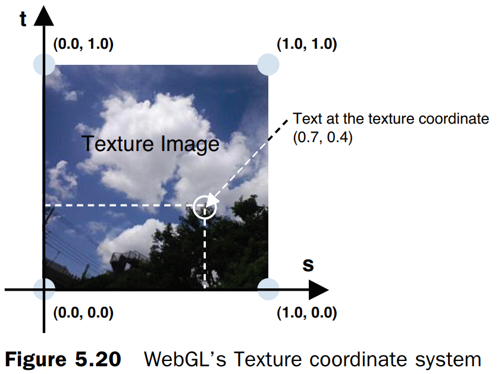

# WebGL编程指南

示例代码

https://sites.google.com/site/webglbook

勘误

https://sites.google.com/site/webglbook/home/webgl-pg-errata

# 第1章 WebGL概述

在正式学习 GLSL ES 之前，我们先大概了解下以下内容：

- OpenGL

OpenGL 全称为 Open Graphics Library（开放图形库）。

是**用于渲染 2D 或 3D 图像的跨语言跨平台的应用程序编程接口**。

- OpenGL ES

OpenGL ES 全称为 OpenGL for Embedded Systems（嵌入式系统开放图形库）。

**OpenGL ES 是 OpenGL 的子集**，主要针对**嵌入式系统**设计，去除了 Open GL 中非必要的特性。

- GLSL

GLSL 全称为 OpenGL Shading Language（OpenGL 着色语言），是一款在 OpenGL 着色器（Shader）中使用的编程语言。

- GLSL ES

GLSL ES 全称为 OpenGL ES Shading Language（OpenGL ES 着色语言），就是用于 OpenGL ES 着色器的编程语言。

# 第2章 WebGL入门

## 绘制一个点

### 顶点着色器

控制点的位置和大小。

### 片元着色器

控制点的颜色。**片元**就是显示在屏幕上的一个像素（严格意义上来说，片元包括这个像素的位置、颜色和其他信息）。

## 绘制一个点（版本2）

### 使用attribute变量

## 改变点的颜色

### uniform变量

只有顶点着色器才能使用attribute变量，使用片元着色器时，需要使用uniform变量。

```js
// Fragment shader program
var FSHADER_SOURCE =
  'precision mediump float;\n' +
  'uniform vec4 u_FragColor;\n' +  // uniform変数
  'void main() {\n' +
  '  gl_FragColor = u_FragColor;\n' +
  '}\n';
```

第3行使用**精度限定词**（precision qualifier）来指定变量的范围（最大值与最小值）和精度，本例中为中等精度。

# 第3章 绘制和变换三角形

## 绘制多个点

构成三维模型的基本单位是三角形。

**缓冲区对象**（buffer object）

### 类型化数组

注意，与普通的`Array`数组不同，类型化数组不支持`push()`和`pop()`方法。

注意，创建类型化数组的唯一方法就是使用`new`运算符，不能使用`[]`运算符（那样创建的就是普通数组）。

## Hello Triangle  

## 移动、旋转和缩放

### 平移

修改应当发生在顶点着色器。

### 旋转

### 变换矩阵：旋转

变换矩阵（transformation matrix  ）

### 变换矩阵：平移

### 示例程序 (RotatedTriangle_Matrix.js)  

WebGL和OpenGL一样，矩阵元素是按列主序存储在数组中的。

### 平移：相同的策略

### 变换矩阵：缩放

# 第4章 高级变换与动画基础

## 平移，然后旋转

### 矩阵变换库：cuon-matrix.js  

### 示例程序：RotatedTriangle_Matrix4.js  

### 复合变换


**模型变换（model transformation）**，或者**建模变换（modeling transformation）**，响应地，模型变换的矩阵成为**模型矩阵（model matrix）**。

### 示例程序 (RotatedTranslatedTriangle.js)  

​		你可能会注意到，“先平移后旋转”的顺序与构造模型矩阵`<旋转矩阵>X<平移矩阵>`的顺序是相反的，这是因为变换矩阵最终要与三角形的三个顶点的原始坐标矢量相乘，再看一下等式3.4，你就明白了。

## 动画

### [window.requestAnimationFrame](https://developer.mozilla.org/zh-CN/docs/Web/API/Window/requestAnimationFrame)

**`window.requestAnimationFrame()`** 告诉浏览器——你希望执行一个动画，并且要求浏览器在下次重绘之前调用指定的回调函数更新动画。该方法需要传入一个回调函数作为参数，该回调函数会在浏览器下一次重绘之前执行

**注意：若你想在浏览器下次重绘之前继续更新下一帧动画，那么回调函数自身必须再次调用`window.requestAnimationFrame()`**

当你准备更新动画时你应该调用此方法。这将使浏览器在下一次重绘之前调用你传入给该方法的动画函数(即你的回调函数)。回调函数执行次数通常是每秒60次，但在大多数遵循W3C建议的浏览器中，回调函数执行次数通常与浏览器屏幕刷新次数相匹配。为了提高性能和电池寿命，因此在大多数浏览器里，当`requestAnimationFrame()` 运行在后台标签页或者隐藏的[``](https://developer.mozilla.org/zh-CN/docs/Web/HTML/Element/iframe) 里时，`requestAnimationFrame()` 会被暂停调用以提升性能和电池寿命。

回调函数会被传入[`DOMHighResTimeStamp`](https://developer.mozilla.org/zh-CN/docs/Web/API/DOMHighResTimeStamp)参数，[`DOMHighResTimeStamp`](https://developer.mozilla.org/zh-CN/docs/Web/API/DOMHighResTimeStamp)指示当前被 `requestAnimationFrame()` 排序的回调函数被触发的时间。在同一个帧中的多个回调函数，它们每一个都会接受到一个相同的时间戳，即使在计算上一个回调函数的工作负载期间已经消耗了一些时间。该时间戳是一个十进制数，单位毫秒，最小精度为1ms(1000μs)。

### 请求再次被调用(requestAnimationFrame()  )

​		在现代浏览器中，不管标签页是否被激活，其中的`setInterval()`  函数都会反复调用`func`，如果标签页比较多，就会增加浏览器的负荷。所以，后来浏览器又引入了`requestAnimationFrame()`  方法，该方法只有当标签页处于激活状态时才会生效。

​		使用这个函数的好处是可以避免在未激活的标签页上运行动画。注意，你无法指定重复调用的间隔；

​		如果你想取消请求，需要使用`cancelAnimationFrame()`.  

### 更新旋转角(animate())  

​		调用函数的时刻t0、t1、t2之间的间隔不是固定的。我们知道，`requestAnimationFrame()`只是请求浏览器在合适的时机调用参数函数，那么浏览器就会根据自身状态决定t0、t1、t2时刻，在不同的浏览器上，或者在同一个浏览器的不同状态下，都有所不同。

# 第5章 颜色和纹理

## 将非坐标数据传入顶点着色器

### 修改颜色（varying变量）

### 示例程序（MultiAttributeColor.js ）

下载的源码运行报错，需要修改FSHADER_SOURCE中的预编译指令`#endif`。(https://blog.csdn.net/liy010/article/details/82120102)

```js
var FSHADER_SOURCE =
  '#ifdef GL_ES\n' +
  'precision mediump float;\n' + // Precision qualifier (See Chapter 6)
  '#endif \n' +
  'varying vec4 v_Color;\n' +    // Receive the data from the vertex shader
  'void main() {\n' +
  '  gl_FragColor = v_Color;\n' +
  '}\n';
```

### 用示例程序做实验

## 彩色三角形(ColoredTriangle.js)  

### 几何形状的装配和光栅化

Geometric Shape Assembly and Rasterization  

### 调用片元着色器

### varying变量的作用和内插过程

​		而三角形表面上这些片元的颜色值都是WebGL系统用这3个顶点的颜色内插出来的。

​		光栅化是三维图形学的关键技术之一，它负责将矢量的几何图形转变为栅格化的片元（像素）。图形被转化为片元之后，我们就可以在片元着色器内做更多的事情，如为每个片元指定不同的颜色。颜色可以内插出来，也可以直接编程指定。

## 在矩形表面贴上图像

**纹理映射（texture mapping  ）**

### 纹理坐标

​		纹理坐标是纹理图像上的坐标，通过纹理坐标可以在纹理图像上获取纹理颜色。WebGL系统中的纹理坐标系统是二维的，如果5.20所示。为了将纹理坐标和广泛使用的x坐标和y坐标区分开来，WebGL使用s和t命名纹理坐标（st坐标系统）。（<span style="color:red;">另一种常用的命名习惯是用uv为纹理坐标的名称</span>。但本书使用st，是因为GLSL ES也使用st分量名访问纹理）



### 将纹理图像粘贴到几何图形上

### 设置纹理坐标(initVertexBuffers())  

### 配置和加载纹理(initTextures())  

注意，处于安全性考虑，WebGL不允许使用跨域纹理图像：

```js
  image.src = '../resources/sky.jpg';
```

### 为WebGL配置纹理(loadTexture())  

### 图像Y轴反转

### 激活纹理单元(gl.activeTexture())  

### 配置纹理对象的参数(gl.texParameteri())  

### 将纹理图像分配给纹理对象(gl.texImage2D())  

​		**流明**（luminance ）表示我们感知到物体表面的亮度。通常使用物体表面红、绿、蓝颜色分量值的加权平均来计算流明。

### 将纹理单元传递给片元着色器(gl.uniform1i())  

### 从顶点着色器向片元着色器传输纹理坐标

### 在片元着色器中获取纹理像素颜色(texture2D())  

### 用示例程序做实验

## 使用多幅纹理

# 第6章 OpenGL ES 着色器 (GLSL ES)  

The OpenGL ES Shading Language (GLSL ES)  

## GLSL ES  概述

## 矢量和矩阵

### 矩阵构造函数

存储在矩阵中的元素是按照列主序排列的。

